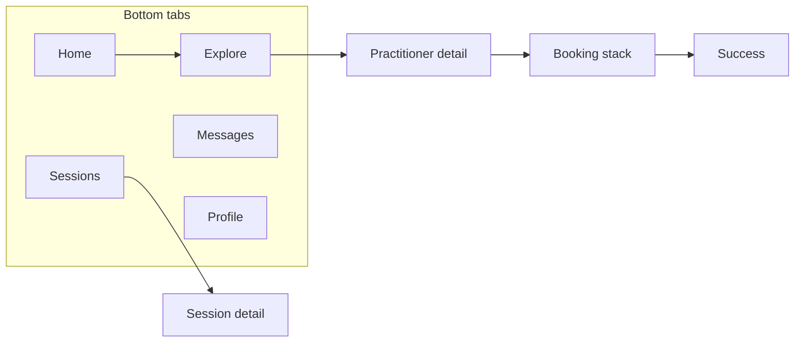
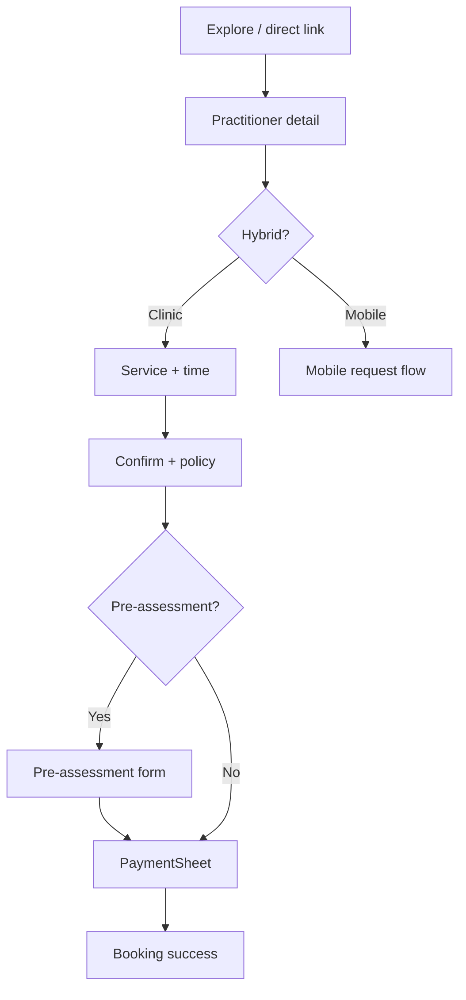
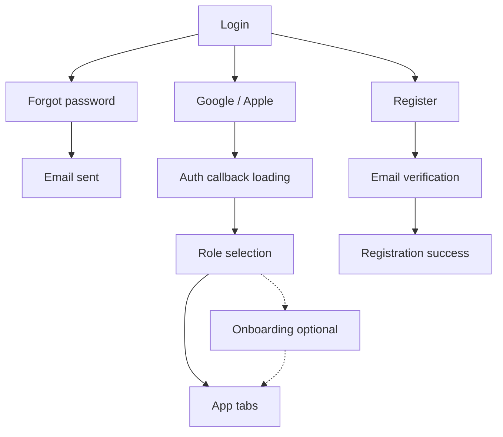
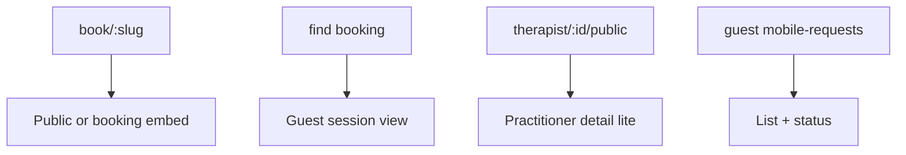

# Screen wireframes & layouts (customer mobile)

**Format:** **Text wireframes** (ASCII) + region lists — suitable for engineering handoff until **Figma** or similar assets exist (see [`17-DOCUMENTATION_GAPS_AND_TRACKER.md`](17-DOCUMENTATION_GAPS_AND_TRACKER.md) DG-02). Replace this section with **frame links** when design files land.

**References:** Screen backlog [`16-MOBILE_SCREENS_BUILD_LIST.md`](16-MOBILE_SCREENS_BUILD_LIST.md), UX foundations [`18-MOBILE_UI_UX_FOUNDATIONS_BMAD.md`](18-MOBILE_UI_UX_FOUNDATIONS_BMAD.md).

---

## 1. Global app shell (authenticated client)

**Pattern:** **Bottom tabs** (5) + **stack** for modals (booking, settings, practitioner detail). **Safe area** top + bottom.

```
┌──────────────────────────────────────┐
│ ████ Safe area (status bar)          │
├──────────────────────────────────────┤
│  [Optional stack title + back]        │  ← only when stack pushes over tabs
│  … screen body …                      │
│                                       │
├──────────────────────────────────────┤
│  🏠      📅      🔍      💬      👤   │  ← Tab: Home | Sessions | Explore | Messages | Profile
│  Home   Sessions Explore  Msg    Me   │
└──────────────────────────────────────┘
│ ████ Home indicator safe area        │
└──────────────────────────────────────┘
```

| Tab      | Maps to web         | Notes                            |
| -------- | ------------------- | -------------------------------- |
| Home     | `/client/dashboard` | Stats, CTA marketplace, timeline |
| Sessions | `/client/sessions`  | Filters, lists, notes            |
| Explore  | `/marketplace`      | Search + practitioner cards      |
| Messages | `/client/messages`  | Conversation list → thread       |
| Profile  | `/client/profile`   | Avatar, edit, **More** entry     |

**Overflow:** “More” (stack): Favorites, Progress, Goals, Exercises, Mobile requests, Notifications, Settings — or **Profile** sub-menu.

---

## 2. Auth: Login (P0)

```
┌──────────────────────────────────────┐
│  Logo / wordmark                      │
│                                       │
│  Email                                │
│  [___________________________]       │
│  Password                             │
│  [___________________________]       │
│                                       │
│  [        Sign in       ]  (primary)  │
│  Forgot password?                     │
│                                       │
│  ─────── or ───────                   │
│  [ Continue with Google ]             │
│  [ Continue with Apple  ]             │
│                                       │
│  Don't have an account? Register     │
└──────────────────────────────────────┘
```

**Regions:** Logo · Form · Primary CTA · OAuth · Register link.

---

## 3. Auth: Role selection (P0)

```
┌──────────────────────────────────────┐
│  How will you use TheraMate?         │
│                                       │
│  ┌────────────────────────────────┐  │
│  │ 👤  I'm looking for treatment   │  │ → client
│  └────────────────────────────────┘  │
│  ┌────────────────────────────────┐  │
│  │ 🩺  I'm a practitioner          │  │ → not customer app
│  └────────────────────────────────┘  │
└──────────────────────────────────────┘
```

---

## 4. Tab: Home (client dashboard) (P0)

```
┌──────────────────────────────────────┐
│  Welcome back, {firstName}            │
│  Short subtitle                       │
│                                       │
│  ┌──────┐ ┌──────┐ ┌──────┐          │
│  │  3   │ │  12  │ │ £240 │          │
│  │Upcom.│ │Total │ │Invest│          │
│  └──────┘ └──────┘ └──────┘          │
│                                       │
│  ┌────────────────────────────────┐ │
│  │ Find your practitioner           │ │
│  │ [ Browse marketplace ]           │ │
│  └────────────────────────────────┘ │
│                                       │
│  Upcoming sessions                    │
│  ┌────────────────────────────────┐ │
│  │ Card: therapist · date · £      │ │
│  └────────────────────────────────┘ │
│  [ View all sessions ]                │
│                                       │
│  Your journey (timeline)              │
│  ┌────────────────────────────────┐ │
│  │ ▓▓ scrollable timeline ▓▓       │ │
│  └────────────────────────────────┘ │
└──────────────────────────────────────┘
```

---

## 5. Tab: Sessions (P0)

```
┌──────────────────────────────────────┐
│  Sessions                    [Filter ▼]│
│  [ Upcoming | Past | Notes ]  ← tabs  │
│                                       │
│  ┌────────────────────────────────┐ │
│  │ Avatar · Name                    │ │
│  │ Date · time · status badge       │ │
│  │ £xx · [ Message ] [ Details ]    │ │
│  └────────────────────────────────┘ │
│  (repeat)                             │
│                                       │
│  Pull to refresh                      │
└──────────────────────────────────────┘
```

**Detail (stack push):** full session row, notes accordion, rebook CTA, **Private rating** if applicable.

---

## 6. Tab: Explore / Marketplace (P0)

```
┌──────────────────────────────────────┐
│  🔍 [ Search location or name...    ] │
│  [ Filters ] [ Map ] (optional)       │
│                                       │
│  ┌────────────────────────────────┐ │
│  │ Photo · Name ★4.8              │ │
│  │ Role · distance · from £xx      │ │
│  │ [ Book ] [ Profile ]            │ │
│  └────────────────────────────────┘ │
│  (repeat — FlashList)                 │
└──────────────────────────────────────┘
```

---

## 7. Practitioner detail (stack) (P0)

```
┌──────────────────────────────────────┐
│  ◀ Back                               │
│  [ Hero: photo / cover ]              │
│  Name · role · ★ reviews             │
│  Location · distance                  │
│  Bio (scroll)                         │
│  Services / prices                    │
│  [ Book clinic ] [ Request mobile ]   │  ← hybrid rules
│  [ Message ]                          │
└──────────────────────────────────────┘
```

---

## 8. Booking flow — clinic (modal stack) (P0)

**Canonical order (web `BookingFlow`, signed-in client):** **Service & time** → **Confirm & pay** (review + policy; creates session) → **Pre-assessment** (step 3 when required) → **payment** → success. Pre-assessment is **after** confirm, not before — see [`docs/features/booking-flows-reference.md`](../../features/booking-flows-reference.md) §1.

**Native:** mirror the same **step order**; progress labels can be `1 of 3` (or similar) for the client path.

```
┌──────────────────────────────────────┐
│  Step 1 of 3 · Service & time  ◀ ✕ │
│  ━━━━━━━━━━░░░░░░░░░░░░              │
│                                       │
│  [ calendar strip or date list ]     │
│  [ time slot chips ]                 │
│                                       │
│  [ Continue ]                        │
└──────────────────────────────────────┘
```

**Pre-assessment:** full-screen step with form fields per web rules (typically **step 3** after session exists).

**Payment:** native **PaymentSheet** (system UI).

---

## 9. Tab: Messages (P0)

**List:**

```
┌──────────────────────────────────────┐
│  Messages                             │
│  ┌────────────────────────────────┐ │
│  │ Avatar · Name · time           │ │
│  │ Preview text...                │ │
│  └────────────────────────────────┘ │
└──────────────────────────────────────┘
```

**Thread:**

```
┌──────────────────────────────────────┐
│  ◀ Name                    [ ⋮ ]      │
├──────────────────────────────────────┤
│  bubble | bubble                     │
│  scrollable thread                   │
├──────────────────────────────────────┤
│  [ Type message... ] [ Send ]        │
└──────────────────────────────────────┘
```

---

## 10. Tab: Profile (P0)

```
┌──────────────────────────────────────┐
│  [ Avatar ]  Name                    │
│  Email (masked)                      │
│  [ Edit profile ]                    │
│                                       │
│  More                                 │
│  → Notifications                      │
│  → Favorites                          │
│  → Progress & goals                   │
│  → My exercises                       │
│  → Mobile requests                    │
│  → Settings                           │
│  → Help                              │
│  Sign out                              │
└──────────────────────────────────────┘
```

---

## 11. Notifications (stack) (P1)

```
┌──────────────────────────────────────┐
│  ◀ Notifications        [ Mark read ]│
│  ┌────────────────────────────────┐ │
│  │ Icon · Title · time            │ │
│  │ Body line...                   │ │
│  └────────────────────────────────┘ │
└──────────────────────────────────────┘
```

---

## 12. Guest: Find my booking (P1)

```
┌──────────────────────────────────────┐
│  Find your booking                    │
│  Email                                │
│  [___________________________]       │
│  Reference / code (if required)       │
│  [___________________________]       │
│  [ Look up ]                         │
└──────────────────────────────────────┘
```

---

## 13. Flow diagrams (Mermaid)

### 13.1 Authenticated primary journey



### 13.2 Booking path (simplified)

**Clinic (authenticated client):** service/time → **confirm** (session created) → pre-assessment **if required** → pay → success.



### 13.3 Authentication — extended states



### 13.4 Guest & deep links



**Guest marketplace booking** (logged out) uses **`GuestBookingFlow`** — different step model than signed-in **`BookingFlow`** (`service/time → guest info → pre-assessment`). See [`docs/features/booking-flows-reference.md`](../../features/booking-flows-reference.md) §2.

---

## 14. Additional screens (wireframes)

Subsections mirror [`16-MOBILE_SCREENS_BUILD_LIST.md`](16-MOBILE_SCREENS_BUILD_LIST.md) IDs (A6, A9–A11, C3–C4, C9–C11, D7, E2, E6, F\*). **SCR-\*** IDs: [`25-SCREEN_REGISTRY_FOR_DESIGN.md`](25-SCREEN_REGISTRY_FOR_DESIGN.md).

### 14.1 Register (**A2** · SCR-AUTH-02)

```
┌──────────────────────────────────────┐
│  Create account                       │
│  First name    [________________]    │
│  Last name     [________________]    │
│  Email         [________________]    │
│  Password      [________________]    │
│  Confirm       [________________]    │
│  [ ] I accept terms                  │
│  [        Create account      ]      │
│  Already have an account? Sign in    │
└──────────────────────────────────────┘
```

### 14.2 Forgot password (**A3**) & set new password (**A4**)

**Request:**

```
┌──────────────────────────────────────┐
│  ◀  Reset password                   │
│  Enter your email                     │
│  [___________________________]       │
│  [     Send reset link        ]      │
└──────────────────────────────────────┘
```

**Confirm (token):**

```
┌──────────────────────────────────────┐
│  Choose a new password                │
│  [___________________________]       │
│  [___________________________]       │
│  [        Save new password    ]     │
└──────────────────────────────────────┘
```

### 14.3 Email verification (**A5**) & registration success (**A6**)

**Verify:**

```
┌──────────────────────────────────────┐
│  Verify your email                    │
│  We sent a link to {email}.          │
│  [ Resend email ]  [ Change email ]   │
│  [ I've verified — continue ]        │
└──────────────────────────────────────┘
```

**Success:**

```
┌──────────────────────────────────────┐
│  ✓ You're all set                     │
│  Next: choose how you use TheraMate. │
│  [        Continue        ]          │
└──────────────────────────────────────┘
```

### 14.4 Auth callback (**A7**) & OAuth completion (**A9**)

**Callback (full-screen):**

```
┌──────────────────────────────────────┐
│         [ Spinner ]                   │
│  Signing you in…                      │
│  (auto-navigate on success)           │
└──────────────────────────────────────┘
```

**OAuth completion** (if web shows profile merge / role): same shell as role selection or single **Continue** after provider returns.

### 14.5 Onboarding (**A10**) & Stripe return (**A11**)

**Onboarding** (client path — match web steps; may be WebView v1):

```
┌──────────────────────────────────────┐
│  Step 1 of n · Welcome                │
│  … content / questions …              │
│  [ Back ]              [ Continue ]   │
└──────────────────────────────────────┘
```

**Stripe return:** thin **“Returning from Stripe…”** loading → deep link to onboarding step.

### 14.6 Booking — service selection (clinic step 1)

```
┌──────────────────────────────────────┐
│  Step 1 of 4 · Choose service   ◀ ✕  │
│  ━━━━━━━━░░░░░░░░░░░░                │
│  ○ 60 min Initial assessment — £xx   │
│  ○ 45 min Follow-up — £xx             │
│  [ Continue ]                         │
└──────────────────────────────────────┘
```

### 14.7 Booking — review & confirm (**SCR-BOOK-04**)

```
┌──────────────────────────────────────┐
│  Review booking                       │
│  Practitioner · Service               │
│  Date · time · duration               │
│  Location / modality                  │
│  Total £xx                            │
│  [ Edit ]                             │
│  [ Confirm & pay ]                    │
└──────────────────────────────────────┘
```

### 14.8 Hybrid chooser (**D4** · SCR-BOOK-07)

```
┌──────────────────────────────────────┐
│  How would you like this session?     │
│  ┌────────────────────────────────┐  │
│  │ 🏥 At the clinic               → │  │
│  └────────────────────────────────┘  │
│  ┌────────────────────────────────┐  │
│  │ 🚗 Mobile / home visit         → │  │
│  └────────────────────────────────┘  │
└──────────────────────────────────────┘
```

### 14.9 Mobile request flow — summary (**D3** · SCR-BOOK-08)

```
┌──────────────────────────────────────┐
│  Request a mobile visit               │
│  Preferred dates [ date picker ]      │
│  Address / area [____________]        │
│  Notes for therapist [________]     │
│  [ Submit request ]                  │
└──────────────────────────────────────┘
```

### 14.10 Mobile booking success (**D7**)

```
┌──────────────────────────────────────┐
│  ✓ Request sent                       │
│  {Practitioner} will respond soon.    │
│  [ View my requests ]  [ Home ]     │
└──────────────────────────────────────┘
```

### 14.11 Settings — root (**C2**), privacy (**C3**), subscription (**C4**)

**Root:**

```
┌──────────────────────────────────────┐
│  ◀ Settings                           │
│  Account · email · password           │
│  Notifications →                      │
│  Privacy & data →                     │
│  Subscription →                     │
│  App appearance                       │
└──────────────────────────────────────┘
```

**Privacy** (stack): toggles for analytics/marketing, export/delete links — match web copy.

**Subscription:** plan name, renew date, **Manage** (opens portal or WebView).

### 14.12 Favorites, Progress, Goals, Exercises, Treatment plans (**C5–C9**)

**Favorites:** same card pattern as Explore, empty state “No saved practitioners yet”.

**Progress / Goals:** optional **segmented control** at top · scrollable metrics + goal cards.

**Exercises:** list of prescribed items · detail with instructions (media).

**Treatment plans:** list of plans · plan detail (sessions linked).

### 14.13 Public therapist profile — guest (**E2**)

```
┌──────────────────────────────────────┐
│  ◀                                    │
│  [ Hero · photo ]                     │
│  Name · role · ★                      │
│  Bio…                                 │
│  [ Book ] [ Sign in to message ]     │
└──────────────────────────────────────┘
```

### 14.14 Guest mobile requests (**E6**)

```
┌──────────────────────────────────────┐
│  Your mobile requests                 │
│  ┌────────────────────────────────┐ │
│  │ Practitioner · status badge     │ │
│  │ Submitted · date                │ │
│  └────────────────────────────────┘ │
└──────────────────────────────────────┘
```

### 14.15 Marketing (optional native **F1–F4**)

**Landing / How it works / Pricing / Help:** hero + sections or **WebView** to web URLs; minimal native chrome + **Sign in**.

### 14.16 SCR ID cross-reference (§14 only)

| §           | Primary SCR IDs                       |
| ----------- | ------------------------------------- |
| 14.1        | SCR-AUTH-02                           |
| 14.2        | SCR-AUTH-03, SCR-AUTH-04              |
| 14.3        | SCR-AUTH-05, SCR-AUTH-08              |
| 14.4        | SCR-AUTH-07, SCR-AUTH-09              |
| 14.5        | SCR-AUTH-10, SCR-AUTH-11              |
| 14.6–14.7   | SCR-BOOK-02, SCR-BOOK-04              |
| 14.8–14.10  | SCR-BOOK-07, SCR-BOOK-08, SCR-BOOK-09 |
| 14.11       | SCR-SEC-02, SCR-SEC-08, SCR-SEC-09    |
| 14.12       | SCR-SEC-03 … SCR-SEC-06, SCR-SEC-10   |
| 14.13–14.14 | SCR-GST-05, SCR-GST-06                |
| 14.15       | SCR-MKT-01 … SCR-MKT-04               |

---

## 15. Wireframe fidelity levels

| Level             | Use                                    |
| ----------------- | -------------------------------------- |
| **L0** (this doc) | Blocks + flow agreement                |
| **L1**            | Figma grayscale frames, one happy path |
| **L2**            | Components + states (empty, error)     |
| **L3**            | Pixel + motion spec                    |

---

## 16. Revision

When Figma links exist, add a column **“Frame URL”** and keep ASCII as **fallback** for repo-only readers.

**Related:** [`22-ERROR_EMPTY_LOADING_NETWORK_STATES.md`](22-ERROR_EMPTY_LOADING_NETWORK_STATES.md), [`12-NAVIGATION_SHELL_AND_ENTRY_POINTS.md`](12-NAVIGATION_SHELL_AND_ENTRY_POINTS.md).

| Date       | Change                                                                   |
| ---------- | ------------------------------------------------------------------------ |
| 2026-03-26 | §13.3–13.4 Mermaid; §14 additional screens + SCR cross-ref               |
| 2026-03-26 | §8 + §13.2 aligned with `BookingFlow.tsx` + `booking-flows-reference` §1 |
