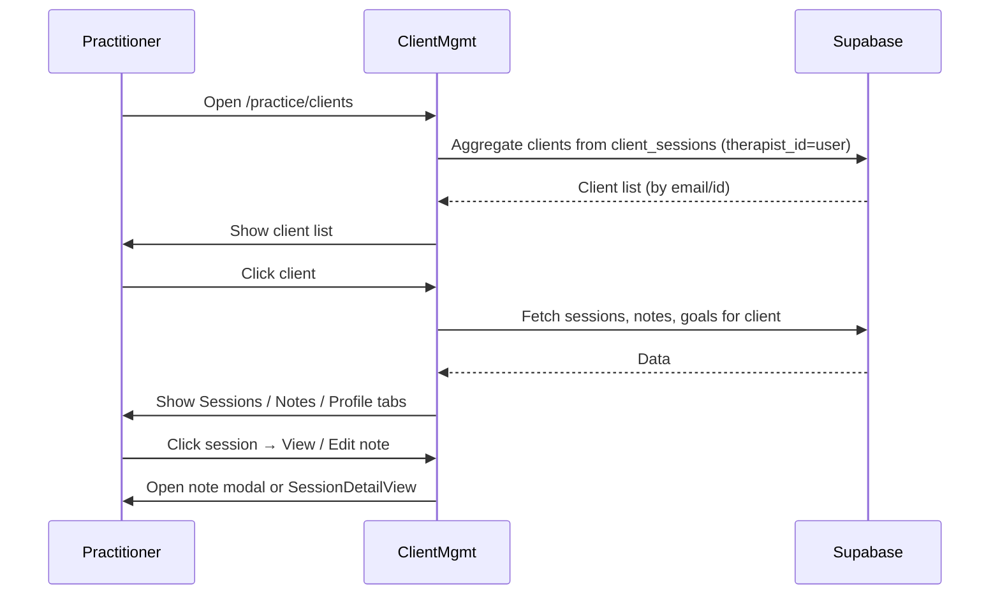

# Client Management – Feature Overview

**Audience:** Junior developers

**Client Management** is the practitioner's view of their clients: a list of people they've treated, with sessions, treatment notes (SOAP), goals, and progress. It is reached via `/practice/clients`.

---

## What is Client Management?

Client Management lets practitioners:

- See a list of clients (people who have had sessions with them)
- View each client's sessions, treatment notes, goals, and progress
- Open sessions and notes from the session list
- Filter and search clients

Clients are derived from **`client_sessions`**: anyone with at least one session where `therapist_id = practitioner` (excluding treatment exchange peers in some views, depending on product rules).

---

## User Sequence: Practitioner Views Client

---

## Route & Entry Points

| Route                                                             | Purpose                                 |
| ----------------------------------------------------------------- | --------------------------------------- |
| `/practice/clients`                                               | Client list; default view               |
| `/practice/clients?session=:id&tab=sessions`                      | Open with a specific session selected   |
| `/practice/clients?session=:id&client=:email&tab=treatment-notes` | Open with session + treatment notes tab |

**Entry points:**

- Dashboard session card → "Profile" → `/practice/clients`
- Dashboard session card → "Notes" → `/practice/clients?session=...&tab=treatment-notes`
- SessionDetailView → "Client profile" link → `/practice/clients?session=...&client=...`
- MobileRequestManagement → "View session" → `/practice/clients?session=...&tab=sessions`

---

## Tabs (Typical Structure)

| Tab                 | Content                                                                |
| ------------------- | ---------------------------------------------------------------------- |
| **Overview**        | Client summary, recent activity                                        |
| **Sessions**        | List of sessions (date, type, status, note status, pre-assessment)     |
| **Treatment Notes** | SOAP notes, goals, progress                                            |
| **Profile**         | Client contact details (when registered; guests may have limited data) |

---

## Data Sources

- **Client list:** Aggregated from `client_sessions` by `client_email` or `client_id`, grouped by client
- **Sessions:** `client_sessions` where `therapist_id = practitioner` and `client_id = X` or `client_email = Y`
- **Treatment notes:** SOAP/treatment notes tables linked to sessions
- **Goals / progress:** Progress tracking tables linked to client/sessions

---

## Guest vs Client

- **Guests** have sessions with `is_guest_booking = true`. They may not have a `users` row until they sign up. Client management can show them by `client_email`.
- **Clients** (registered) have `client_id` set. Full profile and history are available.
- When a guest signs up, `link_guest_sessions_to_user` updates `client_sessions.client_id` so their sessions attach to their new account.

**See:** [GUEST_VS_CLIENT_SYSTEM_LOGIC_TABLE](../product/GUEST_VS_CLIENT_SYSTEM_LOGIC_TABLE.md).

---

## Location (Clinic vs Visit)

For **mobile** and **hybrid** practitioners, sessions can be clinic or visit. The session list in Client Management should show:

- **Location** – "Clinic" or "Visit at [address]" using `getSessionLocation(session, practitioner)`
- **`appointment_type`**, **`visit_address`** – Required in the session query for this to work

**Known gap:** Some client management queries do not yet include `appointment_type` and `visit_address`. See [CLIENT_NOTES_AND_MANAGEMENT_MOBILE_HYBRID_CLINIC_GAPS](../product/CLIENT_NOTES_AND_MANAGEMENT_MOBILE_HYBRID_CLINIC_GAPS.md).

---

## Session List Columns (Typical)

- Date
- Session type
- Status
- Note status (complete / incomplete)
- Pre-assessment (required / completed)
- Location (Clinic / Visit) – when implemented
- Actions (View, Edit note)

---

## Treatment Notes (SOAP)

- **Subjective** – What the client reports
- **Objective** – Observations, measurements
- **Assessment** – Clinical assessment
- **Plan** – Treatment plan, goals

Notes can be opened from:

- Calendar → SessionDetailView → Notes
- Client Management → Sessions tab → "View" or "Edit note" → note modal

The note editor should display session context (including location when available).

---

## In-Depth: Client Derivation

Clients are derived from `client_sessions` where `therapist_id = practitioner`:

- Group by `client_id` (when present) or `client_email`
- Exclude treatment exchange sessions where practitioner is the _client_ (peer), depending on product rules
- Guest sessions (`is_guest_booking = true`) are included; they show under the guest's email until linked to a user on signup

---

## Related Docs

- [CLIENT_NOTES_AND_MANAGEMENT_MOBILE_HYBRID_CLINIC_GAPS](../product/CLIENT_NOTES_AND_MANAGEMENT_MOBILE_HYBRID_CLINIC_GAPS.md)
- [Session Location Rule](./session-location-rule.md)
- [Guest vs Client System Logic](../product/GUEST_VS_CLIENT_SYSTEM_LOGIC_TABLE.md)
- [Database Schema](../architecture/database-schema.md)
- [Diary Overview](./diary-overview.md)
- [Dashboard Overview](./dashboard-overview.md)

---

**Last Updated:** 2026-03-15
