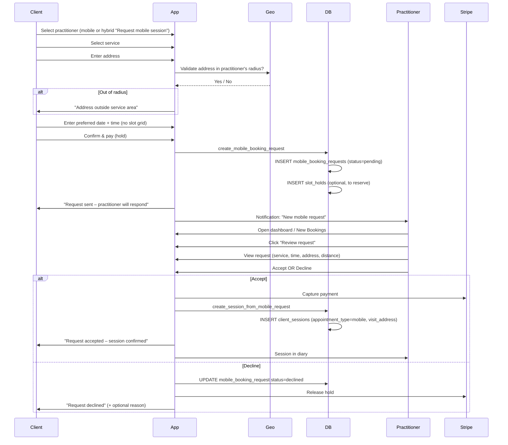
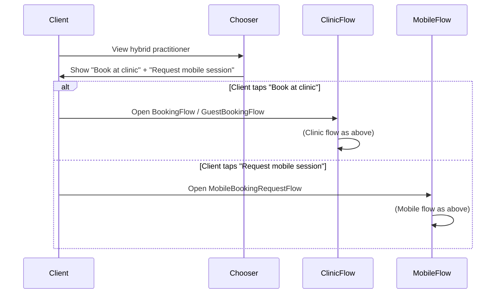

# Clinic, Mobile & Hybrid Flows – Complete Reference

**Audience:** Junior developers (and anyone confused about "booking" vs "requesting")

This document clarifies the three practitioner types and their booking flows. Past confusion often came from mixing up **direct booking** (clinic) with **request-then-approve** (mobile).

---

## Quick Reference: What is What?

| Term                  | Meaning                                                                                                             |
| --------------------- | ------------------------------------------------------------------------------------------------------------------- |
| **Clinic-based**      | Practitioner works only at their clinic. Client travels to them.                                                    |
| **Mobile**            | Practitioner travels to the client. Client never goes to a clinic.                                                  |
| **Hybrid**            | Practitioner does both. Client chooses: "Book at clinic" or "Request mobile session."                               |
| **Clinic flow**       | Direct booking: client picks slot → pays → session created. Practitioner's working hours define slots.              |
| **Mobile flow**       | Request flow: client enters address + preferred time → practitioner Accepts or Declines. No slot picker for client. |
| **Same-day approval** | Clinic only. When a client books a clinic session for today, practitioner can Accept/Decline. Not used for mobile.  |

---

## 1. Clinic Flow (Direct Booking)

**Who uses it:** Clinic-based practitioners, or hybrid practitioners when the client chooses "Book at clinic."

**Key idea:** The client **books directly** into the practitioner's calendar. Slots are generated from the practitioner's working hours minus existing bookings and blocks. Payment happens upfront; the session is created immediately (or enters same-day approval if it's a same-day clinic booking).

### User Sequence: Clinic Booking

```mermaid
sequenceDiagram
    participant Client
    participant App
    participant Slots
    participant Stripe
    participant DB

    Client->>App: Select practitioner (clinic or hybrid "Book at clinic")
    Client->>App: Select service
    App->>Slots: Generate slots (working_hours - bookings - blocks)
    Slots-->>App: Available times
    Client->>App: Pick date + time slot
    Client->>App: Enter details (guest: name/email; client: policy)
    Client->>App: Confirm & pay
    App->>Stripe: Create PaymentIntent
    Stripe-->>App: Client token / payment success
    App->>DB: create_booking_with_validation (clinic)
    DB-->>App: Session created
    App->>Client: Confirmation (email, redirect)
```

### What the client sees

- Service picker
- **Calendar + time grid** (available slots)
- Policy acceptance
- Payment
- Confirmation

### What the practitioner sees

- New session in diary (or same-day approval queue if same-day clinic)
- No "Accept/Decline" for normal future clinic bookings; session is confirmed on payment

### Same-day clinic exception

When the client books a **clinic** session for **today** with short notice, the session may enter a **Same-Day Approval** queue. The practitioner sees it in the dashboard and can Accept or Decline. This is **clinic only**; mobile never uses same-day approval.

### Components & RPCs

| Component                        | Role                                                              |
| -------------------------------- | ----------------------------------------------------------------- |
| `BookingFlow` (authenticated)    | Clinic booking for logged-in clients                              |
| `GuestBookingFlow`               | Clinic booking for guests                                         |
| `CalendarTimeSelector`           | Slot picker (month + time grid)                                   |
| `create_booking_with_validation` | RPC; creates `client_sessions` with `appointment_type = 'clinic'` |

---

## 2. Mobile Flow (Request → Accept/Decline)

**Who uses it:** Mobile-only practitioners, or hybrid practitioners when the client chooses "Request mobile session."

**Key idea:** The client does **not** pick from a slot grid. They enter their **address** and **preferred date/time**. This creates a **mobile_booking_request** (pending). The practitioner must **Accept** or **Decline**. Only on Accept is a session created and payment captured.

### User Sequence: Mobile Request



### What the client sees

- Service picker
- **Address input** (required)
- Preferred date + time (free text or simplified picker – **not** a slot grid)
- Policy + payment (hold, not capture)
- "Request sent – practitioner will respond"

### What the practitioner sees

- Notification: "New mobile request"
- Dashboard / New Bookings: "Review request" → `/practice/mobile-requests?requestId=...`
- On MobileRequestManagement page: Accept or Decline
- On Accept: session created, payment captured, session appears in diary with visit address

### Key difference from clinic

|                          | Clinic                                  | Mobile                                                                 |
| ------------------------ | --------------------------------------- | ---------------------------------------------------------------------- |
| **Client picks from**    | Slot grid (practitioner's availability) | Preferred date/time (no grid)                                          |
| **Session created when** | At payment (or same-day approval)       | When practitioner Accepts                                              |
| **Address**              | N/A (clinic location)                   | Client's address (required)                                            |
| **RPC**                  | `create_booking_with_validation`        | `create_mobile_booking_request` → `create_session_from_mobile_request` |

### Components & RPCs

| Component                            | Role                                         |
| ------------------------------------ | -------------------------------------------- |
| `MobileBookingRequestFlow`           | Request UI; address, date/time, payment hold |
| `MobileRequestManagement`            | Practitioner Accept/Decline UI               |
| `create_mobile_booking_request`      | RPC; creates `mobile_booking_requests`       |
| `create_session_from_mobile_request` | RPC; on Accept, creates `client_sessions`    |
| `get_practitioner_mobile_requests`   | RPC; fetches pending requests                |

---

## 3. Hybrid Flow (Choice of Clinic or Mobile)

**Who uses it:** Hybrid practitioners only. The client sees **two CTAs** (or a chooser).

**Key idea:** Hybrid = clinic + mobile. The client chooses:

1. **"Book at clinic"** → Same as clinic flow (BookingFlow / GuestBookingFlow)
2. **"Request mobile session"** → Same as mobile flow (MobileBookingRequestFlow)

There is no "hybrid-specific" flow. It's always one of the two.

### User Sequence: Hybrid – Client Chooses



### When is each option shown?

| Condition                                              | "Book at clinic" | "Request mobile session"                           |
| ------------------------------------------------------ | ---------------- | -------------------------------------------------- |
| Practitioner has clinic product + clinic address       | ✅               | —                                                  |
| Practitioner has mobile product + base coords + radius | —                | ✅                                                 |
| Practitioner has both + both configs                   | ✅               | ✅                                                 |
| Hybrid with only clinic (no base yet)                  | ✅               | ❌ (base synced from clinic on first Profile save) |

### Base sync for hybrid

Hybrid practitioners don't enter a separate "base address." On Profile save, `base_*` is copied from `clinic_*`. So after first save they can receive mobile requests.

---

## 4. Slot Buffers (Why This Matters)

Different flows use different buffers between sessions:

| Adjacent sessions | Buffer |
| ----------------- | ------ |
| Clinic → Clinic   | 15 min |
| Clinic → Mobile   | 30 min |
| Mobile → Clinic   | 30 min |
| Mobile → Mobile   | 30 min |

Used in: `slot-generation-utils.ts`, `get_directional_booking_buffer_minutes` (backend), `RescheduleService`.

---

## 5. Entry Points: Where Each Flow Starts

| Entry point               | Clinic-based         | Mobile                                 | Hybrid                                                              |
| ------------------------- | -------------------- | -------------------------------------- | ------------------------------------------------------------------- |
| Marketplace card          | "Book" → Clinic flow | "Request mobile session" → Mobile flow | "Book at clinic" / "Request mobile session" → Clinic or Mobile flow |
| Direct link `/book/:slug` | Same                 | Same                                   | Same                                                                |
| Public profile            | Same                 | Same                                   | Same                                                                |
| Client booking (rebook)   | Same                 | Same                                   | Same                                                                |

All use `canBookClinic()` and `canRequestMobile()` from `booking-flow-type.ts` to decide which CTAs to show.

---

## 6. Confusion Busters

### "Why can't the client pick a slot for mobile?"

Because the practitioner must confirm they can travel to that address at that time. Slot generation for mobile would need the practitioner's travel time, which we don't model. So we use request → approve.

### "Is same-day approval for mobile?"

No. Same-day approval is **clinic only**. Mobile always uses `create_mobile_booking_request` + practitioner Accept/Decline.

### "What if a hybrid has only clinic configured?"

They can appear on the marketplace and offer clinic booking only. "Request mobile session" appears after they save Profile (base synced from clinic).

### "Clinic fallback for mobile distance?"

No. Mobile and hybrid use **base** coords only for distance. No clinic fallback.

---

## 7. Related Docs

- [PRACTITIONER_TYPE_CLINIC_BASED](../product/PRACTITIONER_TYPE_CLINIC_BASED.md)
- [PRACTITIONER_TYPE_MOBILE](../product/PRACTITIONER_TYPE_MOBILE.md)
- [PRACTITIONER_TYPE_HYBRID](../product/PRACTITIONER_TYPE_HYBRID.md)
- [HYBRID_CLINIC_AND_MOBILE_BOOKING_RULES](../product/HYBRID_CLINIC_AND_MOBILE_BOOKING_RULES.md)
- [How Booking Works](./how-booking-works.md)
- [Booking Flows Reference](./booking-flows-reference.md)
- [Junior Dev Feature Index](../contributing/junior-dev-feature-index.md)

---

**Last Updated:** 2026-03-15
