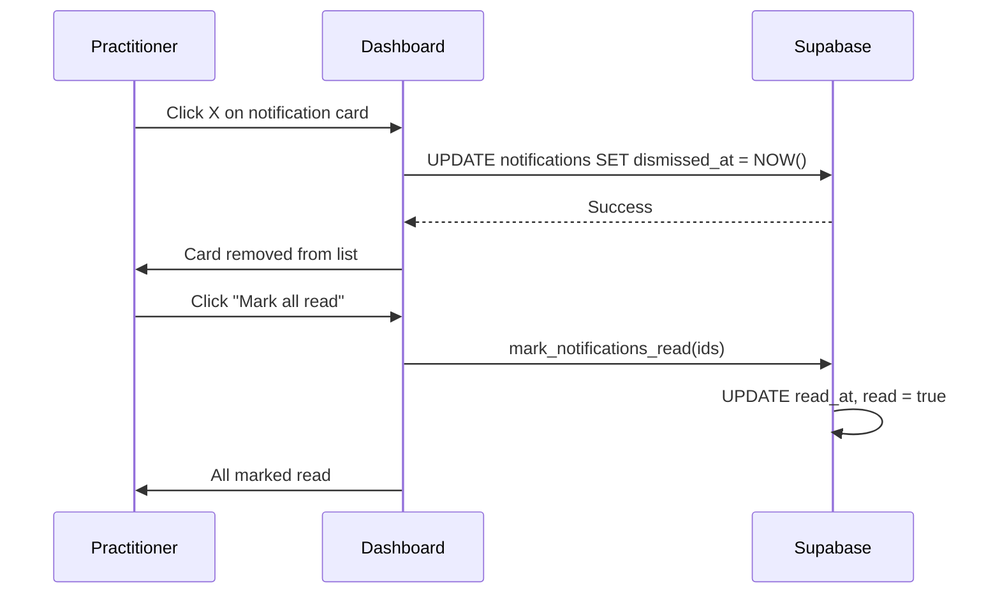

# Practitioner Dashboard – Feature Overview

**Audience:** Junior developers

The **Dashboard** is the practitioner's home screen after login. It shows today's schedule, new bookings requiring action, notifications, and practice metrics.

---

## What is the Dashboard?

The Dashboard is implemented as **TherapistDashboard** and is typically the default route for practitioners (e.g. `/practice` or `/dashboard`). It aggregates:

- **Today's Schedule** – Sessions and items requiring action for today
- **New Bookings** – Notifications for new bookings, treatment exchange requests, mobile requests
- **Metrics** – Sessions, revenue, cancellations, refunds
- **Quick actions** – Accept/Decline for exchange and mobile requests

---

## User Sequence: Dashboard Load & Actions

```mermaid
sequenceDiagram
    participant Practitioner
    participant TherapistDashboard
    participant RPC
    participant Supabase
    participant Realtime

    Practitioner->>TherapistDashboard: Open dashboard
    TherapistDashboard->>RPC: get_practitioner_dashboard_data
    TherapistDashboard->>Supabase: treatment_exchange_requests (received, sent)
    TherapistDashboard->>Supabase: mobile_booking_requests (pending)
    TherapistDashboard->>Supabase: slot_holds (active)
    TherapistDashboard->>Supabase: notifications (undismissed)
    RPC-->>TherapistDashboard: Sessions, stats
    Supabase-->>TherapistDashboard: Exchange requests, mobile requests, notifications
    TherapistDashboard->>TherapistDashboard: Merge into Today's Schedule + New Bookings
    TherapistDashboard->>Practitioner: Render schedule, metrics, New Bookings sidebar

    Practitioner->>TherapistDashboard: Click Accept (treatment exchange)
    TherapistDashboard->>TherapistDashboard: Open ExchangeAcceptanceModal
    Practitioner->>TherapistDashboard: Select service, date/time, confirm
    TherapistDashboard->>Supabase: acceptExchangeRequest, bookReciprocalExchange
    Supabase-->>TherapistDashboard: Success
    TherapistDashboard->>Practitioner: Close modal; refresh data

    Practitioner->>TherapistDashboard: Click "Review request" (mobile)
    TherapistDashboard->>Practitioner: Navigate to /practice/mobile-requests?requestId=...
```

---

## User Sequence: Notification Dismiss & Read



---

## Key Components

| Component                   | Location                                                        | Role                                        |
| --------------------------- | --------------------------------------------------------------- | ------------------------------------------- |
| **TherapistDashboard**      | `src/components/dashboards/TherapistDashboard.tsx`              | Main dashboard; fetches and merges all data |
| **EarningsWidget**          | `src/components/dashboards/EarningsWidget.tsx`                  | Revenue / earnings display                  |
| **SameDayBookingApproval**  | `src/components/practitioner/SameDayBookingApproval.tsx`        | Accept/decline same-day clinic bookings     |
| **ExchangeAcceptanceModal** | `src/components/treatment-exchange/ExchangeAcceptanceModal.tsx` | Accept treatment exchange + book reciprocal |
| **CompleteProfileCta**      | `src/components/dashboard/CompleteProfileCta.tsx`               | Prompt to complete profile if incomplete    |

---

## Data Sources (Two Pipelines)

### Pipeline A: Today's Schedule & Main Content

- **`get_practitioner_dashboard_data`** RPC → `client_sessions`, stats, upcoming sessions
- **`treatment_exchange_requests`** (received, `recipient_id = user`) → pending exchange requests
- **`treatment_exchange_requests`** (sent, `requester_id = user`) → sent exchange requests
- **`slot_holds`** (active, linked to user's sent requests) → slot hold sessions
- **`client_sessions`** (peer bookings as therapist) → treatment exchange sessions where user is providing
- **`mobile_booking_requests`** (pending, `practitioner_id = user`) → mobile requests to accept/decline

All of these are merged into a single "Today's Schedule" list. Items are ordered by time.

### Pipeline B: New Bookings (Notifications)

- **`notifications`** – Rows where `recipient_id = user`, not dismissed
- Filtered for booking-related types: `booking_request`, `exchange_request`, `treatment_exchange_request`, `exchange_slot_held`, `slot_hold`, etc.
- New Bookings sidebar shows these as action cards (Accept/Decline, View, etc.)

**Important:** Today's Schedule filters by `session_date = today`. Exchange requests for tomorrow do not appear there, but they do appear in New Bookings and on the Exchange Requests page.

**See:** [DASHBOARD_AND_TREATMENT_EXCHANGE_FLOW](../product/DASHBOARD_AND_TREATMENT_EXCHANGE_FLOW.md).

---

## Session Types in Today's Schedule

| Type                                   | Source                                        | Actions                                                     |
| -------------------------------------- | --------------------------------------------- | ----------------------------------------------------------- |
| **Regular client session**             | `client_sessions`                             | View, Reschedule, Cancel                                    |
| **Guest session**                      | `client_sessions` (`is_guest_booking = true`) | View (no profile link)                                      |
| **Treatment exchange (you providing)** | `client_sessions` (`is_peer_booking = true`)  | View session                                                |
| **Treatment exchange (you receiving)** | `treatment_exchange_requests` (pending)       | Accept, Decline, or Book reciprocal                         |
| **Pending mobile request**             | `mobile_booking_requests`                     | Accept, Decline → `/practice/mobile-requests?requestId=...` |
| **Slot hold (your sent request)**      | `slot_holds`                                  | Cancelled when request expires                              |

---

## New Bookings Sidebar

Shows notification cards for:

- New treatment exchange requests (Accept/Decline)
- Slot held notifications
- Mobile booking requests (Review request)
- Other booking-related notifications

Clicking Accept on a treatment exchange opens **ExchangeAcceptanceModal** (select service, date/time, book reciprocal). Clicking Decline calls the decline RPC and updates state.

---

## Location Labels (Clinic vs Mobile)

For hybrid/mobile practitioners, session cards show:

- **Clinic** – `appointment_type = 'clinic'`
- **Mobile** – `appointment_type = 'mobile'`, with `visit_address` when available

Uses `getSessionLocation(session, therapist)` from `@/utils/sessionLocation`.

---

## Metrics

- Total sessions (month)
- Monthly revenue
- Completed / cancelled sessions
- Total refunds

Source: `get_practitioner_dashboard_data` RPC and/or aggregated from `client_sessions` and `payments`.

---

## Navigation From Dashboard

| Action                    | Destination                                                    |
| ------------------------- | -------------------------------------------------------------- |
| "Full Diary"              | `/practice/schedule`                                           |
| Session card "View"       | `/practice/sessions/:id` or SessionDetailView                  |
| "Profile" (client)        | `/practice/clients`                                            |
| "Notes" (session)         | `/practice/clients?session=...&tab=treatment-notes`            |
| "Review request" (mobile) | `/practice/mobile-requests?requestId=...`                      |
| Treatment exchange Accept | ExchangeAcceptanceModal                                        |
| Notification card         | Context-aware (exchange → `/practice/exchange-requests`, etc.) |

---

## Same-Day Approval (Clinic Only)

For **clinic** bookings made with less than 24 hours notice, practitioners see a **SameDayBookingApproval** component. They can Accept or Decline. This applies only to clinic bookings, not mobile requests (those use the mobile request flow).

---

## In-Depth: Today's Schedule Merge Order

Items in Today's Schedule are merged from multiple sources and ordered by time:

1. **client_sessions** – Confirmed sessions (therapist_id = user)
2. **treatment_exchange_requests** (received, pending) – Shown as "Accept/Decline" cards
3. **treatment_exchange_requests** (sent, pending) – Shown as "Request sent"
4. **mobile_booking_requests** (pending) – Shown as "Review request" cards
5. **slot_holds** (active, linked to sent exchange) – Shown as "Slot held"

Only items with `session_date = today` (or equivalent for requests) appear in Today's Schedule. Exchange requests for **tomorrow** appear in **New Bookings** and **Exchange Requests** page, not in Today's Schedule.

## In-Depth: Same-Day Approval vs Mobile Request

|              | Same-day approval                               | Mobile request                                                        |
| ------------ | ----------------------------------------------- | --------------------------------------------------------------------- |
| **Flow**     | Clinic only                                     | Mobile (and hybrid mobile path)                                       |
| **When**     | Client books clinic session for today           | Client requests mobile visit                                          |
| **Location** | Today's Schedule / SameDayBookingApproval       | Today's Schedule / New Bookings                                       |
| **RPC**      | `get_pending_same_day_bookings`, accept/decline | `create_mobile_booking_request`, `create_session_from_mobile_request` |

Never confuse the two: mobile always uses the request flow; clinic same-day uses same-day approval.

---

## Related Docs

- [Clinic, Mobile & Hybrid Flows](./clinic-mobile-hybrid-flows.md) – Request vs direct booking
- [DASHBOARD_AND_TREATMENT_EXCHANGE_FLOW](../product/DASHBOARD_AND_TREATMENT_EXCHANGE_FLOW.md)
- [How Treatment Exchange Works](./how-treatment-exchange-works.md)
- [Diary Overview](./diary-overview.md)
- [Notifications Overview](./notifications-overview.md)
- [Database Schema](../architecture/database-schema.md)

---

**Last Updated:** 2026-03-15
