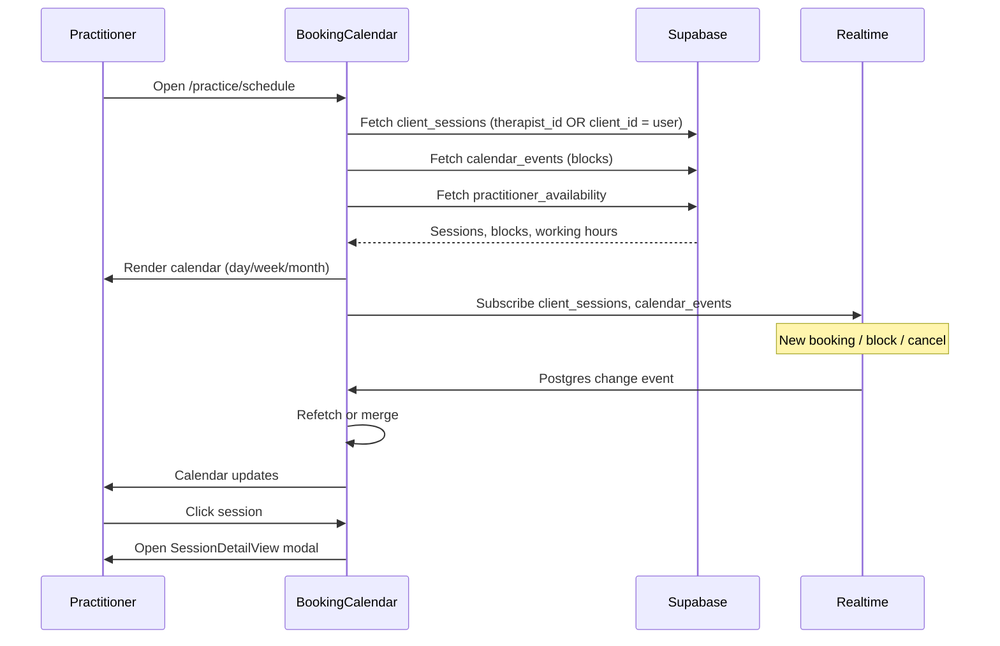

# Diary (Practitioner Schedule) – Feature Overview

**Audience:** Junior developers

The **Diary** is the practitioner's main scheduling view: a calendar that shows all their bookings, blocked time, and availability. It is the source of truth for "what's on my schedule."

---

## What is the Diary?

The Diary is implemented as **BookingCalendar** on the **Practice Schedule** page (`/practice/schedule`). Practitioners use it to:

- View sessions (client, guest, treatment exchange) in day/week/month views
- Block time (unavailable, personal blocks)
- Manage availability (working hours)
- Click a session to open details (SessionDetailView)
- Share their booking link for direct bookings

---

## User Sequence: Practitioner Views Schedule



---

## User Sequence: Block Time

```mermaid
sequenceDiagram
    participant Practitioner
    participant BlockTimeManager
    participant Supabase

    Practitioner->>BlockTimeManager: Click "Block time" (from calendar)
    BlockTimeManager->>Practitioner: Show form (date, time range, title)
    Practitioner->>BlockTimeManager: Enter details, submit
    BlockTimeManager->>Supabase: INSERT calendar_events (event_type=block)
    Supabase-->>BlockTimeManager: Success
    BlockTimeManager->>Practitioner: Close modal; calendar refreshes
```

---

## Key Components

| Component                | Location                                           | Role                                                                |
| ------------------------ | -------------------------------------------------- | ------------------------------------------------------------------- |
| **BookingCalendar**      | `src/components/BookingCalendar.tsx`               | Main calendar UI; fetches sessions, renders events, handles filters |
| **PracticeSchedule**     | `src/pages/practice/PracticeSchedule.tsx`          | Page wrapper; includes BookingCalendar + booking link card          |
| **BlockTimeManager**     | `src/components/practice/BlockTimeManager.tsx`     | Create/edit blocked time (opens from calendar)                      |
| **AvailabilitySettings** | `src/components/practice/AvailabilitySettings.tsx` | Working hours (opens from calendar)                                 |
| **SessionDetailView**    | `src/components/sessions/SessionDetailView.tsx`    | Session modal/detail when clicking an event                         |

---

## Data Sources

The Diary fetches from:

1. **`client_sessions`** – Where `therapist_id = user.id` OR `client_id = user.id` (reciprocal exchange).  
   Includes: regular client bookings, guest bookings, treatment exchange sessions (both as therapist and as client).

2. **`calendar_events`** – Blocked/unavailable time (`event_type = 'block'` or `'unavailable'`).  
   Used to grey out or exclude times in the calendar.

3. **`practitioner_availability`** – Working hours for slot generation and availability indicators.

**Status filter:** Only `scheduled`, `confirmed`, `in_progress`, `completed` appear as "real" sessions.  
`pending_payment`, `expired`, `cancelled`, `no_show` are excluded so unconfirmed or invalid bookings do not clutter the view.

---

## Event Types & Labels

| Type                               | `bookingType`        | Label in UI          | When                                                                                          |
| ---------------------------------- | -------------------- | -------------------- | --------------------------------------------------------------------------------------------- |
| Client session                     | `client`             | "Client"             | `client_id` present, `is_guest_booking = false`                                               |
| Guest session                      | `guest`              | "Guest"              | `is_guest_booking = true` (prefer `session.is_guest_booking` over inferring from `client_id`) |
| Treatment exchange (you providing) | `treatment_exchange` | "Treatment Exchange" | `is_peer_booking = true`, you are therapist                                                   |
| Treatment exchange (you receiving) | `treatment_exchange` | "Treatment Exchange" | `is_peer_booking = true`, you are client                                                      |

For hybrid/mobile practitioners, sessions also show **location** (Clinic vs Visit) via `getSessionLocation(session, therapist)`.

---

## View Modes

- **Day** – Single day
- **Week** – Week view (Mon–Sun)
- **Month** – Full month

Date navigation: prev/next by day, week, or month depending on view.

---

## Real-time Updates

The calendar subscribes to Supabase Realtime for:

- `client_sessions` (INSERT, UPDATE, DELETE)
- `calendar_events` (for block/unavailable changes)

So new bookings, cancellations, and block changes appear without a manual refresh.

---

## Navigation From Diary

| Action                                          | Destination                                           |
| ----------------------------------------------- | ----------------------------------------------------- |
| Click "Full Diary" on dashboard                 | `/practice/schedule`                                  |
| Click a session                                 | SessionDetailView modal (or `/practice/sessions/:id`) |
| From session detail: "Client profile" / "Notes" | `/practice/clients?session=...&tab=...`               |
| Block time / Availability                       | BlockTimeManager / AvailabilitySettings modals        |

---

## Guest vs Client in Diary

- **Guest sessions** should show a "Guest" label, not "Client". Use `session.is_guest_booking === true`.
- **Client sessions** show "Client" and link to the client's profile (`/practice/clients`).
- Guests do not have a profile; do not show a profile link for guest sessions.

**See:** [GUEST_VS_CLIENT_SYSTEM_LOGIC_TABLE](../product/GUEST_VS_CLIENT_SYSTEM_LOGIC_TABLE.md).

---

## In-Depth: Session Query Logic

The diary fetches sessions where the practitioner is **either** the therapist **or** the client (for reciprocal treatment exchange):

```sql
-- Conceptual query
SELECT * FROM client_sessions
WHERE (therapist_id = :userId OR client_id = :userId)
  AND session_date BETWEEN :start AND :end
  AND status IN ('scheduled', 'confirmed', 'in_progress', 'completed')
ORDER BY session_date, start_time
```

Excluded statuses: `pending_payment`, `expired`, `cancelled`, `no_show` – these do not represent confirmed sessions on the schedule.

## In-Depth: Clinic vs Visit Display

For **hybrid** and **mobile** practitioners, each session shows:

- **Clinic:** `appointment_type = 'clinic'` → practitioner's clinic address
- **Mobile:** `appointment_type = 'mobile'` → `visit_address` (client's address)

`getSessionLocation(session, practitioner)` returns the resolved location and label. See [session-location-rule.md](./session-location-rule.md).

---

## Related Docs

- [Database Schema](../architecture/database-schema.md) – `client_sessions`, `calendar_events`, `practitioner_availability`
- [Session Location Rule](./session-location-rule.md) – Clinic vs Visit display
- [Clinic, Mobile & Hybrid Flows](./clinic-mobile-hybrid-flows.md) – Which sessions come from which flows
- [Guest vs Client System Logic](../product/GUEST_VS_CLIENT_SYSTEM_LOGIC_TABLE.md)
- [Dashboard Overview](./dashboard-overview.md)

---

**Last Updated:** 2026-03-15
