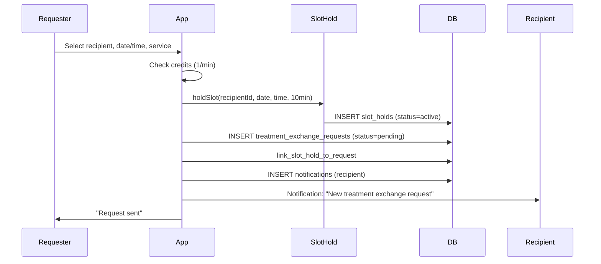
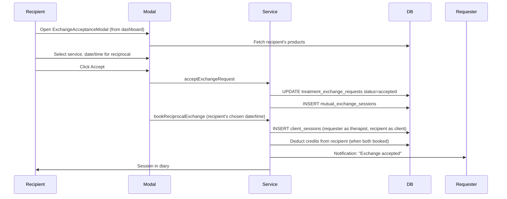
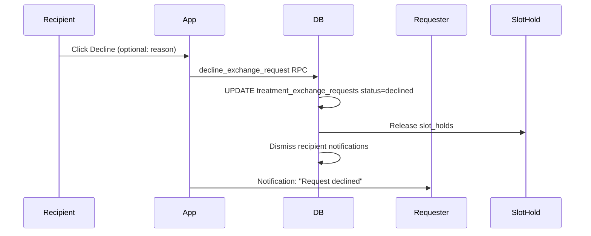

# How Treatment Exchange Works

A comprehensive guide to understanding the treatment exchange system for junior developers.

## Overview

Treatment exchange allows practitioners to exchange treatments with each other using credits instead of money. This creates a peer-to-peer economy where practitioners can receive treatments by providing treatments to others.

## Key Concepts

### What is Treatment Exchange?

- Practitioners can request treatments from other practitioners
- Credits are used as currency (1 credit per minute of treatment)
- Both practitioners must opt-in to participate
- Matching is based on rating tiers, specialization, and distance

### Rating Tiers

Practitioners are matched within the same rating tier:

- **Tier 0:** 0-1 stars
- **Tier 1:** 2-3 stars
- **Tier 2:** 4-5 stars

This ensures practitioners exchange with peers of similar quality.

### Credit System

- **Cost:** 1 credit per minute of treatment (e.g., 60 credits for 60 minutes)
- **Earning:** Practitioners earn 1 credit per patient booking they complete
- **Spending:** Credits are deducted when booking a treatment exchange

## User Sequence: Send Request



---

## User Sequence: Accept & Book Reciprocal



---

## User Sequence: Decline



---

## High-Level Flow (Summary)

```
1. Practitioner A wants treatment
   ↓
2. Check Practitioner A has enough credits
   ↓
3. Find eligible practitioners (same rating tier, opted-in)
   ↓
4. Practitioner A sends request to Practitioner B
   ↓
5. Practitioner B receives notification
   ↓
6. Practitioner B accepts/declines
   ↓
7. If accepted:
   - Credits deducted from Practitioner A
   - Session created
   - Both practitioners notified
```

## Key Components

### 1. TreatmentExchangeService

**Location:** `src/lib/treatment-exchange.ts`

**Main Functions:**

#### Check Credit Balance

```typescript
const { hasSufficientCredits, currentBalance } =
  await TreatmentExchangeService.checkCreditBalance(userId, requiredCredits);
```

#### Get Eligible Practitioners

```typescript
const practitioners = await TreatmentExchangeService.getEligiblePractitioners(
  userId,
  {
    specializations: ["sports_therapy"],
    max_distance_km: 10,
  },
);
```

#### Send Exchange Request

```typescript
const requestId = await TreatmentExchangeService.sendExchangeRequest(
  requesterId,
  recipientId,
  {
    session_date: "2025-02-15",
    start_time: "14:00",
    end_time: "15:00",
    duration_minutes: 60,
    session_type: "massage",
    notes: "Focus on lower back",
  },
);
```

### 2. Exchange Request States

- `pending` - Request sent, awaiting response
- `accepted` - Request accepted, session created
- `declined` - Request declined by recipient
- `expired` - Request expired (time limit reached)
- `cancelled` - Request cancelled by requester

### 3. Matching Logic

Practitioners are matched based on:

1. **Rating Tier** - Must be in same tier (0, 1, or 2)
2. **Opt-in Status** - Must have `treatment_exchange_opt_in = true`
3. **Profile Completion** - Must have `profile_completed = true`
4. **Specialization** - Optional filter
5. **Distance** - Optional maximum distance filter
6. **Session Types** - Optional preferred session types

## Step-by-Step Breakdown

### Step 1: Check Credits

```typescript
// Before sending request, check if user has enough credits
const requiredCredits = 60; // For 60-minute session
const { hasSufficientCredits, currentBalance } =
  await TreatmentExchangeService.checkCreditBalance(userId, requiredCredits);

if (!hasSufficientCredits) {
  // Show error: "You need 60 credits but only have {currentBalance}"
  return;
}
```

### Step 2: Find Eligible Practitioners

```typescript
// Get list of practitioners who can receive the request
const practitioners = await TreatmentExchangeService.getEligiblePractitioners(
  userId,
  {
    specializations: ["sports_therapy"],
    max_distance_km: 10,
  },
);

// Filtered by:
// - Same rating tier
// - Opted into treatment exchange
// - Within distance (if specified)
// - Has specialization (if specified)
```

### Step 3: Send Request

```typescript
// Create exchange request
const requestId = await TreatmentExchangeService.sendExchangeRequest(
  requesterId, // Practitioner requesting treatment
  recipientId, // Practitioner to receive request
  {
    session_date: "2025-02-15",
    start_time: "14:00",
    end_time: "15:00",
    duration_minutes: 60,
    session_type: "massage",
    notes: "Focus on lower back pain",
  },
);
```

### Step 4: Accept/Decline

```typescript
// Recipient accepts the request
await TreatmentExchangeService.acceptExchangeRequest(requestId, recipientId);

// This:
// 1. Deducts credits from requester
// 2. Creates mutual exchange session
// 3. Sends notifications to both parties
```

## Database Tables

### `treatment_exchange_requests`

Stores exchange requests:

- `requester_id` - Who requested
- `recipient_id` - Who received request
- `status` - pending/accepted/declined/expired/cancelled
- `requested_session_date` - When treatment is requested
- `duration_minutes` - Length of treatment

### `mutual_exchange_sessions`

Stores completed exchange sessions:

- `practitioner_a_id` - First practitioner
- `practitioner_b_id` - Second practitioner
- `credits_exchanged` - Number of credits used
- `status` - scheduled/confirmed/completed/cancelled

## Common Questions

**Q: Why rating tiers?**
A: Ensures practitioners exchange with peers of similar quality. A 5-star practitioner shouldn't be matched with a 1-star practitioner.

**Q: What happens if credits are insufficient?**
A: The request cannot be sent. User must earn more credits first.

**Q: Can a request be cancelled?**
A: Yes, the requester can cancel before it's accepted. Credits are not deducted until acceptance.

**Q: What if the recipient declines?**
A: No credits are deducted. The requester can send a new request to someone else.

## In-Depth: Where Exchange Appears

| Surface                    | Source                      | Filter                                                 |
| -------------------------- | --------------------------- | ------------------------------------------------------ |
| **Today's Schedule**       | treatment_exchange_requests | session_date = today, recipient_id = user              |
| **New Bookings sidebar**   | notifications               | source_type in (treatment_exchange_request, slot_hold) |
| **Exchange Requests page** | treatment_exchange_requests | recipient_id = user OR requester_id = user             |

Same pending request can appear in New Bookings and Exchange Requests page, but only in Today's Schedule when the requested date is today.

## Related Files

- `src/lib/treatment-exchange.ts` - Main service
- `src/lib/credits.ts` - Credit management
- `src/lib/exchange-notifications.ts` - Notification handling
- `src/components/treatment-exchange/` - UI components

## Next Steps

- Read `src/lib/treatment-exchange.ts`
- Understand the matching algorithm
- Review the credit deduction flow
- Study the notification system

---

**Last Updated:** 2025-02-09
