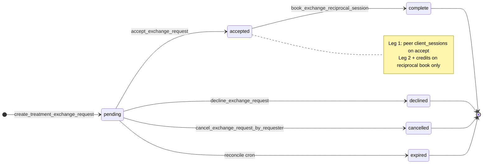
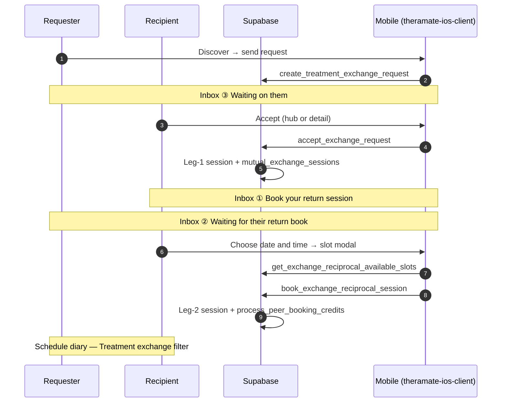
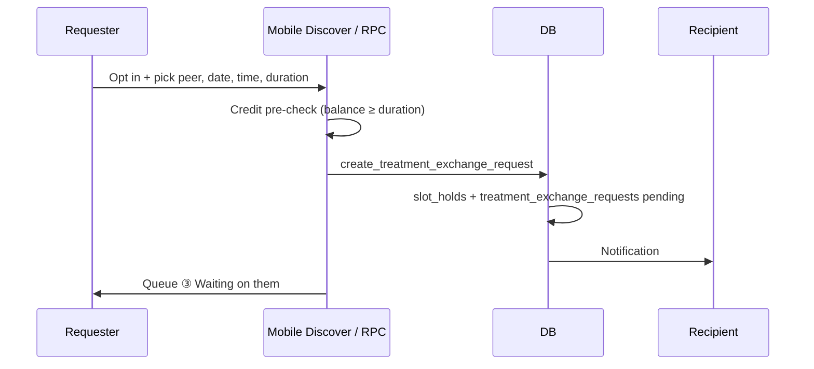
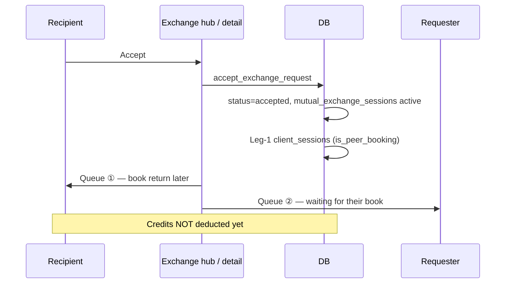
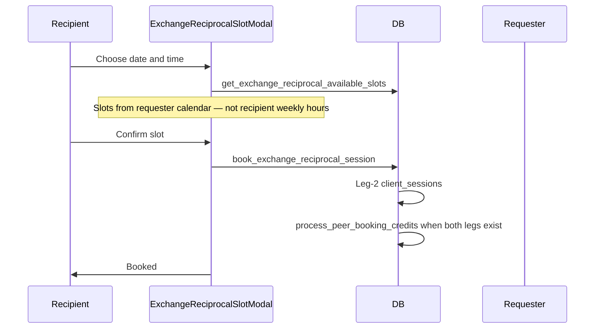
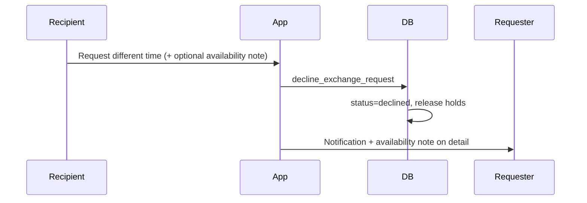
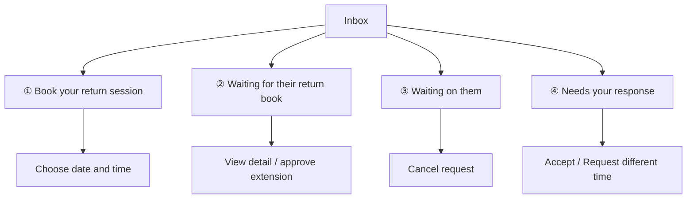

# How Treatment Exchange Works

A guide to the treatment exchange system for developers and PMs. **Backend behaviour** below matches production Supabase (migrations `20260519120000`–`20260520140000`). **Mobile UI** matches [`docs/product/TREATMENT_EXCHANGE_MOBILE_SCREEN_FLOWS.md`](../product/TREATMENT_EXCHANGE_MOBILE_SCREEN_FLOWS.md) — use that doc for screen QA and Maestro.

**Last updated:** 2026-05-21

---

## Overview

Treatment exchange lets practitioners swap treatments using **credits** (1 credit per minute). Both must opt in (`treatment_exchange_opt_in`). Matching uses **rating tiers** (0–1★, 2–3★, 4–5★), role, and discovery filters.

---

## Golden flow (backend + mobile) — source of truth

This replaces the old “accept + book reciprocal in one modal” model.

---

## Key concepts

### Two legs (do not bundle at accept)

| Leg                | Who delivers                                | When created               | RPC                                |
| ------------------ | ------------------------------------------- | -------------------------- | ---------------------------------- |
| **Leg 1**          | Recipient treats requester at proposed time | On **accept**              | `accept_exchange_request`          |
| **Leg 2** (return) | Recipient books on **requester’s** calendar | Separate step after accept | `book_exchange_reciprocal_session` |

**Credits:** Burn via `process_peer_booking_credits` only after **leg 2** is booked (idempotent). Pre-reciprocal cancel must not mint credits (`process_peer_booking_refund`).

### Slot holds

- **Send:** `create_treatment_exchange_request` holds recipient slot (~10 min) while pending.
- **Conflicts:** `assert_practitioner_slot_available` on send, accept, and reciprocal book (`CONFLICT_*` → mobile `formatExchangeConflictMessage`).
- **Pending requests** do not auto-expire in current product copy; cron may still set `expired` — see notifications.

### Rating tiers

| Tier | Stars |
| ---- | ----- |
| 0    | 0–1★  |
| 1    | 2–3★  |
| 2    | 4–5★  |

Mobile discovery: `theramate-ios-client/lib/api/treatmentExchangeDiscovery.ts`.

---

## User sequence: Send request

**Mobile:** `ExchangeDiscoverPanel` → RPC `create_treatment_exchange_request`.

---

## User sequence: Accept (leg 1 only)

**Mobile:** Inbox **Needs your response** or `exchange/[id]` → **Accept**. Copy: still need **Choose date and time** for return session.

---

## User sequence: Book reciprocal (leg 2)

**Mobile:** Hub queue ① or detail → `testID="exchange-choose-reciprocal"`.

---

## User sequence: Request different time (was “decline”)

**UI copy:** Always **“Request different time”** — never “Decline” on mobile. DB status remains `declined`.

---

## User sequence: Cancel

| Actor     | When                    | RPC                                                                      |
| --------- | ----------------------- | ------------------------------------------------------------------------ |
| Requester | `pending`               | `cancel_exchange_request_by_requester`                                   |
| Either    | Booked peer **session** | `process_peer_booking_refund` from booking detail (not diary reschedule) |

---

## Mobile inbox (four active queues)

| Queue | API (mobile)                                          |
| ----- | ----------------------------------------------------- |
| ①     | `fetchAcceptedExchangesNeedingReciprocal`             |
| ②     | `fetchAcceptedExchangesAwaitingReciprocalByRequester` |
| ③     | `fetchPendingExchangeRequestsSentByRequester`         |
| ④     | `fetchPendingExchangeRequestsForRecipient`            |

No terminal **history** list on mobile yet — open declined/cancelled/expired via notification or `exchange/[id]`.

Full navigation diagram: [TREATMENT_EXCHANGE_MOBILE_SCREEN_FLOWS.md §1–2](../product/TREATMENT_EXCHANGE_MOBILE_SCREEN_FLOWS.md).

---

## Request states

| Status      | Meaning                                           |
| ----------- | ------------------------------------------------- |
| `pending`   | Awaiting recipient accept or different time       |
| `accepted`  | Leg 1 booked; reciprocal may still be outstanding |
| `declined`  | Recipient requested different time                |
| `cancelled` | Requester cancelled while pending                 |
| `expired`   | Reconcile/cron (requester may be notified)        |

**“Confirmed”** applies to **sessions** (`client_sessions` / diary), not to `treatment_exchange_requests`. See [TREATMENT_EXCHANGE_NOTIFICATION_FLOWS.md](../product/TREATMENT_EXCHANGE_NOTIFICATION_FLOWS.md).

---

## Database tables (essentials)

### `treatment_exchange_requests`

- `requester_id`, `recipient_id`, `status`
- `requested_session_date`, `requested_start_time`, `duration_minutes`
- `reciprocal_booking_deadline`, extension fields

### `mutual_exchange_sessions`

- `exchange_request_id`
- `practitioner_a_id` = **requester**, `practitioner_b_id` = **recipient**
- `practitioner_a_booked` / `practitioner_b_booked`, `practitioner_a_session_id` / `practitioner_b_session_id`
- `status` (e.g. `active`)

### `client_sessions` (peer legs)

- `is_peer_booking = true` for exchange sessions
- Leg 1 on accept; leg 2 on reciprocal book

Schema reference: [database-tables-mcp-reference.md](../architecture/database-tables-mcp-reference.md).

---

## Where exchange appears

| Surface                             | Platform | Notes                                                       |
| ----------------------------------- | -------- | ----------------------------------------------------------- |
| **Treatment exchange** hub + detail | Mobile   | `/(practitioner)/exchange`, `exchange/[id]`                 |
| **Discover** send                   | Mobile   | Segment on hub                                              |
| **Schedule** peer filter            | Mobile   | Category “Treatment exchange”                               |
| **Booking detail** peer card        | Mobile   | Cancel, view request; no generic reschedule                 |
| **Home — Action required**          | Mobile   | Mobile requests first, then exchange counts                 |
| **Mobile requests** snapshot        | Mobile   | Partial mirror (no queue ②)                                 |
| **Credits** shortcut                | Mobile   | Link to exchange                                            |
| **Exchange Requests** (web)         | Web      | May differ by branch — verify `src/` on your checkout       |
| **Notifications**                   | Both     | `notificationNavigation.ts` → `exchange` or `exchange/[id]` |

---

## Implementation map

### Mobile (this repo — primary UI)

| Concern          | Path                                                                           |
| ---------------- | ------------------------------------------------------------------------------ |
| API              | `theramate-ios-client/lib/api/practitionerExchange.ts`                         |
| Discovery + send | `theramate-ios-client/lib/api/treatmentExchangeDiscovery.ts`                   |
| Hub              | `theramate-ios-client/app/(practitioner)/exchange/index.tsx`                   |
| Detail           | `theramate-ios-client/app/(practitioner)/exchange/[id].tsx`                    |
| Slot modal       | `theramate-ios-client/components/practitioner/ExchangeReciprocalSlotModal.tsx` |
| Peer session     | `theramate-ios-client/app/(practitioner)/(ptabs)/bookings/[id].tsx`            |
| Dashboard counts | `theramate-ios-client/lib/api/practitionerDashboard.ts`                        |
| Maestro          | `theramate-ios-client/.maestro/exchange-*.yaml`                                |

### Supabase

| Concern      | Path                                                                           |
| ------------ | ------------------------------------------------------------------------------ |
| Migrations   | `supabase/migrations/20260519120000_*` … `20260520140000_*`                    |
| Smoke script | `scripts/verify-treatment-exchange-rpcs.mjs`                                   |
| Staging E2E  | `test-scripts/treatment-exchange-staging-e2e.js` (`npm run test:exchange:e2e`) |

### Web (legacy paths — verify on branch)

Older docs referenced `src/lib/treatment-exchange.ts` and `ExchangeAcceptanceModal`. **Do not assume** reciprocal-at-accept on web without reading the current branch. Grep `src/` for `exchange` / `treatment_exchange` before changing web UX.

---

## Common questions (corrected)

**Q: When are credits deducted?**  
A: When **both** legs are booked — `process_peer_booking_credits` runs from `book_exchange_reciprocal_session`, not on accept alone.

**Q: Can the requester cancel?**  
A: Yes, while `pending` — `cancel_exchange_request_by_requester`. No credits burned.

**Q: What does “declined” mean in the DB?**  
A: Recipient chose **request different time**; they can send a new request with another slot.

**Q: Why two steps after accept?**  
A: Leg 1 locks the proposed swap; leg 2 picks a return time on the **requester’s** availability (`get_exchange_reciprocal_available_slots`).

**Q: Can I reschedule a peer session from the diary?**  
A: **No** on mobile — use exchange flows or **cancel exchange session** on booking detail (`process_peer_booking_refund`).

---

## Related docs

- [TREATMENT_EXCHANGE_MOBILE_SCREEN_FLOWS.md](../product/TREATMENT_EXCHANGE_MOBILE_SCREEN_FLOWS.md) — screen diagrams, QA checklist
- [TREATMENT_EXCHANGE_UX_GAPS.md](../product/TREATMENT_EXCHANGE_UX_GAPS.md) — gap tracker
- [TREATMENT_EXCHANGE_SMOKE_TESTS.md](../product/TREATMENT_EXCHANGE_SMOKE_TESTS.md) — RPC + Maestro smoke
- [credit-system.md](./credit-system.md) / [how-credits-work.md](./how-credits-work.md) — credits economy

---

## Changelog (doc alignment)

| Date       | Change                                                                                                                                      |
| ---------- | ------------------------------------------------------------------------------------------------------------------------------------------- |
| 2026-05-21 | Replaced accept+reciprocal-in-one-modal sequence with two-leg prod flow; linked mobile screen-flow doc; fixed credits timing and file paths |
| 2025-02-09 | Original junior-dev guide (partially outdated UI)                                                                                           |
