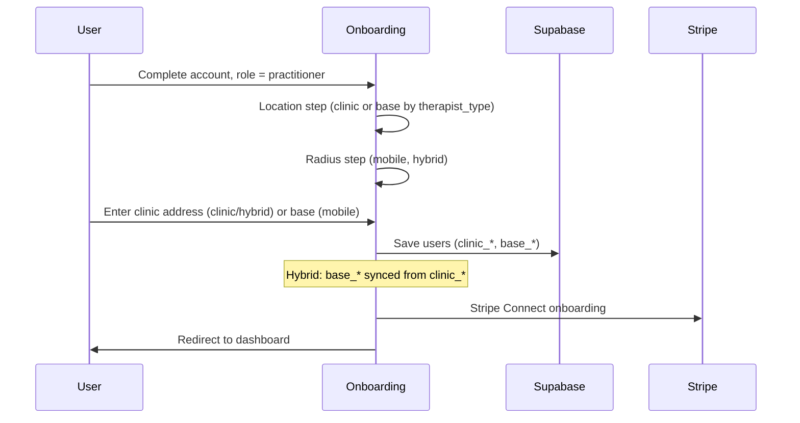

# Profile & Onboarding – Feature Overview

**Audience:** Junior developers

**Profile** is where practitioners (and clients) manage their personal and professional details. **Onboarding** is the initial setup flow for new practitioners: location, therapist type, services, Stripe Connect, etc. Profile validation and location rules differ by practitioner type (clinic, mobile, hybrid).

---

## What is Profile?

The Profile page (`/profile`) lets users edit:

- Name, email, phone
- Bio, qualifications
- For practitioners: clinic address, base address (mobile), service radius
- Therapist type (clinic_based, mobile, hybrid)
- Treatment exchange opt-in
- Stripe Connect onboarding status
- Profile photo, liability insurance
- Address fields (address_line1, city, postcode, etc.)

---

## Key Files

| File                                   | Role                            |
| -------------------------------------- | ------------------------------- | ----------------------------------------------------------------- |
| **Profile.tsx**                        | `src/pages/Profile.tsx`         | Main profile page; validation by therapist type; hybrid base sync |
| **Onboarding.tsx**                     | `src/pages/auth/Onboarding.tsx` | New practitioner setup; location step, radius step                |
| **ProfileBuilder** / **ProfileViewer** | `src/components/profiles/`      | Profile form and public view                                      |

---

## User Sequence: Onboarding (New Practitioner)



---

## User Sequence: Profile Save (Hybrid Base Sync)

```mermaid
sequenceDiagram
    participant Practitioner
    participant Profile
    participant Supabase

    Practitioner->>Profile: Edit clinic_address, save
    Profile->>Profile: If therapist_type=hybrid: base_* = clinic_*
    Profile->>Supabase: UPDATE users (clinic_*, base_*, ...)
    Supabase-->>Profile: Success
    Profile->>Practitioner: Saved; canRequestMobile may now be true
```

---

## Validation by Therapist Type

| Type             | Required fields                                                               |
| ---------------- | ----------------------------------------------------------------------------- |
| **Clinic-based** | `clinic_address` (trimmed)                                                    |
| **Mobile**       | `base_address`, `base_latitude`, `base_longitude`, `mobile_service_radius_km` |
| **Hybrid**       | `clinic_address`, `mobile_service_radius_km` (no separate base in UI)         |

---

## Hybrid: Base Synced From Clinic

For **hybrid** practitioners, the UI does **not** ask for a separate base address. On save:

- `base_address` = `clinic_address`
- `base_latitude` = `clinic_latitude`
- `base_longitude` = `clinic_longitude`

This gives them a base for mobile requests and geo-distance without a duplicate field. After first save, `canRequestMobile` can become true (with radius and products).

**See:** [PRACTITIONER_TYPE_HYBRID](../product/PRACTITIONER_TYPE_HYBRID.md), [HYBRID_CLINIC_AND_MOBILE_BOOKING_RULES](../product/HYBRID_CLINIC_AND_MOBILE_BOOKING_RULES.md).

---

## Onboarding Steps (Practitioners)

1. **Account** – Email, name, terms
2. **Role** – Practitioner vs client
3. **Location** – Clinic (clinic/hybrid) or base (mobile)
4. **Radius** – `mobile_service_radius_km` (mobile, hybrid)
5. **Stripe Connect** – Payment onboarding
6. **Services** – Initial products (optional)
7. **Complete** – Redirect to dashboard

---

## Public Profile

Practitioners have a **public profile** (e.g. `/practitioner/:id` or `/book/:slug`) that clients see before booking. It shows:

- Name, photo, bio
- Qualifications
- Services, prices
- Location (clinic or "mobile within X km")
- Liability insurance badge
- Booking CTA (mode-aware: clinic, mobile, or both for hybrid)

---

## Marketplace Eligibility

Profile data drives marketplace visibility:

- **Clinic:** `clinic_address` required
- **Mobile:** `base_address`, `base_latitude`, `base_longitude`, `mobile_service_radius_km` required
- **Hybrid:** `clinic_address` + `mobile_service_radius_km`; base from clinic on save

`isPractitionerEligibleForMarketplace` in the marketplace checks these plus products.

---

## Related Docs

- [PRACTITIONER_TYPE_CLINIC_BASED](../product/PRACTITIONER_TYPE_CLINIC_BASED.md)
- [PRACTITIONER_TYPE_MOBILE](../product/PRACTITIONER_TYPE_MOBILE.md)
- [PRACTITIONER_TYPE_HYBRID](../product/PRACTITIONER_TYPE_HYBRID.md)
- [HYBRID_CLINIC_AND_MOBILE_BOOKING_RULES](../product/HYBRID_CLINIC_AND_MOBILE_BOOKING_RULES.md)
- [Database Schema](../architecture/database-schema.md) – `users`
- [Services & Pricing Overview](./services-and-pricing-overview.md)

---

**Last Updated:** 2026-03-15
