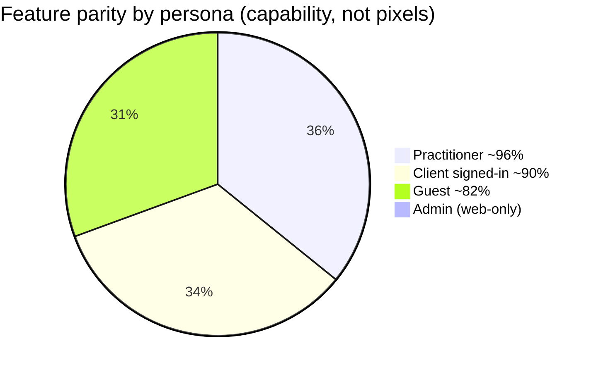
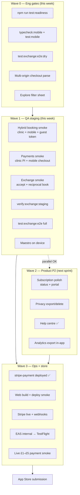
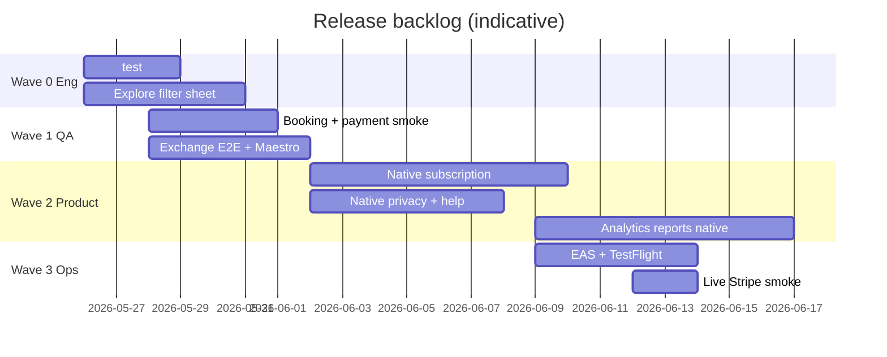
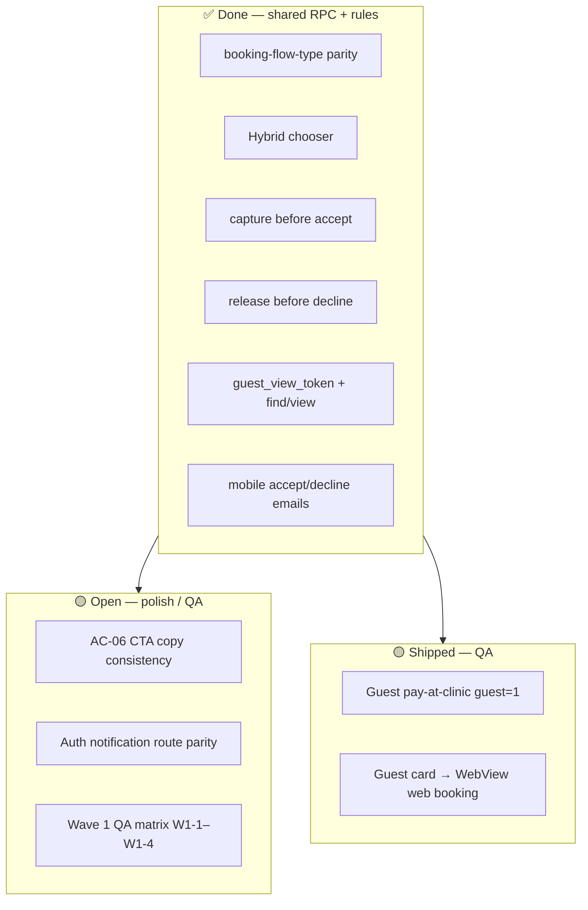
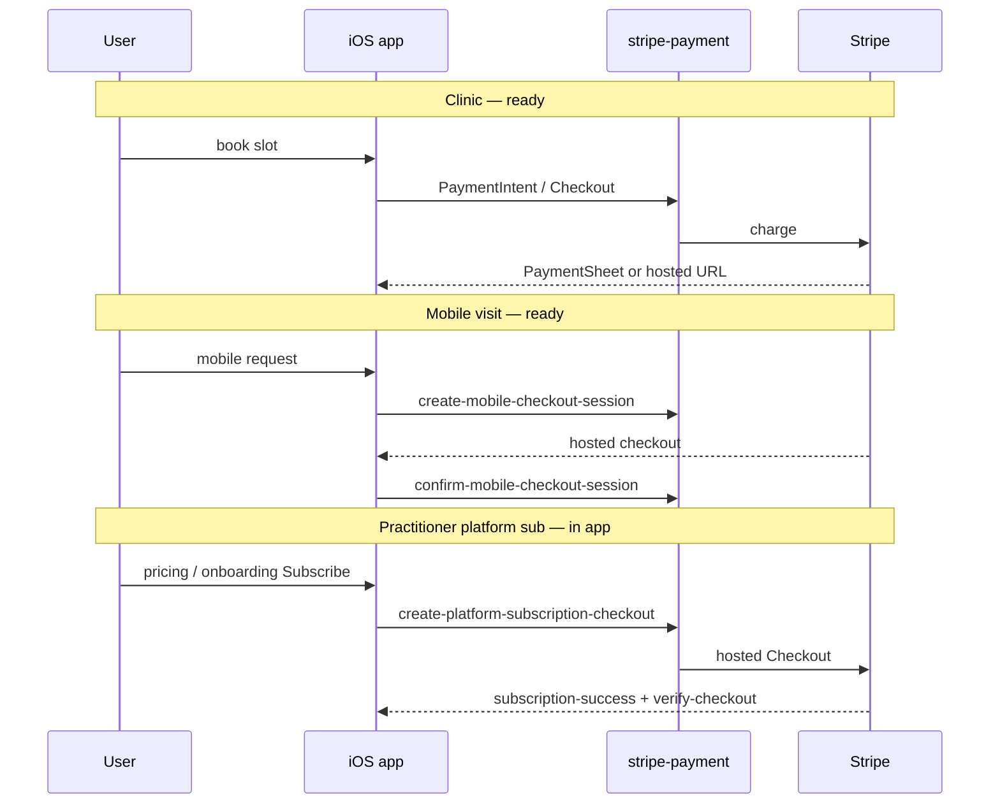
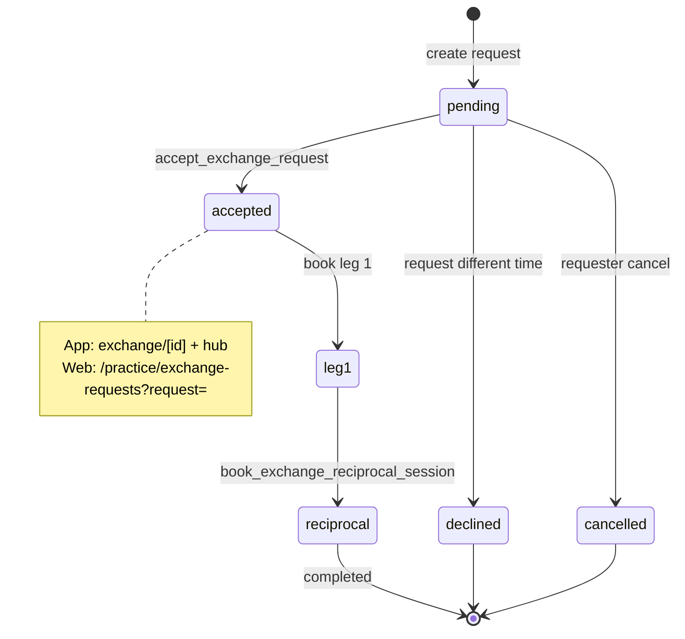
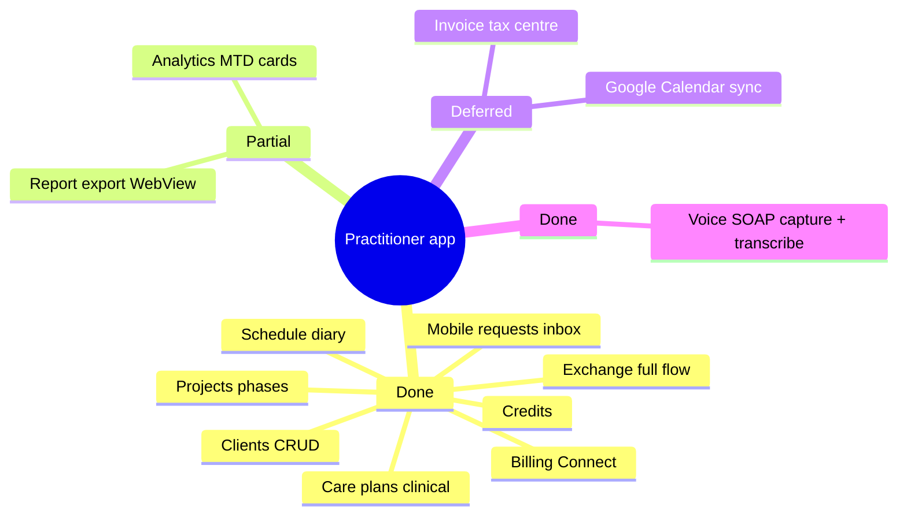
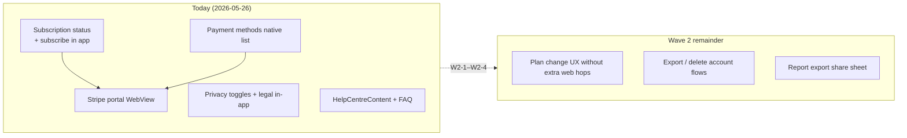
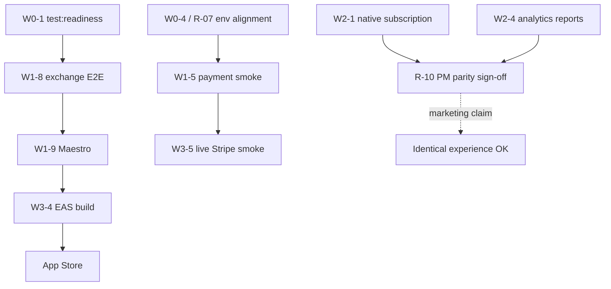
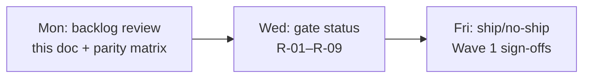

# App release backlog — CTO / PM (with diagrams)

**Date:** 2026-05-26  
**Last reconciled:** 2026-05-26 (guest booking, platform sub checkout, voice SOAP, `stripe-payment` deploy)  
**Audience:** CTO, PM, Eng lead, QA  
**Products:** `theramate-ios-client` + repo-root `src/` + `supabase/`  
**Companion docs:** [WEB_APP_FEATURE_PARITY.md](./WEB_APP_FEATURE_PARITY.md) · [APP_RELEASE_READINESS.md](./APP_RELEASE_READINESS.md) · [FEATURE_BY_FEATURE_GAPS_INDEX.md](./FEATURE_BY_FEATURE_GAPS_INDEX.md) · [WAVE1_QA_RELEASE_SIGNOFF.md](../testing/WAVE1_QA_RELEASE_SIGNOFF.md)

### Gate status (last run: 2026-05-26)

| Gate                           | Result      | Notes                                                                                                                                  |
| ------------------------------ | ----------- | -------------------------------------------------------------------------------------------------------------------------------------- |
| R-01 `test:readiness`          | **Pass**    | typecheck + **61** Jest tests + exchange dry (skipped RPC writes)                                                                      |
| R-02–R-04 Exchange QA          | **Blocked** | `EXCHANGE_*` not in `.env` — add creds for W1-8/W1-9                                                                                   |
| W0-3 Explore filter            | **Done**    | `ExploreFiltersSheet.tsx` — delivery + sort shipped                                                                                    |
| W3-1 `stripe-payment` deploy   | **Done**    | Includes `create-platform-subscription-checkout` (prod `aikqnvltuwwgifuocvto`)                                                         |
| W3-1b `verify-checkout` deploy | **Done**    | Was 404 on prod until 2026-05-27; required for `subscription-success`                                                                  |
| W1-1–W1-7 Manual QA            | **Open**    | [WAVE1_QA_RELEASE_SIGNOFF.md](../testing/WAVE1_QA_RELEASE_SIGNOFF.md) — see [APP_RELEASE_TODO_CTO_PM.md](./APP_RELEASE_TODO_CTO_PM.md) |

---

## 1. Where we are (executive)

**Ship stance:** Core **book · pay · exchange · practice hub** are build-complete on app + web. **Release** is gated by automated tests, staging QA, Maestro, EAS, and live Stripe — not by rebuilding booking.

**Do not claim:** “identical to web everywhere” until **Wave 2 (P2 account)** and **release gates** are signed.

---

## 2. Release pipeline (gates → store)

| Gate | Command / action                                                                                             | Owner   | PM sign-off  |
| ---- | ------------------------------------------------------------------------------------------------------------ | ------- | ------------ |
| R-01 | `npm run test:readiness`                                                                                     | Eng     | ☑ 2026-05-26 |
| R-02 | `npm run verify:exchange:staging`                                                                            | QA      | ☐            |
| R-03 | `npm run test:exchange:e2e`                                                                                  | QA      | ☐            |
| R-04 | `npm run test:maestro:exchange`                                                                              | QA      | ☐            |
| R-05 | Manual [STRIPE_CHECKOUT_MOBILE_PRODUCTION_READINESS](./STRIPE_CHECKOUT_MOBILE_PRODUCTION_READINESS.md)       | QA      | ☐            |
| R-06 | Manual [TREATMENT_EXCHANGE_MOBILE_PRODUCTION_READINESS](./TREATMENT_EXCHANGE_MOBILE_PRODUCTION_READINESS.md) | QA      | ☐            |
| R-07 | Env: `APP_URL` = `EXPO_PUBLIC_WEB_URL` (+ checkout origins)                                                  | Eng/Ops | ☐            |
| R-08 | EAS internal build tagged                                                                                    | Release | ☐            |
| R-09 | Stripe live + webhook smoke                                                                                  | Ops     | ☐            |
| R-10 | PM: no P0 open in parity matrix                                                                              | PM      | ☐            |

---

## 3. Backlog waves (prioritized)

### Wave 0 — Ship blockers (Eng)

| ID   | Item                                           | Files / track                        | Est | Owner       | Status                      |
| ---- | ---------------------------------------------- | ------------------------------------ | --- | ----------- | --------------------------- |
| W0-1 | `test:readiness` aggregator green in CI        | `scripts/run-release-gates.mjs`      | S   | Eng         | **Done** 2026-05-26         |
| W0-2 | Multi-origin Stripe redirect parse             | `lib/stripeCheckoutWebOrigins` (app) | S   | Eng         | **Done** (unit test passes) |
| W0-3 | Explore filter sheet (delivery + sort)         | `ExploreFiltersSheet.tsx`            | M   | Eng/Product | **Done**                    |
| W0-4 | Deploy `send-booking-notification` if not prod | `supabase/functions`                 | S   | Eng         | Verify                      |

### Wave 1 — QA sign-off (no new features)

| ID   | Scenario                                            | Surfaces                         | Owner | Status |
| ---- | --------------------------------------------------- | -------------------------------- | ----- | ------ |
| W1-1 | Hybrid chooser: clinic-only / mobile-only / both    | App explore + web marketplace    | QA    | Open   |
| W1-2 | Mobile request: hold → accept → emails with address | App practitioner + client        | QA    | Open   |
| W1-3 | Mobile decline email + guest list                   | Web + app guest                  | QA    | Open   |
| W1-4 | Guest accept → view session (token)                 | App + web `GuestBookingView`     | QA    | Open   |
| W1-5 | Clinic book + PaymentSheet / hosted fallback        | App `booking/*`                  | QA    | Open   |
| W1-6 | Exchange: discover → accept → reciprocal            | App `exchange/*`                 | QA    | Open   |
| W1-7 | Deep link `?request=` → native `exchange/[id]`      | Push + universal link            | QA    | Open   |
| W1-8 | `EXCHANGE_*` full E2E                               | `.env` + `test:exchange:e2e`     | QA    | Open   |
| W1-9 | Maestro happy paths                                 | `theramate-ios-client/.maestro/` | QA    | Open   |

### Wave 2 — 1:1 perception (Product + Eng)

| ID   | Maps to | Item                                                      | Primary files                                                                 | Est | Owner       | Status                                                                  |
| ---- | ------- | --------------------------------------------------------- | ----------------------------------------------------------------------------- | --- | ----------- | ----------------------------------------------------------------------- |
| W2-1 | P2-1    | Native subscription management                            | `settings/subscription.tsx`, `pricing.tsx`, `platformSubscriptionCheckout.ts` | L   | Eng         | **Partial** — status + subscribe in app; plan changes via Stripe portal |
| W2-2 | P2-2    | Native privacy tools                                      | `settings/privacy.tsx`, `PrivacySecurityContent.tsx`, legal routes            | M   | Eng         | **Partial** — in-app legal; export/delete flows TBD                     |
| W2-3 | P2-3    | Native help centre / FAQ                                  | `HelpCentreContent.tsx`, `help-centre.tsx`, `helpCopy.ts`                     | M   | Eng/Content | **Done**                                                                |
| W2-4 | P1      | Advanced analytics reports (no export WebView dependency) | `analytics/reports.tsx`                                                       | L   | Eng         | Open                                                                    |
| W2-5 | P3-3    | CI guard: block new required `account-web` routes         | lint/CI                                                                       | S   | Eng         | Open                                                                    |
| W2-6 | —       | Native marketing pages                                    | `how-it-works`, `contact`, `pricing`                                          | M   | Product     | **Done** (shells)                                                       |

### Wave 3 — Ops & store

| ID   | Item                                           | Owner   | Status              |
| ---- | ---------------------------------------------- | ------- | ------------------- |
| W3-1 | `npx supabase functions deploy stripe-payment` | Eng     | **Done** 2026-05-26 |
| W3-2 | Web `peer-care-connect` build + deploy smoke   | Ops     | Open                |
| W3-3 | Stripe live keys + webhooks                    | Ops     | Open                |
| W3-4 | EAS internal build                             | Release | Open                |
| W3-5 | Live payment smoke (£1–£5)                     | QA/Ops  | Open                |

### Explicitly deferred (document, do not schedule for v1)

| ID  | Item                                                          | Reason                                                                  |
| --- | ------------------------------------------------------------- | ----------------------------------------------------------------------- |
| D-1 | Guest **card** checkout without account (native PaymentSheet) | Product: pay-at-clinic native; card via in-app WebView → web `?guest=1` |
| D-2 | Guest **mobile** request without sign-in (native full flow)   | Product: WebView → web `?mode=mobile&guest=1`                           |
| D-3 | Admin on app                                                  | Web-only by design                                                      |
| D-4 | Google Calendar two-way sync                                  | In-app calendar policy                                                  |
| D-5 | CPD, full marketplace CMS                                     | Out of scope                                                            |

---

## 4. Parity backlog by domain (diagrams)

### 4.1 Booking & mobile requests (mostly done)

| ID   | Item                                | Web | App | Status                                            |
| ---- | ----------------------------------- | --- | --- | ------------------------------------------------- |
| B-01 | `booking-flow-type`                 | ✅  | ✅  | Done                                              |
| B-02 | Mobile checkout + confirm           | ✅  | ✅  | Done                                              |
| B-03 | Guest find/view                     | ✅  | ✅  | Done                                              |
| B-04 | QA hybrid + guest paths             | —   | —   | **W1-1–W1-4**                                     |
| B-05 | Generic CTA copy (`AC-06`)          | 🟡  | 🟡  | Low                                               |
| B-06 | Guest pay-at-clinic without account | ✅  | ✅  | Done — `guest=1`, `ensure_guest_user_for_booking` |
| B-07 | Guest card checkout                 | ✅  | ✅  | Done — `openGuestBookingOnWeb` (in-app WebView)   |

### 4.2 Payments (client + guest + platform sub shipped — QA W1-5)

| ID   | Item                                   | Status     | Gate                          |
| ---- | -------------------------------------- | ---------- | ----------------------------- |
| $-01 | Clinic + mobile client checkout        | ✅ Ready   | W1-5, R-05                    |
| $-02 | Connect embedded onboarding            | ✅ Ready   | W1-5                          |
| $-03 | Customer portal (WebView)              | ✅ Shipped | W1-5                          |
| $-04 | Practitioner subscription **purchase** | ✅ Shipped | W1-5 — test-mode subscribe QA |
| $-05 | Guest pay-at-clinic (no account)       | ✅ Shipped | W1-4                          |
| $-06 | Guest card checkout                    | ✅ Shipped | W1-5 — WebView to web         |

### 4.3 Treatment exchange (app ready; QA open)

| ID   | Item                      | Web | App | Status        |
| ---- | ------------------------- | --- | --- | ------------- |
| X-01 | Inbox + discover + detail | ✅  | ✅  | Done          |
| X-02 | Reciprocal book RPC       | ✅  | ✅  | Done          |
| X-03 | Deep link `?request=`     | ✅  | ✅  | Done          |
| X-04 | Staging E2E + Maestro     | —   | —   | **W1-6–W1-9** |

### 4.4 Practitioner hub (native-first; analytics partial)

| ID   | Item                               | Status     | Wave                                         |
| ---- | ---------------------------------- | ---------- | -------------------------------------------- |
| P-01 | Schedule / services / availability | ✅ Done    | —                                            |
| P-02 | Billing + Connect                  | ✅ Done    | —                                            |
| P-03 | Clients / projects / clinical      | ✅ Done    | —                                            |
| P-04 | Advanced reports native UX         | 🟡 Partial | W2-4                                         |
| P-05 | Voice → transcript SOAP UI         | ✅ Done    | — (`VoiceSoapCapture`, `ai-soap-transcribe`) |

### 4.5 Account & client profile (P2 — main 1:1 gap)

| ID   | Item                | Files                                                                  | Est | Status                        |
| ---- | ------------------- | ---------------------------------------------------------------------- | --- | ----------------------------- |
| A-01 | Subscription native | `settings/subscription.tsx`, `pricing.tsx`, `subscription-success.tsx` | L   | **Partial**                   |
| A-02 | Payment methods     | `profile/payment-methods.tsx`                                          | M   | **Done** (portal via WebView) |
| A-03 | Privacy native      | `settings/privacy.tsx`, `PrivacySecurityContent.tsx`                   | M   | **Partial**                   |
| A-04 | Help centre native  | `HelpCentreContent.tsx`, `help-centre.tsx`                             | M   | **Done**                      |

---

## 5. Dependency graph (what blocks what)

**CTO rule:** Do not block TestFlight on Wave 2 if Wave 1 QA passes — Wave 2 improves **perception**, not **core revenue safety**.

---

## 6. Sprint board (copy to Jira/Linear)

### Sprint: Release candidate (Week of 2026-05-26)

| Key      | Title                               | Type    | Points | Owner   | Depends          |
| -------- | ----------------------------------- | ------- | ------ | ------- | ---------------- |
| TM-RC-01 | Green `test:readiness` in CI        | Eng     | 2      | Eng     | —                |
| TM-RC-02 | Explore delivery + sort filter      | Feature | 5      | Eng     | —                |
| TM-RC-03 | QA: hybrid booking matrix W1-1–W1-4 | QA      | 8      | QA      | TM-RC-01         |
| TM-RC-04 | QA: payments smoke W1-5             | QA      | 5      | QA      | R-07             |
| TM-RC-05 | Exchange staging verify + E2E       | QA      | 8      | QA      | EXCHANGE\_\* env |
| TM-RC-06 | Maestro exchange on device          | QA      | 5      | QA      | TM-RC-05         |
| TM-RC-07 | EAS internal + TestFlight           | Release | 3      | Release | TM-RC-03–06      |

### Sprint: Native account (next)

| Key       | Title                                    | Type    | Points | Owner |
| --------- | ---------------------------------------- | ------- | ------ | ----- |
| TM-ACC-01 | Subscription polish (portal + plan UX)   | Feature | 5      | Eng   |
| TM-ACC-02 | Privacy export/delete flows              | Feature | 5      | Eng   |
| TM-ACC-03 | ~~Native help centre~~                   | —       | —      | Done  |
| TM-ACC-04 | CI no-account-web guard                  | Chore   | 2      | Eng   |
| TM-ACC-05 | Analytics reports without export handoff | Feature | 8      | Eng   |

---

## 7. QA traceability matrix

| Edge / AC              | Test case                                | Wave item           | Sign-off |
| ---------------------- | ---------------------------------------- | ------------------- | -------- |
| Hybrid both modes      | TC-HYB-02                                | W1-1                | ☐        |
| Mobile hold → accept   | TC-MOB-02                                | W1-2                | ☐        |
| Mobile hold → decline  | TC-MOB-03                                | W1-3                | ☐        |
| Guest token view       | P0-4 / P1-6                              | W1-4                | ☐        |
| Clinic online pay      | Stripe readiness §Manual                 | W1-5                | ☐        |
| Guest pay-at-clinic    | `guest=1` booking                        | W1-4                | ☐        |
| Guest card via WebView | `openGuestBookingOnWeb`                  | W1-5                | ☐        |
| Platform subscribe     | pricing / onboarding + `verify-checkout` | W1-5                | ☐        |
| Exchange two-leg       | Exchange readiness §Manual               | W1-6–W1-7           | ☐        |
| Voice SOAP transcribe  | clinical-notes                           | W1-5 (practitioner) | ☐        |
| CTA copy               | AC-06                                    | B-05                | ☐        |

Source: [BOOKING_MODE_EDGE_CASES_AND_ACCEPTANCE_CRITERIA.md](./BOOKING_MODE_EDGE_CASES_AND_ACCEPTANCE_CRITERIA.md)

---

## 8. PM messaging matrix

| Message                                             | When safe                                         |
| --------------------------------------------------- | ------------------------------------------------- |
| “Book and pay for clinic or home visits in the app” | After W1-5 + R-05                                 |
| “Treatment exchange end-to-end in the app”          | After W1-6–W1-9                                   |
| “Same booking rules as web”                         | Now (P0 done)                                     |
| “Guest book without account (pay at clinic)”        | Now — QA W1-4                                     |
| “Guest pay by card in the app”                      | After W1-5 — clarify WebView opens web checkout   |
| “Subscribe to Theramate in the app”                 | After W1-5 test-mode subscribe QA                 |
| “Never opens a browser”                             | ❌ Not accurate — Stripe/legal use in-app WebView |
| “Identical to web”                                  | After R-10 + W2-4 (analytics export)              |

---

## 9. Weekly cadence (CTO / PM)

| Ritual    | Output                                                                                               |
| --------- | ---------------------------------------------------------------------------------------------------- |
| Monday    | Update Status column in §3; tick R-01–R-10                                                           |
| Wednesday | Eng reports `test:readiness` + env drift                                                             |
| Friday    | QA publishes smoke results; PM updates [WEB_APP_FEATURE_PARITY.md](./WEB_APP_FEATURE_PARITY.md) rows |

---

## 10. Wave 2 — Eng ticket acceptance (ready to paste)

### TM-ACC-01 — Native subscription

| AC            | Detail                                                                                                  |
| ------------- | ------------------------------------------------------------------------------------------------------- |
| Read status   | Show plan tier, renewal, trial from `subscriptions` without full-page web                               |
| Manage        | Portal or cancel opens only via allowlisted WebView when Stripe requires hosted UI                      |
| Files         | `app/settings/subscription.tsx`, `(tabs)/profile/index.tsx`, `(practitioner)/(ptabs)/profile/index.tsx` |
| No regression | `npm run typecheck:mobile` + profile smoke                                                              |

### TM-ACC-02 — Native privacy

| AC     | Detail                                                                      |
| ------ | --------------------------------------------------------------------------- |
| In-app | Export/delete/account actions that today require `account-web`              |
| Files  | `app/settings/privacy.tsx`, `components/profile/PrivacySecurityContent.tsx` |

### TM-ACC-03 — Native help centre

| AC      | Detail                                                  |
| ------- | ------------------------------------------------------- |
| Content | FAQ articles offline or fetched from known CMS endpoint |
| Files   | `app/(tabs)/profile/help-centre.tsx`                    |

### TM-ACC-04 — Analytics reports

| AC       | Detail                                         |
| -------- | ---------------------------------------------- |
| Generate | Trigger report job natively; show progress     |
| Download | Open export in-app or share sheet — not Safari |
| Files    | `app/(practitioner)/analytics/reports.tsx`     |

---

## 11. Maintenance

When closing an item:

1. Tick **Status** here and **PM sign-off** in §2.
2. Update row in [WEB_APP_FEATURE_PARITY.md](./WEB_APP_FEATURE_PARITY.md).
3. Update [FEATURE_BY_FEATURE_GAPS_INDEX.md](./FEATURE_BY_FEATURE_GAPS_INDEX.md) if cross-cutting.

---

## Related

- [APP_RELEASE_READINESS.md](./APP_RELEASE_READINESS.md) — architecture + gate commands
- [WEB_APP_PARITY_GAPS_CTO_REVIEW.md](./WEB_APP_PARITY_GAPS_CTO_REVIEW.md) — 2026-05-26 gap review
- [MOBILE_NATIVE_COMPLETION_CHECKLIST.md](./MOBILE_NATIVE_COMPLETION_CHECKLIST.md) — native DoD checkboxes
- [MOBILE_NATIVE_COMPLETION_SPRINT_PLAN.md](./MOBILE_NATIVE_COMPLETION_SPRINT_PLAN.md) — eng sprint estimates
