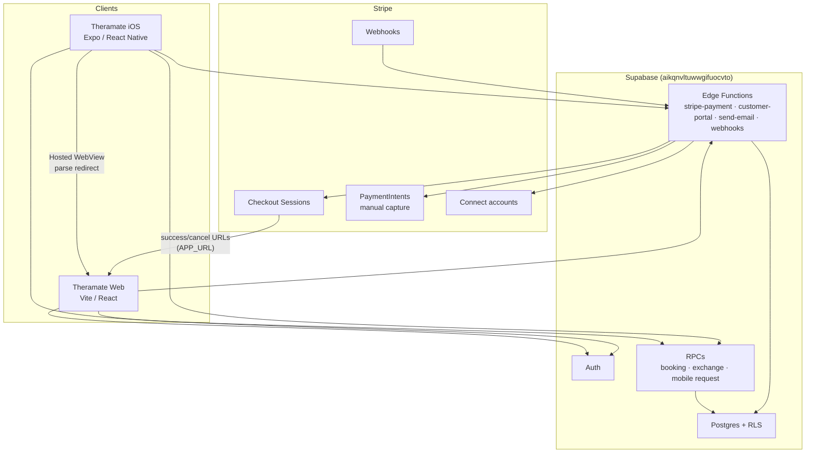
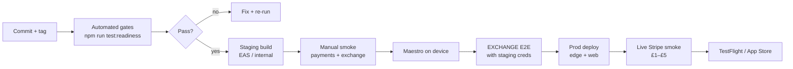
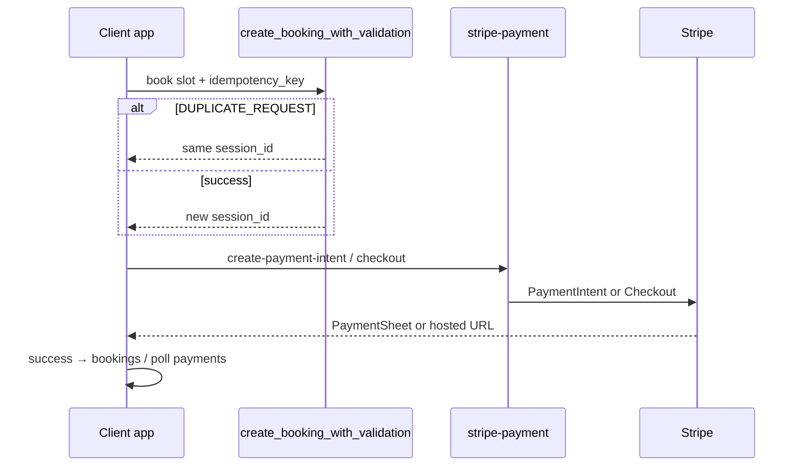
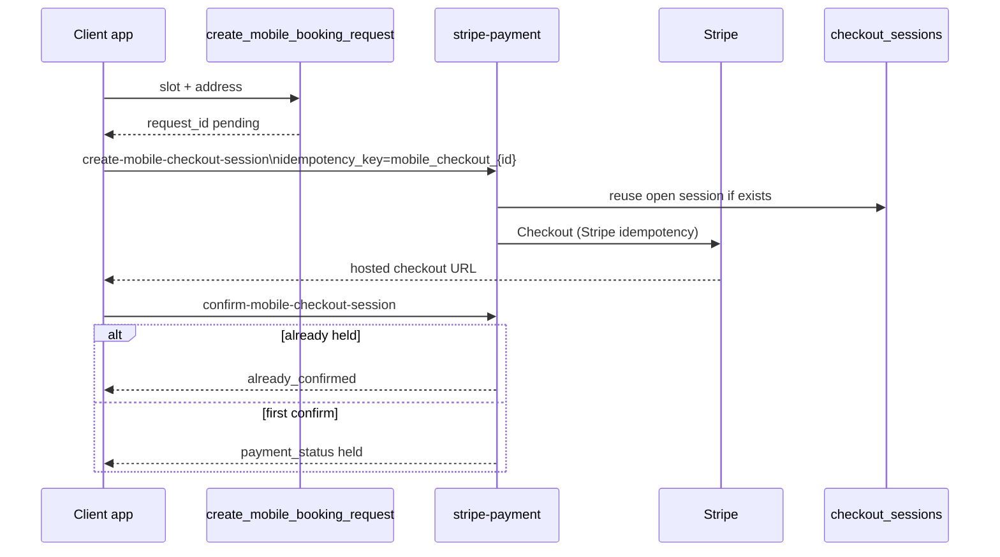
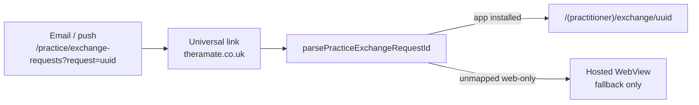
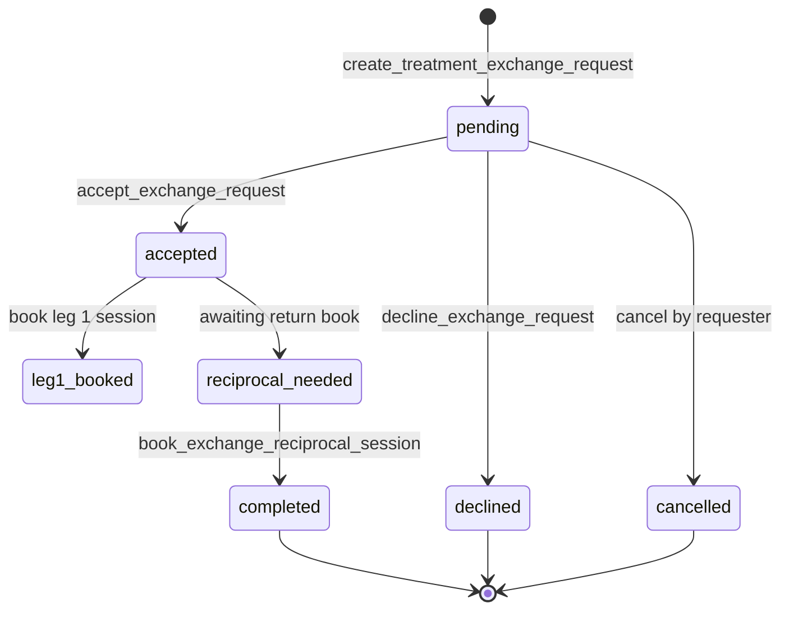

# App release readiness — CTO / PM blueprint

**Date:** 2026-05-26  
**Products:** Theramate iOS (`theramate-ios-client`) + Supabase + web (`src/`)  
**Status:** Core mobile flows + guest booking + platform subscribe + voice SOAP shipped in code; release blocked on W1 QA, exchange E2E, EAS/TestFlight, live Stripe smoke.

---

## 1. Target system architecture

---

## 2. Release gate pipeline (how it should run)

| Gate                | Command                                                                                                | Owner                                   |
| ------------------- | ------------------------------------------------------------------------------------------------------ | --------------------------------------- |
| Mobile types        | `npm run typecheck:mobile`                                                                             | Eng                                     |
| Mobile unit         | `npm run test:mobile`                                                                                  | Eng                                     |
| Exchange dry        | `npm run test:exchange:e2e:dry`                                                                        | Eng (needs `SUPABASE_SERVICE_ROLE_KEY`) |
| Exchange pair check | `npm run verify:exchange:staging`                                                                      | QA (needs `EXCHANGE_*` in `.env`)       |
| Exchange full       | `npm run test:exchange:e2e`                                                                            | QA (after pair verify)                  |
| Maestro exchange    | `npm run test:maestro:exchange`                                                                        | QA (device + Maestro CLI)               |
| Edge deploy         | `npx supabase@2.101.0 functions deploy stripe-payment`                                                 | Eng                                     |
| Manual payment      | [STRIPE_CHECKOUT_MOBILE_PRODUCTION_READINESS.md](STRIPE_CHECKOUT_MOBILE_PRODUCTION_READINESS.md)       | QA                                      |
| Manual exchange     | [TREATMENT_EXCHANGE_MOBILE_PRODUCTION_READINESS.md](TREATMENT_EXCHANGE_MOBILE_PRODUCTION_READINESS.md) | QA                                      |

---

## 3. Client payment journeys (target)

### 3.1 Clinic booking

### 3.2 Mobile visit request

---

## 4. Web link → native (exchange deep link)

Implemented in `lib/webExchangeDeepLink.ts`, `lib/deepLinking.ts`, `lib/notificationWebRouteMap.ts`.

---

## 5. Practitioner treatment exchange (target)

**Mobile surfaces:** Hub inbox (4 queues) · Discover · `[id]` detail · Home card · Notifications → `exchange/[id]`.

---

## 6. Environment contract (must align)

| Variable                             | Where                       | Must match                                    |
| ------------------------------------ | --------------------------- | --------------------------------------------- |
| `APP_URL` / `SITE_URL`               | Supabase edge secrets       | Stripe `success_url` / `cancel_url`           |
| `EXPO_PUBLIC_WEB_URL`                | `theramate-ios-client/.env` | Same origin as `APP_URL` for redirect parsing |
| `EXPO_PUBLIC_CHECKOUT_WEB_ORIGINS`   | Optional comma list         | Aliases (e.g. `.com` + `.co.uk`)              |
| `EXPO_PUBLIC_STRIPE_PUBLISHABLE_KEY` | Mobile                      | Stripe dashboard mode (test/live)             |

---

## 7. Implementation backlog (priority)

| P   | Item                                                                | Track       | Status                                           |
| --- | ------------------------------------------------------------------- | ----------- | ------------------------------------------------ |
| P0  | `npm run test:readiness` aggregator                                 | Eng         | **Done** 2026-05-26                              |
| P0  | Multi-origin checkout redirect parsing                              | Eng         | **Done**                                         |
| P0  | Explore filter sheet (delivery model + sort)                        | Product/Eng | **Done**                                         |
| P1  | `EXCHANGE_*` staging accounts + full E2E                            | QA          | Open                                             |
| P1  | Maestro happy paths on device                                       | QA          | Open                                             |
| P1  | Commit + EAS internal build                                         | Release     | Open                                             |
| P1  | Web `/practice/exchange-requests?request=` → native `exchange/[id]` | Mobile      | **Done** (universal link + notification URL map) |
| P2  | Full web `ExchangeRequests` page in `src/`                          | Web         | Backlog (not in this repo checkout)              |
| P2  | Stripe live + webhooks + live smoke                                 | Ops         | Open                                             |
| P2  | Practitioner platform subscribe (hosted Checkout)                   | Product     | **Done** 2026-05-26 — QA W1-5                    |
| P2  | Guest pay-at-clinic + card WebView                                  | Product     | **Done** 2026-05-26 — QA W1-4/W1-5               |
| P2  | Voice → SOAP transcribe UI                                          | Product     | **Done** 2026-05-26                              |
| P2  | Subscription plan change without portal                             | Product     | Open (portal WebView)                            |
| P2  | Analytics export without WebView                                    | Eng         | Open (W2-4)                                      |

---

## 8. References

- [**APP_RELEASE_BACKLOG_CTO_PM.md**](APP_RELEASE_BACKLOG_CTO_PM.md) — Prioritized waves, sprint board, QA sign-off matrix (2026-05-26)
- [STRIPE_CHECKOUT_MOBILE_PRODUCTION_READINESS.md](STRIPE_CHECKOUT_MOBILE_PRODUCTION_READINESS.md)
- [TREATMENT_EXCHANGE_MOBILE_PRODUCTION_READINESS.md](TREATMENT_EXCHANGE_MOBILE_PRODUCTION_READINESS.md)
- [BOOKING_E2E_PRE_TO_POST_CHECKLIST.md](../testing/BOOKING_E2E_PRE_TO_POST_CHECKLIST.md)
- [PRACTITIONER_MOBILE_REMAINING.md](PRACTITIONER_MOBILE_REMAINING.md)
