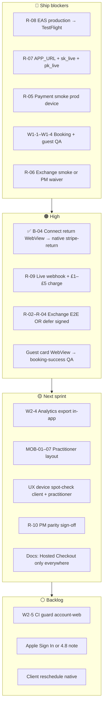
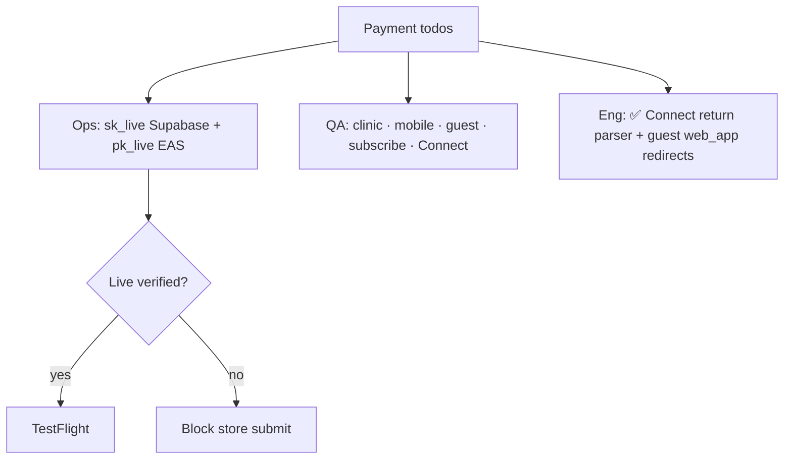
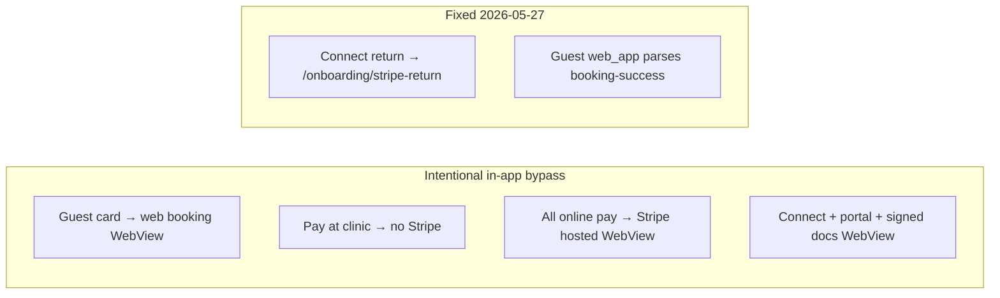
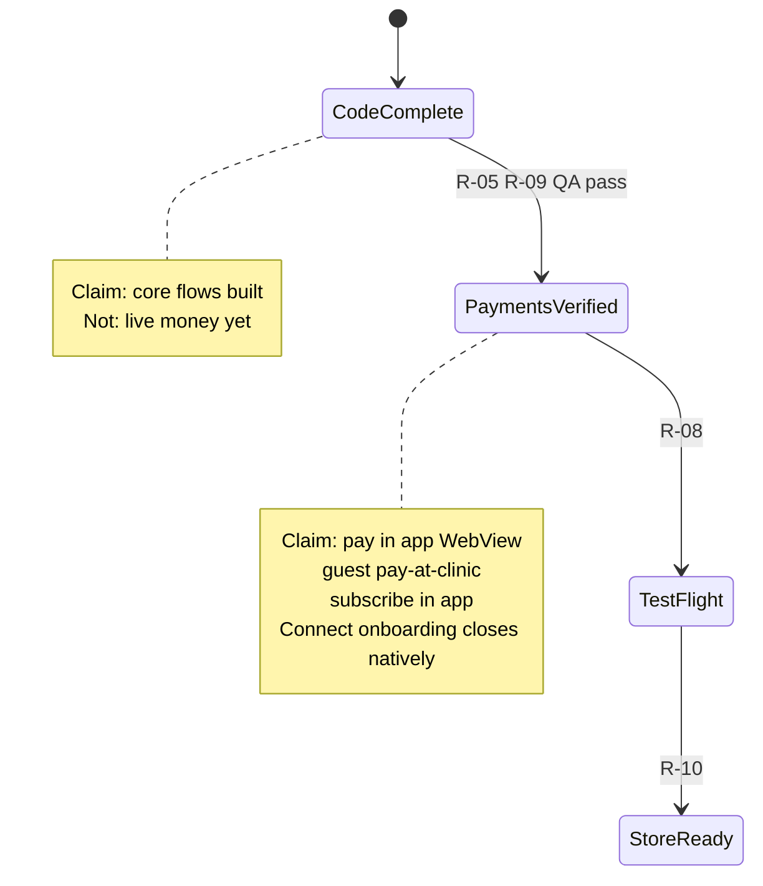

# App release todo — CTO / PM (living)

**Date:** 2026-05-27  
**Audience:** CTO, PM, Eng lead, QA, Ops  
**Related:** [APP_RELEASE_BACKLOG_CTO_PM.md](./APP_RELEASE_BACKLOG_CTO_PM.md) · [WAVE1_QA_RELEASE_SIGNOFF.md](../testing/WAVE1_QA_RELEASE_SIGNOFF.md) · [STRIPE_CHECKOUT_MOBILE_PRODUCTION_READINESS.md](./STRIPE_CHECKOUT_MOBILE_PRODUCTION_READINESS.md)

---

## Executive status

| Area                                | Code              | Ops / QA                                                                                | Store        |
| ----------------------------------- | ----------------- | --------------------------------------------------------------------------------------- | ------------ |
| Core booking + pay (hosted WebView) | ✅                | ☐ prod smoke                                                                            | ☐ TestFlight |
| Guest + platform sub + voice        | ✅                | ☐                                                                                       | ☐            |
| Stripe Connect return in WebView    | ✅ **2026-05-27** | ☐                                                                                       | ☐            |
| Exchange E2E automation             | ☐ creds           | ☐ manual OK?                                                                            | ☐            |
| Live Stripe confirmed               | Web `pk_live`     | ☐ `sk_live` in Supabase (MCP cannot read secrets)                                       | ☐            |
| Prod payment smoke                  | —                 | ☐ 0 payments/7d — [WAVE1_PROD_PAYMENT_SMOKE.md](../testing/WAVE1_PROD_PAYMENT_SMOKE.md) | ☐            |

---

## 1. Master backlog (by owner)

---

## 2. Release gates (tick when done)

| Gate                   | Owner   | Status | Action                                                            |
| ---------------------- | ------- | ------ | ----------------------------------------------------------------- |
| R-01 `test:readiness`  | Eng     | ☑      | Keep CI green (62 tests)                                          |
| R-07 Env alignment     | Ops     | ☐      | `APP_URL`=`https://theramate.co.uk`; `sk_live_*`; EAS `pk_live_*` |
| R-05 Payment smoke     | QA      | ☐      | [W1-5](../testing/WAVE1_QA_RELEASE_SIGNOFF.md) items 1–10         |
| R-06 Exchange smoke    | QA      | ☐      | Or PM documents deferral                                          |
| R-08 EAS / TestFlight  | Release | ☐      | `eas build --platform ios --profile production`                   |
| R-09 Live Stripe       | Ops/QA  | ☐      | Webhook + small charge                                            |
| R-10 PM sign-off       | PM      | ☐      | [parity matrix](./WEB_APP_FEATURE_PARITY.md)                      |
| R-02–R-04 Exchange E2E | QA      | ☐      | `EXCHANGE_*` in `.env`                                            |

---

## 3. Payment & bypass logic todos

| ID     | Item                                                                    | Owner | Pri              |
| ------ | ----------------------------------------------------------------------- | ----- | ---------------- |
| PAY-01 | Supabase `STRIPE_SECRET_KEY` = `sk_live_`                               | Ops   | P0               |
| PAY-02 | EAS `EXPO_PUBLIC_STRIPE_PUBLISHABLE_KEY` = `pk_live_`                   | Ops   | P0               |
| PAY-03 | Connect accounts are **live** mode for paying practitioners             | Ops   | P0               |
| PAY-04 | Prod smoke all W1-5 paths                                               | QA    | P0               |
| PAY-05 | Connect: finish onboarding → lands on **stripe-return** → status screen | QA    | P0               |
| PAY-06 | Guest card: WebView closes to **booking-success** (web_app kind)        | QA    | P1               |
| PAY-07 | Qualification PDFs open in signed WebView (not Safari)                  | Eng   | ☑ **2026-05-27** |
| PAY-08 | Guest WebView Close → `/booking` via `dismissPath`                      | Eng   | ☑ **2026-05-27** |
| PAY-09 | Web `/subscription-success` + Connect return routes wired               | Eng   | ☑ **2026-05-27** |
| PAY-10 | Web platform subscribe + verify-checkout parity                         | Eng   | ☑ **2026-05-27** |
| PAY-11 | Web Connect hosted onboarding CTA                                       | Eng   | ☑ **2026-05-27** |

**Policy (do not regress):** Mobile uses **Hosted Checkout / Connect / Portal in allowlisted WebView** — PaymentSheet SDK is **disabled** (`app.config.js`). Not Safari for money.

---

## 4. Bypass inventory (PM messaging)

| Claim                   | Accurate?                                               |
| ----------------------- | ------------------------------------------------------- |
| “Never opens a browser” | **No** — in-app WebView + OAuth sheet                   |
| “Pay in the app”        | **Yes** — user stays in shell                           |
| “Native booking”        | **Partial** — native steps; pay often web UI in WebView |
| “Identical to web”      | **No** — ~90% client / ~96% practitioner                |

---

## 5. This week sprint (copy to Jira/Linear)

| Key       | Title                                | Owner   | P        |
| --------- | ------------------------------------ | ------- | -------- |
| TM-OPS-01 | Verify live Stripe secrets + APP_URL | Ops     | P0       |
| TM-OPS-02 | EAS production env `pk_live`         | Ops     | P0       |
| TM-QA-01  | Prod payment smoke W1-5              | QA      | P0       |
| TM-QA-02  | Guest paths W1-4                     | QA      | P0       |
| TM-QA-03  | Connect return E2E on device         | QA      | P0       |
| TM-REL-01 | TestFlight build                     | Release | P0       |
| TM-ENG-01 | ~~Connect WebView return parser~~    | Eng     | **Done** |
| TM-QA-04  | Layout spot-check SE + large         | QA      | P1       |
| TM-PM-01  | R-10 sign-off + messaging matrix     | PM      | P1       |

---

## 6. Safe to claim (state machine)

---

## 7. Wave 2 (post–TestFlight)

- W2-4 Analytics export without report WebView
- MOB-01–07 Practitioner phone layout ([remediation plan](./PRACTITIONER_MOBILE_VIEW_REMEDIATION_PLAN.md))
- W2-5 CI guard: no new `account-web` routes
- Client reschedule in-app (optional)
- Apple Sign In vs Guideline 4.8 (product/legal)

---

## Changelog

| Date       | Change                                                                  |
| ---------- | ----------------------------------------------------------------------- |
| 2026-05-27 | Created; B-04 Connect return + guest `web_app` redirect parsing shipped |
