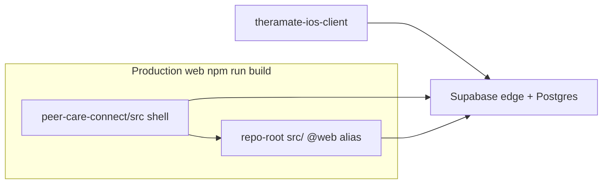
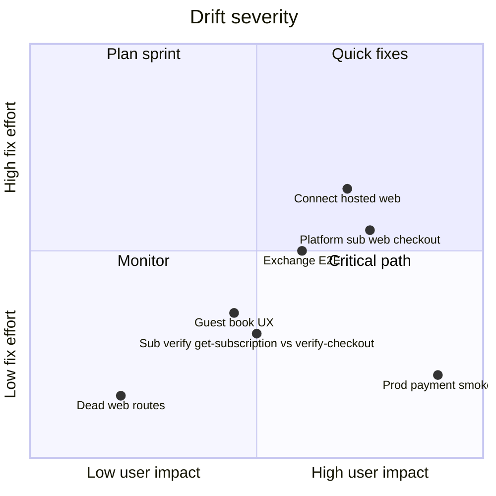

# App / web / backend drift audit

**Date:** 2026-05-27  
**Repos:** `theramate-ios-client` · `peer-care-connect` + `src/` (@web) · Supabase `aikqnvltuwwgifuocvto`

---

## Verdict

| Layer                                                                             | Status                                                                                           |
| --------------------------------------------------------------------------------- | ------------------------------------------------------------------------------------------------ |
| **Shared libs** (booking-flow-type, guestBooking slug, practitionerExchange RPCs) | **Aligned**                                                                                      |
| **Edge `stripe-payment` success URLs**                                            | **Aligned** with mobile WebView redirects                                                        |
| **Production web routes**                                                         | **Was drifted** — fixed 2026-05-27 (see below)                                                   |
| **Platform subscribe UX**                                                         | **Drift** — mobile can start checkout; web pricing is portal-only                                |
| **Connect onboarding UX**                                                         | **Mostly aligned** — hosted Account Links on web + mobile; legacy embedded form remains on web   |
| **Realtime**                                                                      | **Partial** — DB publications OK; mobile diary/messages; web messaging only in `@web`            |
| **Prod payment proof**                                                            | **Open** — run `npm run test:payment-smoke:check` + device script in WAVE1_PROD_PAYMENT_SMOKE.md |

**Not “all done”** — backend + mobile logic are close; web had **dead routes** and product gaps remain.

---

## Architecture (how web is built)



---

## Critical drift fixed (2026-05-27)

Edge + mobile redirect to URLs that **existed as pages but were not routed**:

| URL                         | Page file                                                 | Issue                                | Fix         |
| --------------------------- | --------------------------------------------------------- | ------------------------------------ | ----------- |
| `/subscription-success`     | `peer-care-connect/src/pages/SubscriptionSuccess.tsx`     | Not in `AppContent` routes → **404** | Route added |
| `/onboarding/stripe-return` | `peer-care-connect/src/pages/onboarding/StripeReturn.tsx` | Not routed → **404**                 | Route added |
| `/stripe-return`            | Same component                                            | Mobile parser allows alias           | Route added |

**Impact:** Practitioner platform checkout or Connect return hitting the **browser** (not app WebView) would have landed on 404. Mobile WebView intercept still worked.

---

## Parity shipped (2026-05-27, second pass)

| Item               | Change                                                                                     |
| ------------------ | ------------------------------------------------------------------------------------------ |
| Web routes         | `/subscription-success`, `/onboarding/stripe-return`, `/stripe-return` in `AppContent.tsx` |
| Platform subscribe | `src/lib/platformSubscriptionCheckout.ts` + Subscribe on `PricingPage.tsx`                 |
| Sub verify         | `SubscriptionSuccess.tsx` calls `verify-checkout` then polls `get-subscription`            |
| Connect hosted     | `src/lib/stripeConnectHosted.ts` + **Continue with Stripe** on `ConnectAccountSetup.tsx`   |

---

## Remaining drifts (ranked)



| #   | Area                    | Mobile                                         | Web                                                 | Risk                                           |
| --- | ----------------------- | ---------------------------------------------- | --------------------------------------------------- | ---------------------------------------------- |
| 1   | **Platform subscribe**  | ☑ Same checkout action                         | ☑ Subscribe on `/pricing`                           | **Aligned** — deploy web build                 |
| 2   | **Subscription verify** | `verify-checkout` + poll fallback              | ☑ verify then `get-subscription` poll               | **Aligned**                                    |
| 3   | **Connect onboarding**  | Hosted Account Links + `HOSTED_CHECKOUT_PATHS` | ☑ Hosted CTA + legacy form below                    | **Aligned** on return paths — QA both UX paths |
| 4   | **Guest `/book/:slug`** | Guest + signed-in choice on native             | ☑ `DirectBooking` guest + sign-in CTAs (2026-06-04) | **Aligned**                                    |
| 5   | **Guest card checkout** | Opens web in WebView (`guestBookingWeb.ts`)    | Full flow on web                                    | Intentional; keep success URLs aligned         |
| 6   | **Env**                 | `EXPO_PUBLIC_WEB_URL`                          | Stripe returns use Supabase `APP_URL`               | Must match (documented in `.env.example`)      |
| 7   | **Realtime tables**     | Diary, messages, notifications hooks           | Messaging realtime in `@web`; shell may differ      | Slot/booking freshness — test hybrid cancel    |
| 8   | **Prod charges**        | —                                              | 0 `payments` / `checkout_sessions` (7d)             | No live proof                                  |

---

## Aligned (low drift)

- `booking-flow-type.ts` / `canBookClinic` / `canRequestMobile`
- `fetchPublicTherapistBySlugOrId` (slug → `booking_slug`)
- `practitionerExchange.ts` RPCs + “Request different time” copy
- `/booking-success`, `/mobile-booking/success` pages + edge `success_url`
- `ensure_guest_user_for_booking` (web inline, mobile `guestUser.ts`)
- Supabase realtime publication: `client_sessions`, `notifications`, `subscriptions`, `calendar_events`, `practitioner_availability`

---

## Realtime checklist

| Surface              | Mobile                         | Web                       | DB realtime                                                       |
| -------------------- | ------------------------------ | ------------------------- | ----------------------------------------------------------------- |
| Messages             | `messages/[id].tsx` channel    | `MessagingInterface.tsx`  | —                                                                 |
| Practitioner diary   | `usePractitionerDiaryRealtime` | Confirm `BookingCalendar` | `client_sessions`, `calendar_events`, `practitioner_availability` |
| Notifications        | hooks / invalidation           | Notifications page        | `notifications`                                                   |
| Booking availability | 25s poll + diary               | Web booking flows         | `practitioner_availability`                                       |

**QA:** [REALTIME_CROSS_SURFACE_QA.md](../testing/REALTIME_CROSS_SURFACE_QA.md) — R1–R5 manual matrix.

**Checkout URLs:** `HOSTED_CHECKOUT_PATHS` synced across web, mobile, and `supabase/functions/_shared/hosted-checkout-paths.ts` (enforced by `npm run check:platform-drift`).

---

## Ops snapshot (Supabase MCP)

- Project: **ACTIVE_HEALTHY** (eu-west-2)
- `stripe-payment` v132, `verify-checkout` v1, `stripe-webhook` v99
- Subscriptions: 7 active, 1 past_due
- Connect accounts: 9
- Payments (7d): **0**

---

## Automated drift check

```bash
npm run check:platform-drift
```

Compares normalized logic in `booking-flow-type`, `guestBooking`, `platformSubscriptionCheckout`, `hostedCheckoutPaths`, Connect hosted return paths (`stripeConnectHosted` / mobile `stripeConnect` + `openConnectHostedOnboarding`), and RPC names in `practitionerExchange`. Runs in `pre-deploy` and `test:readiness`.

## Next actions

| Owner | Action                                                                                 |
| ----- | -------------------------------------------------------------------------------------- |
| Eng   | Deploy web build (pricing subscribe + Connect hosted + success routes + `/book/:slug`) |
| QA    | [WAVE1_PROD_PAYMENT_SMOKE.md](../testing/WAVE1_PROD_PAYMENT_SMOKE.md) on prod build    |
| Ops   | Confirm `APP_URL` + `sk_live_*` in Supabase secrets                                    |

---

**Related:** [APP_RELEASE_TODO_CTO_PM.md](./APP_RELEASE_TODO_CTO_PM.md) · [STRIPE_HOSTED_CHECKOUT_ONLY.md](./STRIPE_HOSTED_CHECKOUT_ONLY.md)
