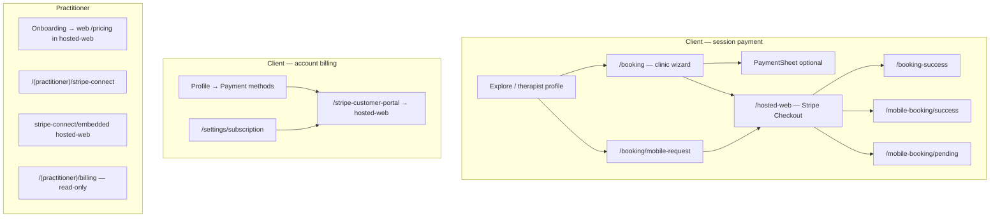
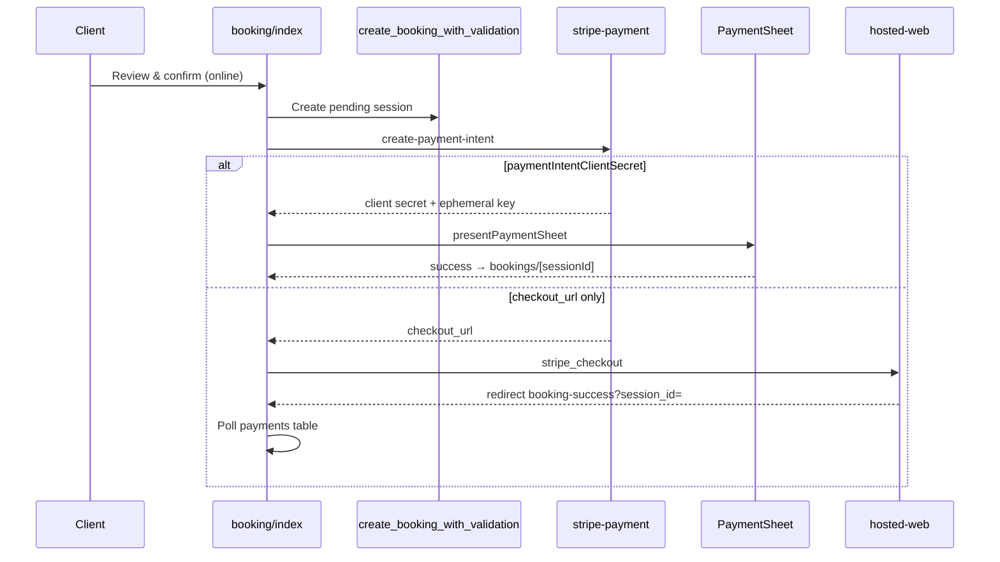
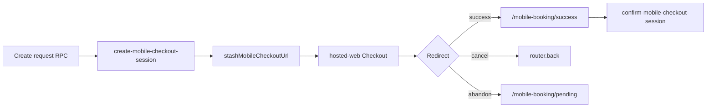
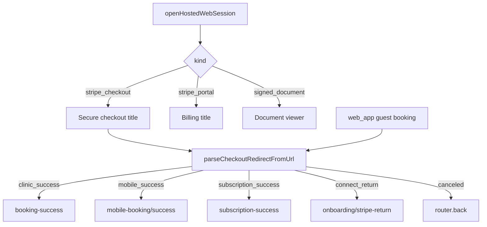

# Stripe Checkout — Mobile Screen Flows (CTO / PM)

**Date:** 2026-05-21  
**Scope:** `theramate-ios-client` — client payments, billing portal, practitioner Connect  
**Readiness index:** [`STRIPE_CHECKOUT_MOBILE_PRODUCTION_READINESS.md`](STRIPE_CHECKOUT_MOBILE_PRODUCTION_READINESS.md)

---

## 1. Master navigation



---

## 2. Clinic booking — `/booking`



| Step              | Payment method      | Return path                                                                  |
| ----------------- | ------------------- | ---------------------------------------------------------------------------- |
| Online + secrets  | Native PaymentSheet | `theramate://booking-success` → **bookings detail** (not `/booking-success`) |
| Online + URL only | Hosted Checkout     | WebView → `/booking-success` → poll `payments`                               |
| In person         | No Stripe           | Alert → bookings detail                                                      |

**Env:** `EXPO_PUBLIC_STRIPE_PUBLISHABLE_KEY` required for PaymentSheet (`StripeProvider` in `_layout.tsx`).

---

## 3. Mobile visit request — `/booking/mobile-request`



**Always hosted Checkout** — no PaymentSheet on mobile visit path.

**Retry:** Profile → mobile request detail → **Complete payment** (`resumeMobileRequestCheckout`) or pending screen **Reopen checkout** (uses stashed URL).

---

## 4. Hosted WebView — `/hosted-web`



Allowlist: `lib/hostedWebViewAllowlist.ts` — Stripe hosts + `APP_CONFIG.WEB_URL`.

---

## 5. Customer portal & platform subscription

| Screen                    | Flow                                                                                                 |
| ------------------------- | ---------------------------------------------------------------------------------------------------- |
| `/settings/subscription`  | Read `subscriptions`; manage → customer portal WebView                                               |
| `/pricing`                | `create-platform-subscription-checkout` → hosted Checkout → return                                   |
| `/subscription-success`   | `verify-checkout` then → `/settings/subscription` (`hostedWebViewRedirects`: `subscription_success`) |
| `/stripe-customer-portal` | `customer-portal` edge fn → hosted-web                                                               |
| Practitioner onboarding   | **Subscribe** → same checkout as `/pricing` (not website-only)                                       |

---

## 6. Practitioner Stripe Connect

```mermaid
flowchart LR
  IDX[stripe-connect/index] --> CREATE[create-connect-account]
  CREATE --> LINK[create-connect-hosted-onboarding-link]
  LINK --> WV[hosted-web]
  WV --> RET[/onboarding/stripe-return native]
  RET --> STATUS[stripe-connect status refresh]
```

Client session payments use practitioner's Connect account via `stripe-payment` backend (destination charges).

---

## 7. Deep links

| URL pattern                                                               | App route                   |
| ------------------------------------------------------------------------- | --------------------------- |
| `…/booking-success?session_id=`                                           | `/booking-success`          |
| `…/mobile-booking/success?mobile_request_id=&mobile_checkout_session_id=` | `/mobile-booking/success`   |
| `…/mobile-booking/pending?…`                                              | `/mobile-booking/pending`   |
| `theramate://booking-success`                                             | Same (via `deepLinking.ts`) |

---

## 8. Readiness gaps (tracked)

| ID  | Severity | Issue                                                       | Status                                       |
| --- | -------- | ----------------------------------------------------------- | -------------------------------------------- |
| S1  | P0       | Pending screen Reopen disabled when only stashed URL exists | **Fixed**                                    |
| S2  | P1       | No retry payment on mobile request detail                   | **Fixed** — Complete payment                 |
| S3  | P2       | PaymentSheet success skips `/booking-success` poll          | Documented — session row updated server-side |
| S4  | P2       | No native practitioner subscription purchase                | Web `/pricing` only                          |
| S5  | P2       | Guest cannot pay in app                                     | By design — sign in required                 |
| S6  | P3       | No Maestro / Jest E2E for live Stripe                       | Unit tests for redirect parser only          |
| S7  | P3       | Clinic success passive DB poll vs mobile confirm RPC        | Asymmetric by design                         |

---

## 9. QA checklist

- [ ] `EXPO_PUBLIC_STRIPE_PUBLISHABLE_KEY` set — clinic PaymentSheet appears
- [ ] Clinic hosted Checkout → lands on booking-success with session link
- [ ] Mobile request Checkout → success confirms via edge fn
- [ ] Cancel checkout → returns to previous screen
- [ ] Pending → Reopen checkout works without `checkoutUrl` param
- [ ] Mobile request detail → Complete payment opens Checkout
- [ ] Customer portal opens in-app (not Safari)
- [ ] Practitioner Connect embedded completes
