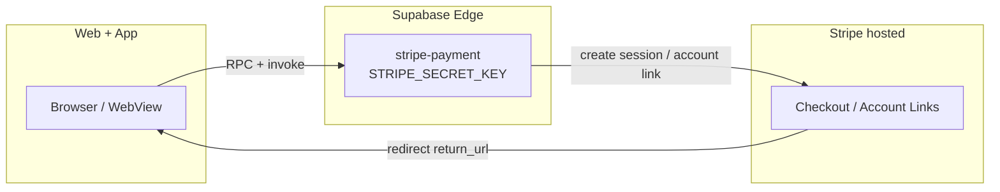

# Stripe hosted Checkout only (no publishable key in clients)

**Last updated:** 2026-05-25  
**Policy:** All card payments and Connect onboarding use **Stripe-hosted pages** + **Supabase Edge Functions** (`stripe-payment`). Clients never load `sk_*` and do not require `pk_*` / `EXPO_PUBLIC_STRIPE_PUBLISHABLE_KEY`.

**Deployed:** `stripe-payment` v131 on project `aikqnvltuwwgifuocvto` (includes `create-connect-hosted-onboarding-link`).

---

## Architecture



---

## Flows

| Flow                     | Client                               | Edge action                             | Return URL                  |
| ------------------------ | ------------------------------------ | --------------------------------------- | --------------------------- |
| Clinic book (web)        | `BookingFlow` → redirect             | `create-checkout-session`               | `/booking-success`          |
| Clinic book (app)        | `openHostedWebSession`               | same                                    | `/booking-success`          |
| Mobile request           | `createMobileRequestAndOpenCheckout` | `create-mobile-checkout-session`        | `/mobile-booking/success`   |
| Connect onboarding (app) | `openConnectHostedOnboarding`        | `create-connect-hosted-onboarding-link` | `/onboarding/stripe-return` |

---

## Environment variables

| Variable                             | Where                 | Required?                |
| ------------------------------------ | --------------------- | ------------------------ |
| `STRIPE_SECRET_KEY`                  | Supabase Edge secrets | Yes                      |
| `STRIPE_WEBHOOK_SECRET`              | Supabase Edge secrets | Yes                      |
| `APP_URL` / `SITE_URL`               | Supabase Edge secrets | Yes (return URLs)        |
| `VITE_STRIPE_PUBLISHABLE_KEY`        | Vercel                | **No** (hosted-only web) |
| `EXPO_PUBLIC_STRIPE_PUBLISHABLE_KEY` | Expo                  | **No** (hosted-only app) |

**Never:** `VITE_STRIPE_SECRET_KEY`, `VITE_STRIPE_WEBHOOK_SECRET` (build fails via `scripts/stripe-env-guard.mjs`).

---

## Deploy checklist

1. Remove `VITE_STRIPE_*` secret keys from Vercel; keep only Supabase anon + URL if needed.
2. Set `STRIPE_SECRET_KEY` in Supabase → Edge Functions → Secrets.
3. Deploy `stripe-payment` (includes `create-connect-hosted-onboarding-link`):

   ```bash
   npm run deploy:stripe-payment
   ```

   Uses `npx supabase@2.101.0` — **no Docker** required (remote bundle upload).

4. Rebuild native app after removing `@stripe/stripe-react-native` Expo plugin from `app.config.js`.

---

## Rollback (PaymentSheet)

To restore native PaymentSheet on clinic booking:

1. Re-add `@stripe/stripe-react-native` plugin in `app.config.js`.
2. Wrap root layout in `StripeProvider` with `EXPO_PUBLIC_STRIPE_PUBLISHABLE_KEY`.
3. Restore PaymentSheet branch in `theramate-ios-client/app/booking/index.tsx`.

Mobile and web hosted paths remain the safe default.
