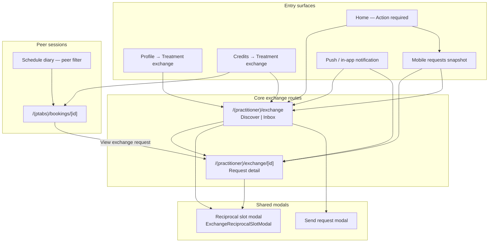
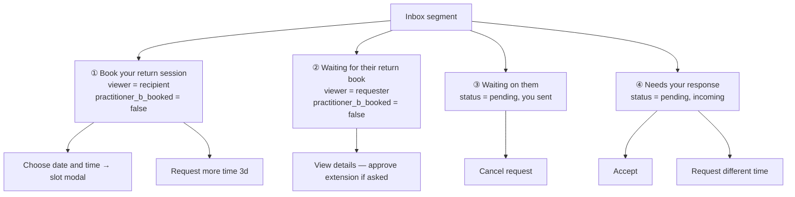
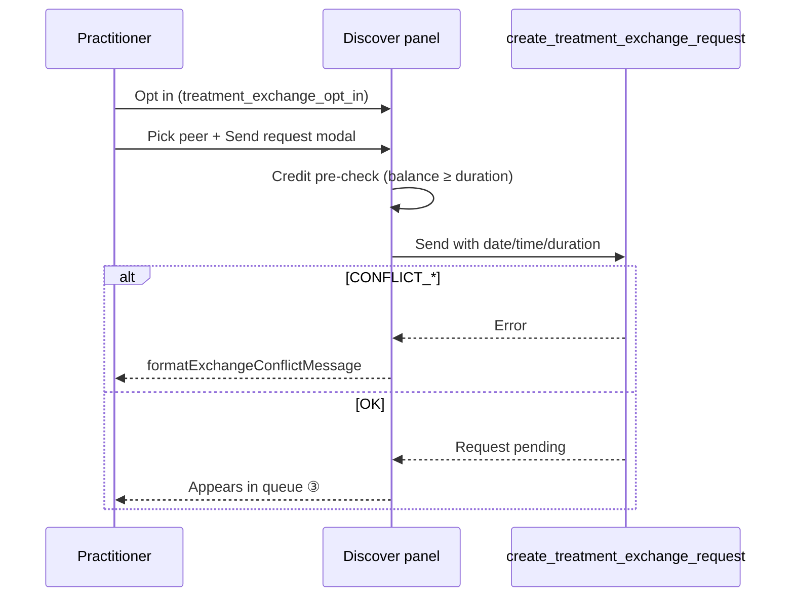
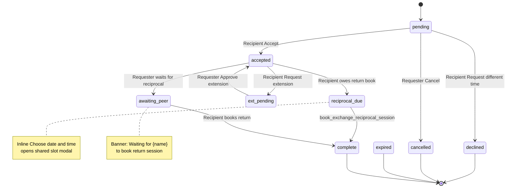
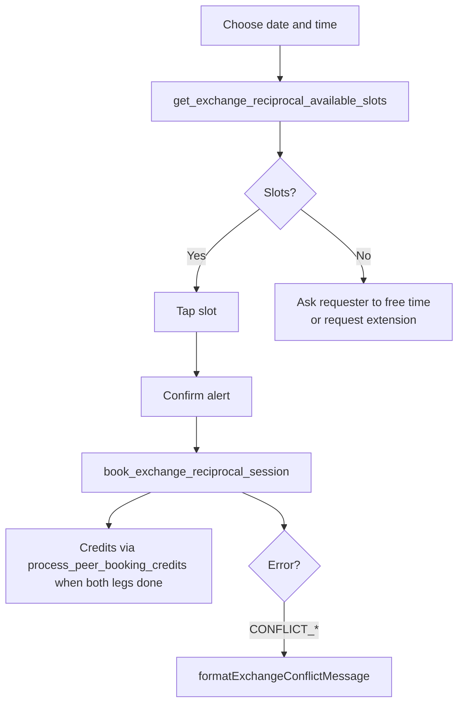
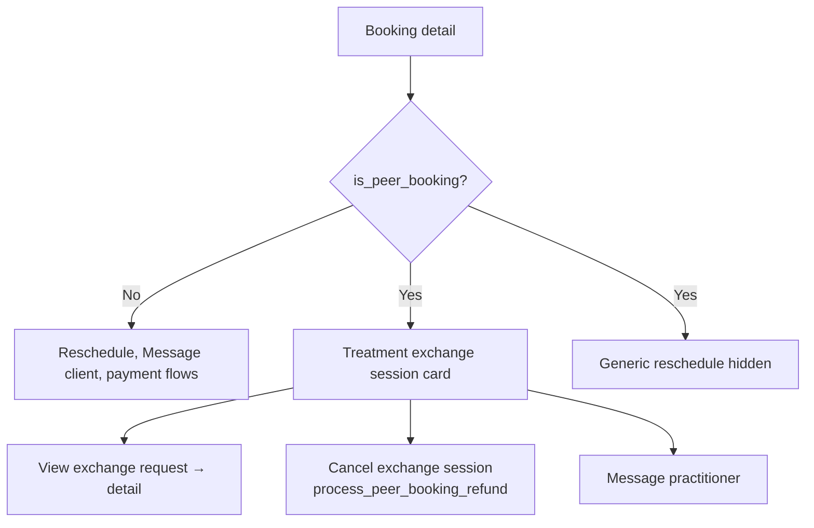
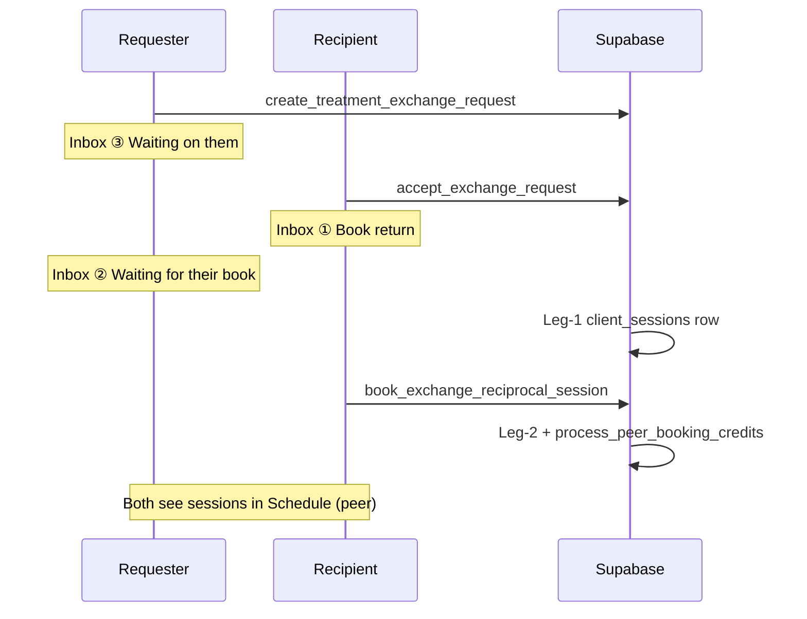

# Treatment Exchange — Mobile Screen Flows (CTO / PM)

**Date:** 2026-05-21  
**Scope:** Native practitioner app (`theramate-ios-client`)  
**Status:** Screen-readiness remediation applied — use these diagrams as the source of truth for QA, Maestro, and web parity.

**Companion (backend + cross-platform):** [`docs/features/how-treatment-exchange-works.md`](../features/how-treatment-exchange-works.md) — golden state machine and RPC sequences aligned with prod; this file is the **mobile screen** layer on top.

---

## 1. Master navigation

---

## 2. Inbox queue model (corrected)

Four **active** queues — no terminal history list (detail-by-ID / notifications only).

| Queue                             | API                                                   | Primary actions                |
| --------------------------------- | ----------------------------------------------------- | ------------------------------ |
| ① Return book (recipient)         | `fetchAcceptedExchangesNeedingReciprocal`             | Slot modal, extension          |
| ② Awaiting their book (requester) | `fetchAcceptedExchangesAwaitingReciprocalByRequester` | View detail, approve extension |
| ③ Outgoing pending                | `fetchPendingExchangeRequestsSentByRequester`         | Cancel                         |
| ④ Incoming pending                | `fetchPendingExchangeRequestsForRecipient`            | Accept, Request different time |

---

## 3. Discover + send

**Copy rule:** Recipient action is always **“Request different time”** (RPC `decline_exchange_request`) — never “Decline”.

---

## 4. Request detail — state machine

| Status                   | Recipient                      | Requester                         |
| ------------------------ | ------------------------------ | --------------------------------- |
| `pending`                | Accept, Request different time | Cancel request                    |
| `accepted` + owes return | Choose date and time (modal)   | Waiting banner; approve extension |
| `declined`               | —                              | Read availability note            |
| Terminal                 | Back to list                   | Back to list                      |

**Timestamp copy:** Footer uses **“Different time requested”** (not “Declined”).

---

## 5. Reciprocal slot modal (shared component)

Used from **Inbox queue ①** and **Request detail** (recipient).

**Maestro:** `testID="exchange-choose-reciprocal"` or text **“Choose date and time”** — not “Book return”.

---

## 6. Peer session booking detail

**Logic guard:** Peer sessions must **not** use diary reschedule — exchange state machine owns slot changes.

---

## 7. End-to-end happy path

---

## 8. Remediation log (2026-05-21)

| ID    | Fix                                                                  |
| ----- | -------------------------------------------------------------------- |
| L2    | Inbox queue ② + requester detail banner                              |
| L3    | Inline reciprocal slot modal on detail                               |
| L4    | Hide generic reschedule on peer booking detail                       |
| L5    | View exchange request link from peer session                         |
| C1    | “Decline” → “Request different time” copy sweep                      |
| C2    | Detail timestamp “Different time requested”                          |
| C3    | Maestro taps `exchange-choose-reciprocal`                            |
| C4/C5 | Message practitioner; no client reschedule copy on peer              |
| C6    | Detail reschedule uses `formatExchangeConflictMessage`               |
| L2b   | Home dashboard extension-pending + accept invalidates awaiting cache |

**Still open (not in this PR):** terminal history inbox, web parity, deep-link routes, notification “Client” label rules (Gap 6).

---

## 9. QA checklist

- [ ] Requester sees queue ② after recipient accepts
- [ ] Recipient books return from hub **or** detail (same modal)
- [ ] Peer booking detail: no reschedule; link to exchange request works
- [ ] Copy never says “Decline” on mobile exchange surfaces
- [ ] Maestro recipient flow passes with `exchange-choose-reciprocal`
- [ ] `npm run typecheck:mobile` passes
