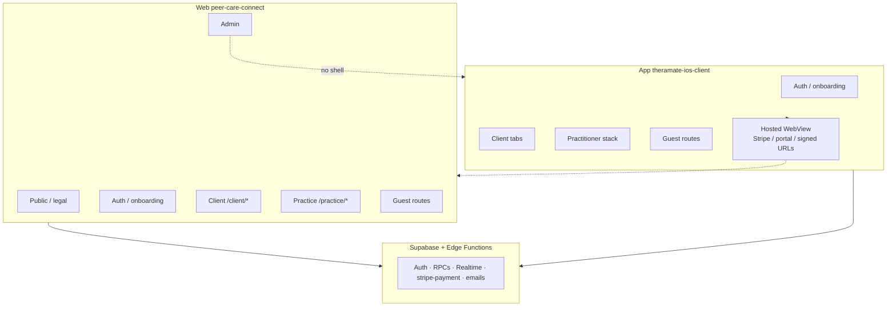
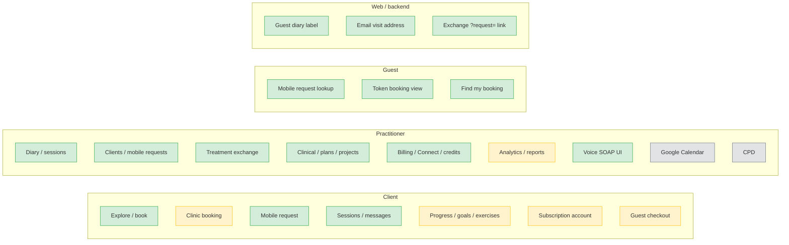
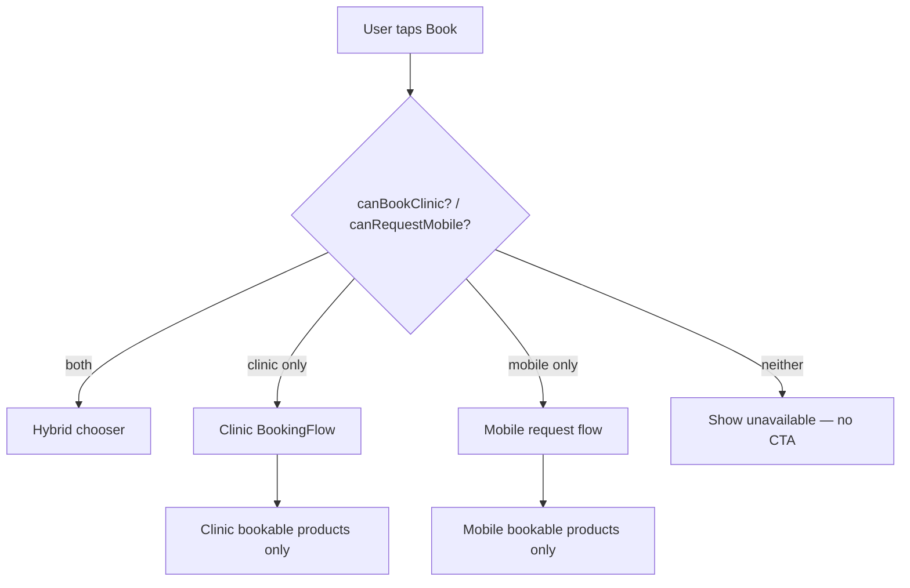
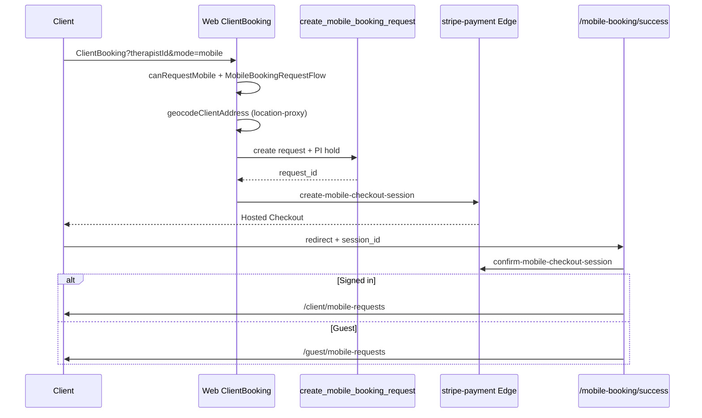
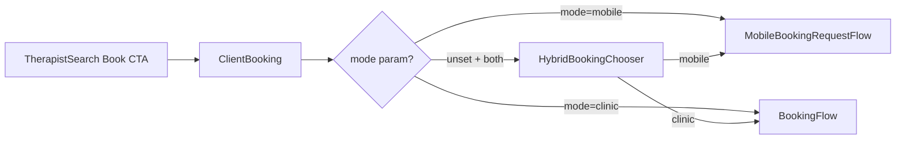
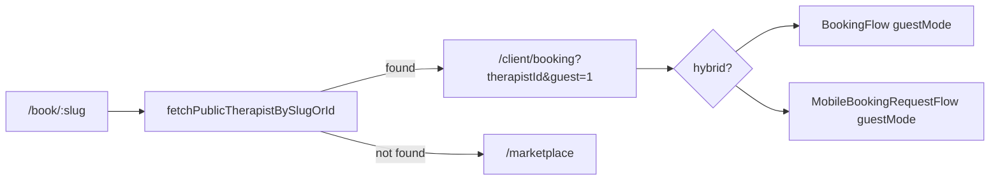

# Web ↔ App feature parity (CTO / PM)

**Last updated:** 2026-05-26 (guest booking, platform sub checkout, voice SOAP, `stripe-payment` deploy)  
**Web (canonical):** repo-root `src/` + Vite shell `peer-care-connect/` — routes in `peer-care-connect/src/components/AppContent.tsx`  
**App:** `theramate-ios-client/` — Expo Router under `app/`  
**Backend:** `supabase/` — shared RPCs, RLS, Edge Functions

---

## Executive summary

| Persona            | Parity    | Ship stance                                                                                |
| ------------------ | --------- | ------------------------------------------------------------------------------------------ |
| Practitioner       | ~96%      | Full practice hub + pricing/billing portal on web                                          |
| Admin              | ~85%      | Verification queue on web; analytics/monitoring still light                                |
| Client (signed-in) | ~90%      | Dashboard, sessions list, booking, mobile requests                                         |
| Guest              | ~82%      | `/book/:slug`, pay-at-clinic `guest=1`, card via in-app WebView; find/view; mobile success |
| Admin              | 0% on app | Web-only by design                                                                         |

**Marketing:** Do not claim “identical experience” until P0 items below are closed and QA-signed.

---

## Status legend

| Symbol | Meaning                                   |
| ------ | ----------------------------------------- |
| ✅     | Parity — same capability + shared backend |
| 🟡     | Partial — UI or behavior differs          |
| 🔴     | Build — required on app (or both)         |
| 🔵     | Fix — web/backend gap                     |
| ⚪     | Out of scope for app v1                   |

---

## Diagram — product surfaces

---

## Diagram — parity by domain

---

## Diagram — booking decision (P0 logic)

Web and app must both use `booking-flow-type` (`canBookClinic`, `canRequestMobile`, product `service_type`, radius, base coords).

---

## Diagram — web mobile checkout (P0-R4)

Stripe hosted Checkout return URL is `/mobile-booking/success` (public route in `peer-care-connect/src/lib/auth-routes.ts`). Registered in `peer-care-connect/src/components/AppContent.tsx`.

---

## Diagram — hybrid chooser (web)

---

## Diagram — direct book link (web)

---

## Build backlog (prioritized)

### P0 — Booking rules & trust (Sprint 1)

| ID   | Item                                                                                | Owner          | Status                                                                        |
| ---- | ----------------------------------------------------------------------------------- | -------------- | ----------------------------------------------------------------------------- |
| P0-1 | Port `booking-flow-type` to app; wire explore, choose-mode, booking, mobile-request | App            | **Done (2026-05-25)**                                                         |
| P0-2 | Extend marketplace practitioner payload (products, radius, coords)                  | App            | **Done (2026-05-25)**                                                         |
| P0-3 | Web diary: label guests via `is_guest_booking`                                      | Web            | **Done (2026-05-25)** — `BookingCalendar.tsx`, `MyBookings.tsx`               |
| P0-4 | Guest accepted mobile → session view (token or guest-safe route)                    | App + Web + DB | **Done (2026-05-25)** — applied remote `guest_mobile_session_view_parity`     |
| P0-5 | Client RPC + backfill guest mobile session tokens                                   | DB             | **Done (2026-05-25)** — `20260525130000_*`, `20260525131000_*` applied remote |

### P1 — Revenue & support (Sprint 2)

| ID   | Item                                                                           | Owner          | Status                                                                                                                           |
| ---- | ------------------------------------------------------------------------------ | -------------- | -------------------------------------------------------------------------------------------------------------------------------- |
| P1-1 | `sessionLocation` in confirmation emails for mobile visits                     | Web/backend    | **Done (2026-05-25)** — `mobile_accept` in `send-booking-notification` + `queue_mobile_accept_confirmation_emails` on accept RPC |
| P1-2 | Show `expires_at` on mobile request UIs                                        | App            | **Done (2026-05-25)** — guest + signed-in list/detail                                                                            |
| P1-3 | Web `/practice/exchange-requests?request=` deep link                           | Web            | **Done** — `ExchangeRequests.tsx`                                                                                                |
| P1-4 | Mobile success: guest path to track request without sign-in                    | App            | **Done (2026-05-25)** — `mobile-booking/success` → `guest/mobile-requests`                                                       |
| P1-5 | Signed-in client mobile requests via `get_client_mobile_requests` + token view | App + Web + DB | **Done (2026-05-25)**                                                                                                            |

### P0 revenue / trust (Sprint 2b — 2026-05-25)

| ID     | Item                                                      | Owner      | Status                                                                            |
| ------ | --------------------------------------------------------- | ---------- | --------------------------------------------------------------------------------- |
| P0-R1  | Stripe **capture** before `accept_mobile_booking_request` | App        | **Done** — `practitionerMobileRequests.ts`                                        |
| P0-R2  | Stripe **release** before decline when PI held            | App        | **Done**                                                                          |
| P0-R3  | Guest find booking: RPC + tokenized `booking/view`        | App + DB   | **Done** — `get_guest_sessions_by_email`                                          |
| P0-R4  | Web discovery CTAs use `booking-flow-type`                | Web `src/` | **Done** — `TherapistSearch` + marketplace payload                                |
| P0-R4b | `ClientBooking?mode=mobile` + `MobileBookingRequestFlow`  | Web `src/` | **Done (2026-05-25)** — `HybridBookingChooser`, `geocodeClientAddress`, guest RPC |
| P0-R4c | `/mobile-booking/success` + confirm checkout              | Web `src/` | **Done** — `MobileBookingSuccess.tsx`; route in `AppContent.tsx`                  |

### P1 — Guest + comms (Sprint 4 — 2026-05-26)

| ID    | Item                                                                                      | Owner                | Status                                                                                                                                    |
| ----- | ----------------------------------------------------------------------------------------- | -------------------- | ----------------------------------------------------------------------------------------------------------------------------------------- |
| P1-6  | Web `/booking/find` + `/booking/view/:id` (RPC parity)                                    | Web `src/`           | **Done** — `FindBooking.tsx`, `GuestBookingView.tsx`, `src/lib/guestBooking.ts`                                                           |
| P1-7  | Resend on mobile **decline** (pg_net → `send-booking-notification`)                       | DB + Edge            | **Done** — `20260526120000_*` applied remote; `emailType: mobile_decline`                                                                 |
| P1-8  | Hosted Stripe only (no `pk_*` in clients)                                                 | App + Web            | **Done** — see [STRIPE_HOSTED_CHECKOUT_ONLY.md](./STRIPE_HOSTED_CHECKOUT_ONLY.md)                                                         |
| P1-9  | Web `/book/:slug` + `/therapist/:id/public` + `/booking-success`                          | Web `src/`           | **Done** — `DirectBooking.tsx`, `PublicTherapistProfile.tsx`, `BookingSuccess.tsx`; `fetchPublicTherapistBySlugOrId` in `guestBooking.ts` |
| P1-10 | Web router shell (`AppContent`, `main.tsx`, public routes)                                | `peer-care-connect/` | **Done** — `src/components/AppContent.tsx`                                                                                                |
| P1-11 | Auth boot modules + Supabase client in shell                                              | `peer-care-connect/` | **Done** — `auth-profile-cache`, `auth-bootstrap`, `auth-error-handler`, `integrations/supabase/client`, `SubscriptionContext`            |
| P1-12 | Protected routes for shipped `src/pages` (messages, analytics, payments, practice subset) | `peer-care-connect/` | **Done** — `AppRoute` + placeholders for dashboards/exchange until full deploy tree                                                       |
| P1-13 | Web practitioner `/practice/mobile-requests` (accept/decline + Stripe)                    | Web `src/`           | **Done** — `PractitionerMobileRequestsInbox.tsx`, `practitionerMobileRequests.ts`                                                         |
| P1-14 | `notification-system` + currency display fixes                                            | Web `src/`           | **Done** — edge invoke for `mobile_expired`; `formatCurrencyFromPence`                                                                    |
| P1-15 | Web `/practice/exchange-requests` + reciprocal book                                       | Web `src/`           | **Done** — `ExchangeRequestsPage.tsx`, `practitionerExchange.ts` (app parity)                                                             |
| P1-16 | Web `/client/dashboard`                                                                   | Web `src/`           | **Done** — `ClientDashboard.tsx`, `clientSessions.ts`                                                                                     |
| P1-17 | Web `/dashboard` practice home                                                            | Web `src/`           | **Done** — `PracticeDashboard.tsx`, `practitionerDashboard.ts`                                                                            |
| P1-18 | Web `/credits`                                                                            | Web `src/`           | **Done** — `CreditsPage.tsx`, `credits.ts`                                                                                                |
| P1-19 | Web `/client/sessions`                                                                    | Web `src/`           | **Done** — `ClientSessions.tsx`                                                                                                           |
| P1-20 | Web `/notifications`                                                                      | Web `src/`           | **Done** — `NotificationsPage.tsx`, `notifications.ts`                                                                                    |

### P2 — Account native (Sprint 3)

| ID   | Item                                                                         | Owner | Status                                                                      |
| ---- | ---------------------------------------------------------------------------- | ----- | --------------------------------------------------------------------------- |
| P2-1 | Native subscription management (status + subscribe; portal for plan changes) | App   | **Partial** — `platformSubscriptionCheckout.ts`, `subscription-success.tsx` |
| P2-2 | Native privacy tools                                                         | App   | **Partial** — legal in-app; export/delete TBD                               |
| P2-3 | Native help centre FAQ                                                       | App   | **Done** — `HelpCentreContent.tsx`                                          |

### P3 — Polish

| ID   | Item                                        | Status                                                  |
| ---- | ------------------------------------------- | ------------------------------------------------------- | ----------- |
| P3-1 | Voice → transcript SOAP UI                  | **Done** — `VoiceSoapCapture.tsx`, `ai-soap-transcribe` |
| P3-2 | Advanced analytics without external browser |
| P3-3 | CI guard: no required `account-web` routes  |
| P3-4 | ~~Find my booking parity~~                  | —                                                       | Done (P1-6) |

### Out of scope (app v1)

- ~~Admin verification~~ — shipped on web (`/admin/verification`)
- CPD (`/cpd`)
- Google Calendar two-way sync (app: in-app calendar only)
- Full marketplace CMS

---

## Route matrix (PM inventory)

### Client — signed-in

| Feature            | Web                               | App                       | Status                                                        |
| ------------------ | --------------------------------- | ------------------------- | ------------------------------------------------------------- |
| Dashboard          | `/client/dashboard`               | `(tabs)/index`            | ✅ next session + quick links                                 |
| Marketplace / book | `/marketplace`, `/client/booking` | `explore`, `booking/*`    | ✅ rules + mobile flow in `src/`; `?guest=1` + `?mode=mobile` |
| Sessions           | `/client/sessions`                | `(tabs)/bookings`         | ✅                                                            |
| Progress           | `/client/progress`                | `profile/progress-goals`  | ✅ goals list (metrics in app)                                |
| Goals              | `/client/goals`                   | (same)                    | ✅ redirect → `/client/progress`                              |
| Exercises          | `/client/exercises`               | `profile/exercises`       | ✅                                                            |
| Mobile requests    | `/client/mobile-requests`         | `profile/mobile-requests` | ✅                                                            |
| Messages           | `/client/messages`                | `(tabs)/messages`         | ✅                                                            |
| Treatment plans    | `/client/plans`                   | `profile/treatment-plans` | ✅                                                            |
| Favorites          | `/client/favorites`               | `profile/favorites`       | ✅                                                            |
| Notifications      | `/notifications`                  | `notifications`           | ✅                                                            |
| Subscription       | `/settings/subscription`          | `settings/subscription`   | 🟡 status + subscribe in app; portal WebView for manage       |

### Practitioner

| Feature              | Web                                                        | App                                | Status                                  |
| -------------------- | ---------------------------------------------------------- | ---------------------------------- | --------------------------------------- |
| Practice dashboard   | `/dashboard`, `/practice` → dashboard                      | `(ptabs)/index`                    | ✅                                      |
| Diary                | `/practice/schedule` → upcoming-sessions                   | `(ptabs)/schedule`                 | ✅                                      |
| Sessions             | `/bookings`, `/practice/sessions/:id`                      | `(ptabs)/bookings`                 | ✅                                      |
| Clients              | `/practice/clients`                                        | `clients/*`                        | ✅ list + hub tabs                      |
| Mobile requests      | `/practice/mobile-requests`                                | `mobile-requests/*`                | ✅ web inbox + capture/decline          |
| Exchange             | `/practice/exchange-requests?request=`                     | `exchange/*`                       | ✅ web inbox + accept + reciprocal book |
| Treatment plans      | `/practice/treatment-plans`                                | `treatment-plans/*`                | ✅ list, create, edit, linked sessions  |
| Clinical             | `/practice/clinical-files`, `/practice/clinical-notes/:id` | `clinical-notes`, `clinical-files` | ✅ vault list + SOAP editor + uploads   |
| Projects             | `/projects`                                                | `projects/*`                       | ✅                                      |
| Services / scheduler | `/practice/scheduler`                                      | `services`, `availability`         | ✅ weekly hours editor                  |
| Billing / Connect    | `/practice/billing`, `/payments/connect`                   | `billing`, `stripe-connect`        | ✅                                      |
| Credits              | `/credits`                                                 | `credits`                          | ✅                                      |
| Analytics            | `/analytics`, `/practice/analytics`                        | `analytics`                        | 🟡                                      |
| Calendar (Google)    | `/practice/calendar`                                       | in-app only                        | ⚪                                      |

### Guest / public

| Feature                   | Web                        | App                                               | Status                                                |
| ------------------------- | -------------------------- | ------------------------------------------------- | ----------------------------------------------------- |
| Direct book               | `/book/:slug`              | `book/[slug]`                                     | ✅ `booking_slug` + UUID; → `/client/booking?guest=1` |
| Public profile            | `/therapist/:id/public`    | (via explore / book)                              | ✅ `PublicTherapistProfile` + `HybridBookingChooser`  |
| Clinic checkout return    | `/booking-success`         | `booking-success`                                 | ✅                                                    |
| Guest mobile requests     | `/guest/mobile-requests`   | `guest/mobile-requests`                           | ✅                                                    |
| Guest session view        | `/booking/view/:sessionId` | `booking/view/[sessionId]`                        | ✅                                                    |
| Find booking              | `/booking/find`            | `booking/find`                                    | ✅                                                    |
| Guest pay without account | `/client/booking?guest=1`  | `booking/index?guest=1` + `openGuestBookingOnWeb` | 🟡 pay-at-clinic native; card via in-app WebView      |

### Admin

| Feature      | Web                   | App | Status       |
| ------------ | --------------------- | --- | ------------ |
| Verification | `/admin/verification` | —   | ✅ web queue |

---

## Payments (do not re-build)

Clinic + mobile visit checkout on app: **production-ready** when Stripe/Connect configured. See [STRIPE_CHECKOUT_MOBILE_PRODUCTION_READINESS.md](./STRIPE_CHECKOUT_MOBILE_PRODUCTION_READINESS.md).

Practitioner **platform subscription purchase**: in-app hosted Checkout (`create-platform-subscription-checkout`) → `subscription-success` + `verify-checkout`. Plan changes still use Stripe customer portal WebView.

Guest **card** checkout: in-app WebView to web `/client/booking?guest=1` (not native PaymentSheet without account). Guest **pay-at-clinic**: native `ensure_guest_user_for_booking` + `guest=1`.

---

## Maintenance

When shipping a feature on either surface:

1. Update the row in this doc.
2. Update [FEATURE_BY_FEATURE_GAPS_INDEX.md](./FEATURE_BY_FEATURE_GAPS_INDEX.md).
3. If practitioner-only: [PRACTITIONER_MOBILE_REMAINING.md](./PRACTITIONER_MOBILE_REMAINING.md).

---

## Related docs

- [**APP_RELEASE_BACKLOG_CTO_PM.md**](APP_RELEASE_BACKLOG_CTO_PM.md) — Release waves, gates, sprint board, mermaid by domain (2026-05-26)
- [WEB_APP_PARITY_GAPS_CTO_REVIEW.md](./WEB_APP_PARITY_GAPS_CTO_REVIEW.md) — gap diagram + code review (2026-05-26)
- [MOBILE_WEB_FULL_SCREEN_INVENTORY.md](./MOBILE_WEB_FULL_SCREEN_INVENTORY.md)
- [MOBILE_NATIVE_COMPLETION_CHECKLIST.md](./MOBILE_NATIVE_COMPLETION_CHECKLIST.md)
- [MOBILE_REQUEST_REMEDIATION_TABLE.md](./MOBILE_REQUEST_REMEDIATION_TABLE.md)
- [mobile-hybrid-practitioner-booking-gaps.md](../features/mobile-hybrid-practitioner-booking-gaps.md)
