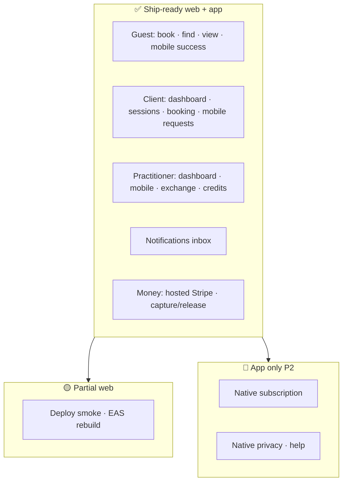
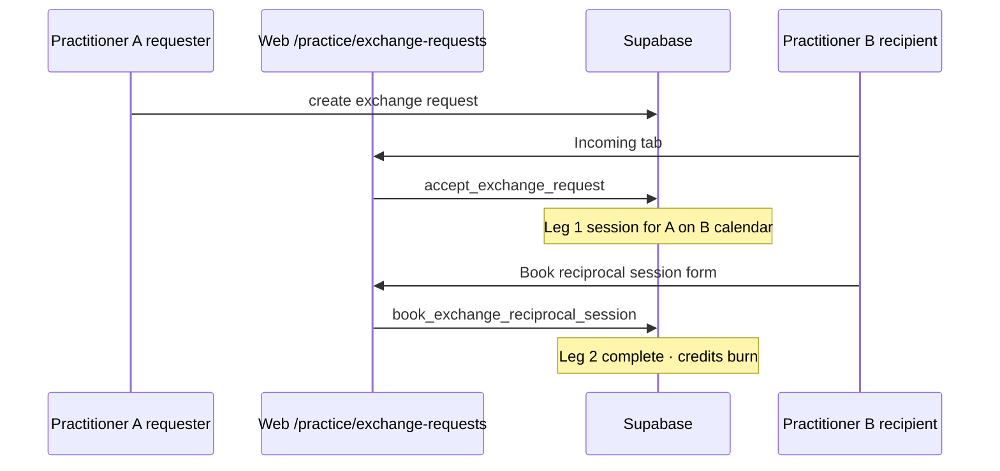
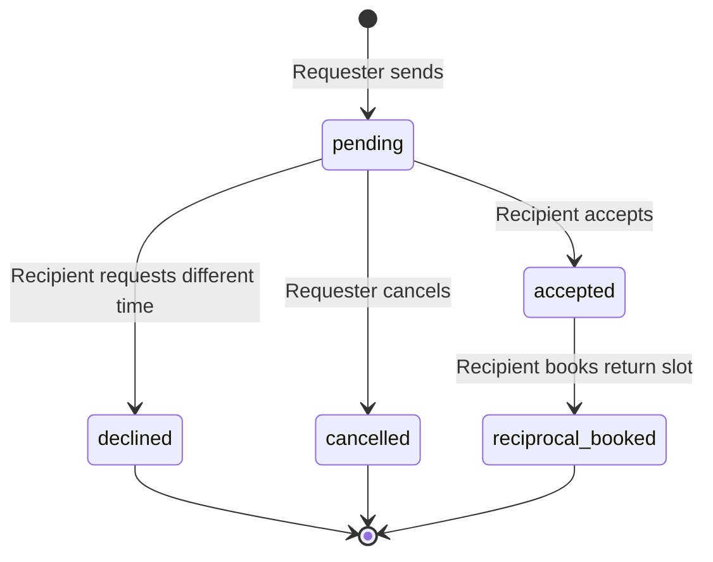
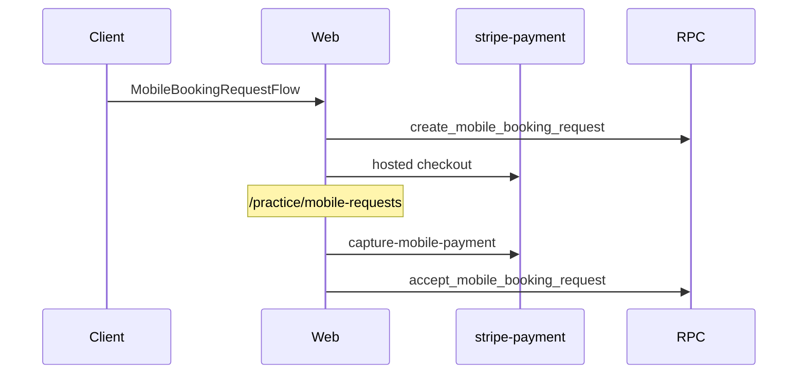
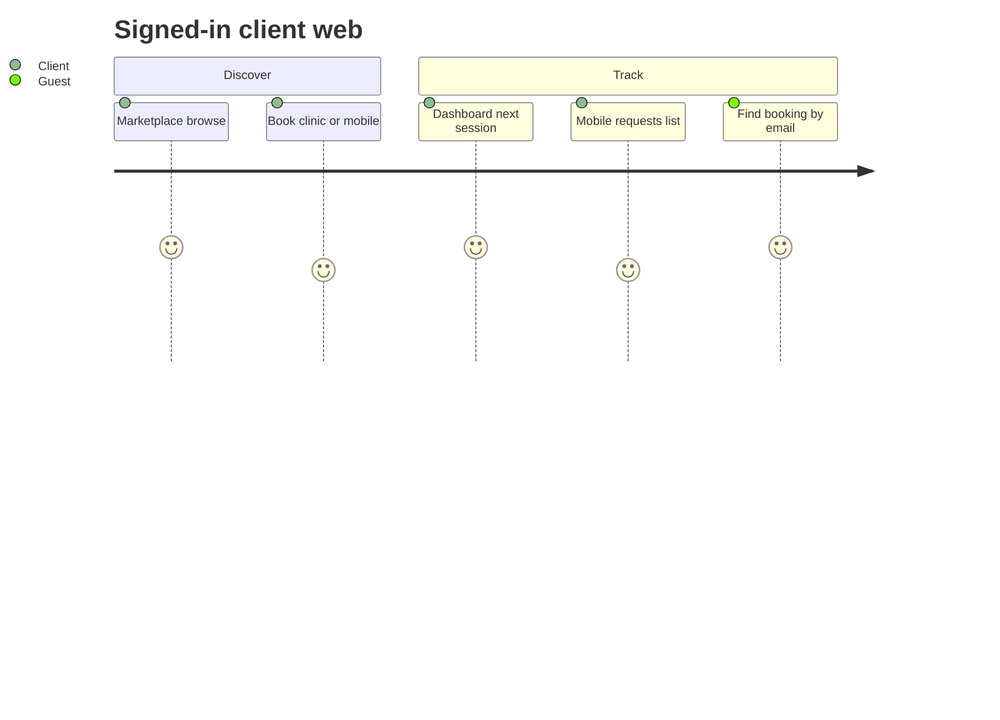
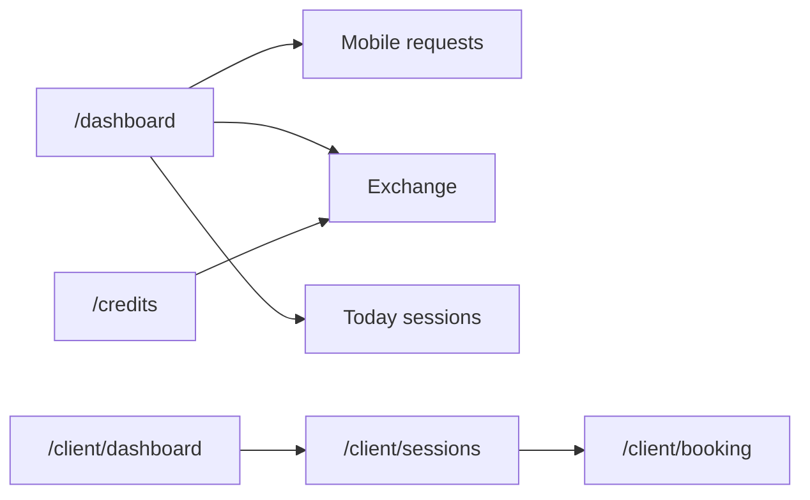

# Web ↔ App parity — CTO gap review (2026-05-26)

**Scope:** `peer-care-connect/` + repo-root `src/` + `theramate-ios-client/`  
**Status:** Guest booking, mobile inbox, exchange, client + practice dashboards, credits, sessions, and notifications ship-ready on web.

---

## 1. Product surface map



---

## 2. Treatment exchange (web parity)





**Routes**

| Web                           | App             | Capability                                         |
| ----------------------------- | --------------- | -------------------------------------------------- |
| `/practice/exchange-requests` | `exchange/*`    | Inbox incoming + sent                              |
| `?request=<uuid>`             | `exchange/[id]` | Accept · different time · cancel · reciprocal book |

---

## 3. Mobile requests (reference)



---

## 4. Client journey (PM)



---

## 5. Code review log (cumulative)

| ID       | Severity | Finding                              | Status                                                           |
| -------- | -------- | ------------------------------------ | ---------------------------------------------------------------- |
| CR-01–09 | P0–P2    | Auth, UI kit, mobile inbox, currency | **Fixed** (Sprint 6–7)                                           |
| CR-10    | P1       | Exchange web = placeholder           | **Fixed** — `ExchangeRequestsPage` + `practitionerExchange.ts`   |
| CR-11    | P1       | Client dashboard = placeholder       | **Fixed** — `ClientDashboard.tsx` + `clientSessions.ts`          |
| CR-12    | P2       | Credits page placeholder             | **Fixed** — `CreditsPage.tsx` + `credits.ts`                     |
| CR-13    | P2       | Practice dashboard placeholder       | **Fixed** — `PracticeDashboard.tsx` + `practitionerDashboard.ts` |
| CR-14    | P2       | Notifications placeholder            | **Fixed** — `NotificationsPage.tsx`                              |
| CR-15    | P2       | Client sessions placeholder          | **Fixed** — `ClientSessions.tsx`                                 |

---

## 6. Sprint 9 (PM) — practitioner + client hub



| Item                                                      | Status                                |
| --------------------------------------------------------- | ------------------------------------- |
| Practice dashboard (today, actions, month stats)          | **Done**                              |
| Credits balance + transactions                            | **Done**                              |
| Client sessions upcoming/past                             | **Done**                              |
| Notifications list                                        | **Done**                              |
| QA `/dashboard` + `/credits` + `/client/sessions`         | **QA**                                |
| Admin verification (`/admin/verification`)                | **Done** — queue + verify             |
| Pricing (`/pricing`)                                      | **Done** — plans, fees, Stripe portal |
| `/client/sessions` route regression                       | **Fixed**                             |
| Practitioner care plans (`/practice/treatment-plans`)     | **Done**                              |
| Clinical vault + SOAP editor                              | **Done**                              |
| Public marketing + legal (`/about`, `/help`, `/terms`, …) | **Done**                              |
| Auth (`/register`, `/reset-password`, `/auth/callback`)   | **Done**                              |
| Deploy smoke (`deploy:stripe-payment`)                    | Ops                                   |

---

## 7. Build gate

```bash
cd peer-care-connect
export VITE_SUPABASE_URL=...
export VITE_SUPABASE_ANON_KEY=...
npm run build
```

---

## Related

- [WEB_APP_FEATURE_PARITY.md](./WEB_APP_FEATURE_PARITY.md)
- [TREATMENT_EXCHANGE_MOBILE_SCREEN_FLOWS.md](./TREATMENT_EXCHANGE_MOBILE_SCREEN_FLOWS.md)
