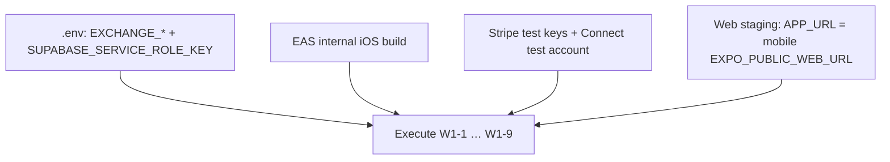
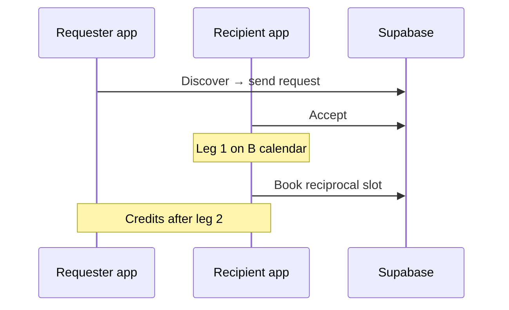
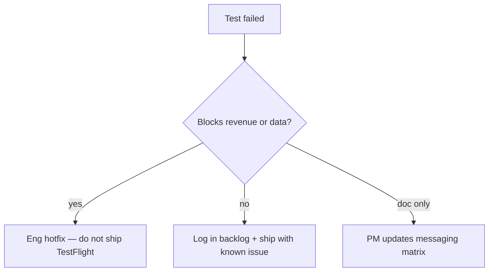

# Wave 1 — QA release sign-off pack

**Date:** 2026-05-26  
**Owner:** QA  
**Prerequisite:** Wave 0 green — `npm run test:readiness` (see run log in [APP_RELEASE_BACKLOG_CTO_PM.md](../product/APP_RELEASE_BACKLOG_CTO_PM.md))  
**Environment:** Staging Supabase + Stripe test mode + EAS internal build (iOS)

---

## Sign-off summary

| ID   | Scenario                 | App | Web | Tester | Date | Pass |
| ---- | ------------------------ | --- | --- | ------ | ---- | ---- |
| W1-1 | Hybrid booking matrix    | ☐   | ☐   |        |      | ☐    |
| W1-2 | Mobile accept + emails   | ☐   | ☐   |        |      | ☐    |
| W1-3 | Mobile decline + guest   | ☐   | ☐   |        |      | ☐    |
| W1-4 | Guest token session view | ☐   | ☐   |        |      | ☐    |
| W1-5 | Payments smoke           | ☐   | —   |        |      | ☐    |
| W1-6 | Exchange two-leg         | ☐   | ☐   |        |      | ☐    |
| W1-7 | Exchange deep link       | ☐   | ☐   |        |      | ☐    |
| W1-8 | Exchange E2E script      | —   | —   |        |      | ☐    |
| W1-9 | Maestro on device        | ☐   | —   |        |      | ☐    |

---

## Prerequisites



| Check             | Command / location                                               |
| ----------------- | ---------------------------------------------------------------- |
| Automated gates   | `npm run test:readiness` from repo root                          |
| Exchange pair     | `npm run verify:exchange:staging` (after `EXCHANGE_*` in `.env`) |
| Full exchange RPC | `npm run test:exchange:e2e`                                      |
| Maestro           | `npm run test:maestro:exchange` (device + CLI)                   |
| Env template      | `.env.example`, `theramate-ios-client/.maestro/.env.example`     |

**2026-05-26 automated run:** `test:readiness` **passed** (typecheck + **61** unit tests + exchange dry skip). `stripe-payment` deployed (platform sub checkout). `EXCHANGE_*` not set — W1-8/W1-9 blocked until creds added.

**Production payment smoke:** Use [WAVE1_PROD_PAYMENT_SMOKE.md](./WAVE1_PROD_PAYMENT_SMOKE.md) on a **live** EAS build (not Stripe test mode). Supabase MCP snapshot 2026-05-27: 0 `payments` / `checkout_sessions` in 7d; `verify-checkout` v1 active; 9 Connect accounts; 7 active subs. Automated gates: **63** unit tests.

---

## W1-1 — Hybrid booking matrix

**Maps to:** TC-HYB-02, TC-CLN-01, TC-MOB-01

### Setup

Use three practitioner fixtures (or document IDs here):

| Fixture | `therapist_type` | Expected             |
| ------- | ---------------- | -------------------- |
| A       | `clinic_based`   | Clinic CTA only      |
| B       | `mobile`         | Mobile request only  |
| C       | `hybrid`         | Chooser or both CTAs |

### App (`theramate-ios-client`)

1. **Explore** → open filter sheet → set delivery **Clinic** / **Mobile** / **Hybrid** / **Any** + sort — list updates.
2. Practitioner **A**: detail shows clinic book only; no mobile CTA.
3. Practitioner **B**: mobile request only; no clinic slot book.
4. Practitioner **C**: chooser or both paths; products filtered per `booking-flow-type`.
5. Stale deep link: open clinic book URL for mobile-only → blocked or redirected with clear message.

### Web (`src/`)

1. Marketplace / `ClientBooking` — same three fixtures; `?mode=clinic` / `?mode=mobile` / hybrid chooser.
2. `/book/:slug` for fixture C → guest flow reaches correct mode.

**Pass criteria:** No CTA when `canBookClinic` and `canRequestMobile` are both false; hybrid never offers wrong product type.

---

## W1-2 — Mobile accept + emails

**Maps to:** TC-MOB-02, P1-1

### Steps (app primary)

1. Signed-in **client** submits mobile request → completes hosted checkout → `payment_status` held.
2. **Practitioner** opens `mobile-requests` → **Accept**.
3. Verify capture ran (no accept error); session appears in both diaries.
4. **Emails** (staging inbox): client `mobile_request_accepted_client`; practitioner confirmation includes **visit address**.

### Web cross-check

`/practice/mobile-requests` — same accept path on staging web build.

**Pass criteria:** Session created; emails contain visit address; client can open session from mobile requests list.

---

## W1-3 — Mobile decline + guest

**Maps to:** TC-MOB-03, P1-7

1. New mobile request with held payment.
2. Practitioner **decline** → payment released (no stuck hold).
3. Client/guest receives decline email (pg_net → `mobile_decline`).
4. Guest: `/guest/mobile-requests` (web + app) shows declined state.

**Pass criteria:** Hold released; decline email received; guest route works without sign-in.

---

## W1-4 — Guest token session view

**Maps to:** P0-4, P1-6

1. Guest mobile request → practitioner **accept**.
2. **App:** tap View session → `booking/view/[sessionId]?token=…` (not signed-in bookings tab).
3. **Web:** `/booking/view/:id` with token from email or RPC.
4. Signed-in client with `guest_view_token` on same session — same view works.

**Pass criteria:** Guest never forced through client auth for view-only session.

---

## W1-5 — Payments smoke (app)

Source: [STRIPE_CHECKOUT_MOBILE_PRODUCTION_READINESS.md](../product/STRIPE_CHECKOUT_MOBILE_PRODUCTION_READINESS.md)

| #   | Step                                                                             | Pass |
| --- | -------------------------------------------------------------------------------- | ---- |
| 1   | Clinic online book — hosted WebView completes → booking-success                  | ☐    |
| 2   | Mobile visit — checkout → success → held/paid                                    | ☐    |
| 3   | Abandon checkout → pending → reopen                                              | ☐    |
| 4   | Profile → complete payment on unpaid request                                     | ☐    |
| 5   | Payment methods → Customer portal in-app WebView                                 | ☐    |
| 6   | Practitioner Connect hosted onboarding → **stripe-return** → Connect status      | ☐    |
| 7   | Guest pay-at-clinic: `/book/:slug` → Book as guest → in-person completes         | ☐    |
| 8   | Guest card: same → online pay → in-app WebView → booking success                 | ☐    |
| 9   | Platform subscribe: `pricing` or onboarding → Subscribe → `subscription-success` | ☐    |
| 10  | Voice SOAP: clinical-notes → record → transcribe inserts SOAP fields             | ☐    |

**Env check:** `EXPO_PUBLIC_WEB_URL` matches Supabase `APP_URL` for Stripe return URLs.

---

## W1-6 — Exchange two-leg

Source: [TREATMENT_EXCHANGE_MOBILE_PRODUCTION_READINESS.md](../product/TREATMENT_EXCHANGE_MOBILE_PRODUCTION_READINESS.md)



| #   | Step                                                        | Pass |
| --- | ----------------------------------------------------------- | ---- |
| 1   | Requester: Discover → send (credit pre-check)               | ☐    |
| 2   | Recipient: Incoming → accept                                | ☐    |
| 3   | Recipient: Book reciprocal from hub or detail               | ☐    |
| 4   | Requester: Home card shows awaiting/completed               | ☐    |
| 5   | Copy: recipient sees **Request different time** not Decline | ☐    |

**Web:** `/practice/exchange-requests` — same flow for staging QA.

---

## W1-7 — Exchange deep link

1. Send test notification or open URL: `/practice/exchange-requests?request=<uuid>`.
2. **App installed:** lands on `exchange/[id]` (not generic web-only).
3. Push payload with `requestId` → same screen.

**Pass criteria:** No dead-end web placeholder; detail shows actions for pending request.

---

## W1-8 — Exchange automated E2E

1. Add to repo root `.env`:

   ```
   EXCHANGE_REQUESTER_EMAIL=
   EXCHANGE_REQUESTER_PASSWORD=
   EXCHANGE_RECIPIENT_EMAIL=
   EXCHANGE_RECIPIENT_PASSWORD=
   SUPABASE_SERVICE_ROLE_KEY=
   ```

2. `npm run verify:exchange:staging`
3. `npm run test:exchange:e2e`

**Pass criteria:** Both exit 0.

---

## W1-9 — Maestro on device

1. Install Maestro CLI; configure `theramate-ios-client/.maestro/.env`.
2. `npm run test:maestro:exchange`
3. Flows: `exchange-happy-path-requester.yaml`, `exchange-happy-path-recipient.yaml`

**Pass criteria:** Flows complete on staging build without manual intervention.

---

## Failure routing



| Severity | Examples                                      | Action               |
| -------- | --------------------------------------------- | -------------------- |
| P0       | Payment capture fails, accept without session | Block release        |
| P1       | Wrong email copy, deep link opens web only    | Fix before marketing |
| P2       | CTA copy AC-06, analytics WebView             | Document; Wave 2     |

---

## Related

- [BOOKING_E2E_PRE_TO_POST_CHECKLIST.md](./BOOKING_E2E_PRE_TO_POST_CHECKLIST.md)
- [APP_RELEASE_BACKLOG_CTO_PM.md](../product/APP_RELEASE_BACKLOG_CTO_PM.md)
- [TREATMENT_EXCHANGE_SMOKE_TESTS.md](../product/TREATMENT_EXCHANGE_SMOKE_TESTS.md)
